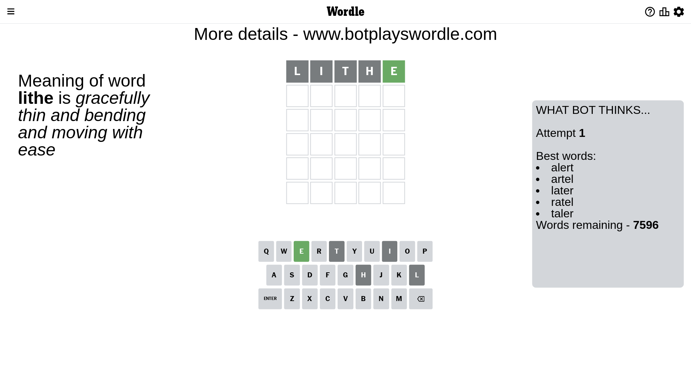

# Wordle for May 15, 2023 - \#695

## Attempt 1

This is the first attempt and we'll choose a random word to start with.

Let's start with word `lithe`

Attempt for `lithe` gives us 1 correct letters, 0 present letters and 4 wrong letters.

If we look into details, we can see that:

Letter `l` is not present in the word and we will not use it any more

Letter `i` is not present in the word and we will not use it any more

Letter `t` is not present in the word and we will not use it any more

Letter `h` is not present in the word and we will not use it any more

Letter `e` should be at position 5

We got information about the correct letters and it should make next attempt easier

Some letters are missing (like `l`, `i`, `t`, `h`) but it's also important piece of information

Word should contain letters `[e]`

That was a great guess that limited number of remaining words

## Attempt 2

Right now we have 428 words to choose from and best of them seem to be `[drone ronde snare crane nacre]`

So far we know that possible letters are:

At position 1: `[a b c d e f g j k m n o p q r s u v w x y z]`

At position 2: `[a b c d e f g j k m n o p q r s u v w x y z]`

At position 3: `[a b c d e f g j k m n o p q r s u v w x y z]`

At position 4: `[a b c d e f g j k m n o p q r s u v w x y z]`

At position 5: `[e]`

Next guess is `nacre`, let's see what it gives us

Attempt for `nacre` gives us 2 correct letters, 2 present letters and 1 wrong letters.

If we look into details, we can see that:

Letter `n` is on a different spot - this means that it cannot be at position 1

Letter `a` should be at position 2

Letter `c` is on a different spot - this means that it cannot be at position 3

Letter `r` is not present in the word and we will not use it any more

We got information about the correct letters and it should make next attempt easier

Some letters are missing (like `r`) but it's also important piece of information

Word should contain letters `[e n a c]`

That was a great guess that limited number of remaining words

## Attempt 3

Right now we have 1 words to choose from and best of them seem to be `[canoe]`

So far we know that possible letters are:

At position 1: `[a b c d e f g j k m o p q s u v w x y z]`

At position 2: `[a]`

At position 3: `[a b d e f g j k m n o p q s u v w x y z]`

At position 4: `[a b c d e f g j k m n o p q s u v w x y z]`

At position 5: `[e]`

It must be `canoe`

That's the correct answer! The word is `canoe`!

## Conclusion

Today's word is `canoe` and it took 3 attempts to guess it

