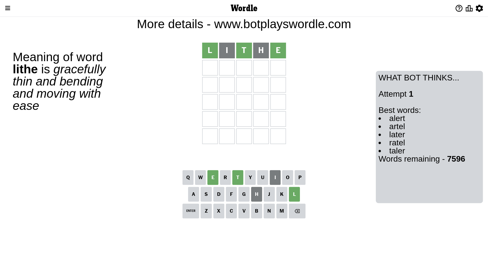
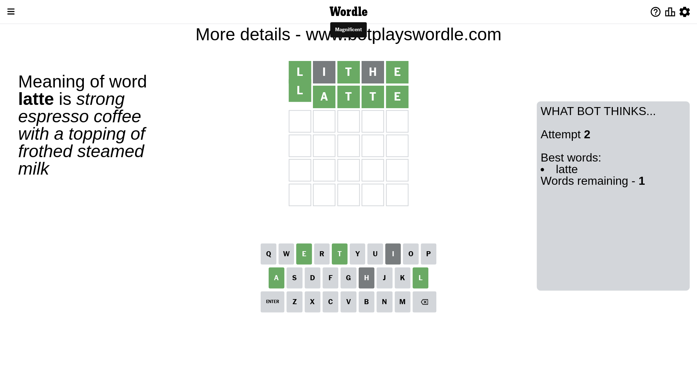

# Wordle for May 16, 2023 - \#696

## Attempt 1

This is the first attempt and we'll choose a random word to start with.

Let's start with word `lithe`

Attempt for `lithe` gives us 3 correct letters, 0 present letters and 2 wrong letters.

If we look into details, we can see that:

Letter `l` should be at position 1

Letter `i` is not present in the word and we will not use it any more

Letter `t` should be at position 3

Letter `h` is not present in the word and we will not use it any more

Letter `e` should be at position 5

We got information about the correct letters and it should make next attempt easier

Some letters are missing (like `i`, `h`) but it's also important piece of information

Word should contain letters `[l t e]`

That was a great guess that limited number of remaining words

## Attempt 2

Right now we have 1 words to choose from and best of them seem to be `[latte]`

So far we know that possible letters are:

At position 1: `[l]`

At position 2: `[a b c d e f g j k l m n o p q r s t u v w x y z]`

At position 3: `[t]`

At position 4: `[a b c d e f g j k l m n o p q r s t u v w x y z]`

At position 5: `[e]`

It must be `latte`

That's the correct answer! The word is `latte`!

## Conclusion

Today's word is `latte` and it took 2 attempts to guess it

