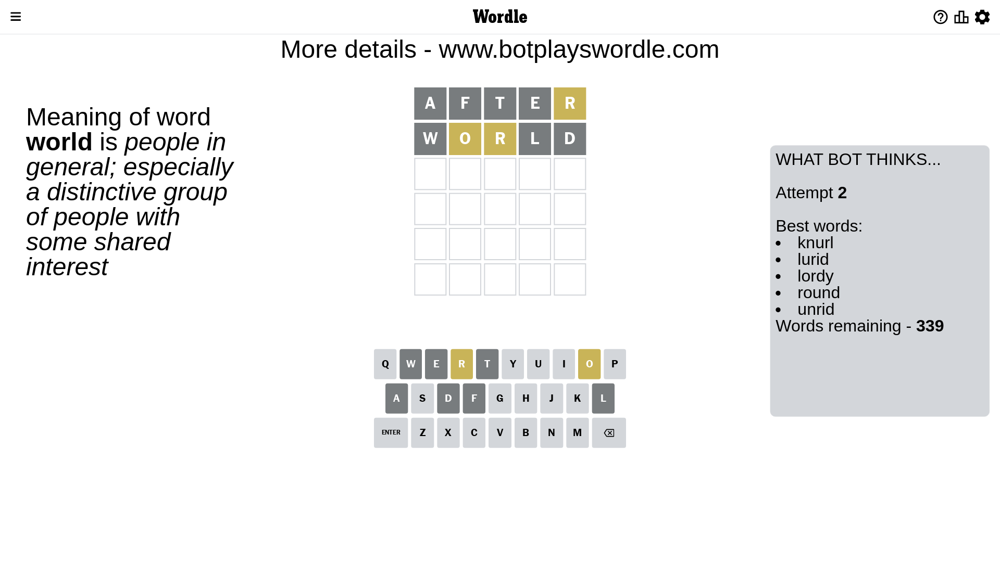
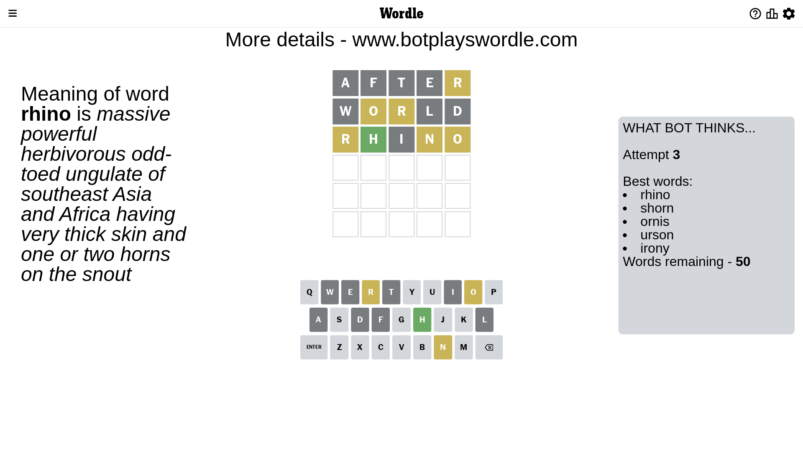
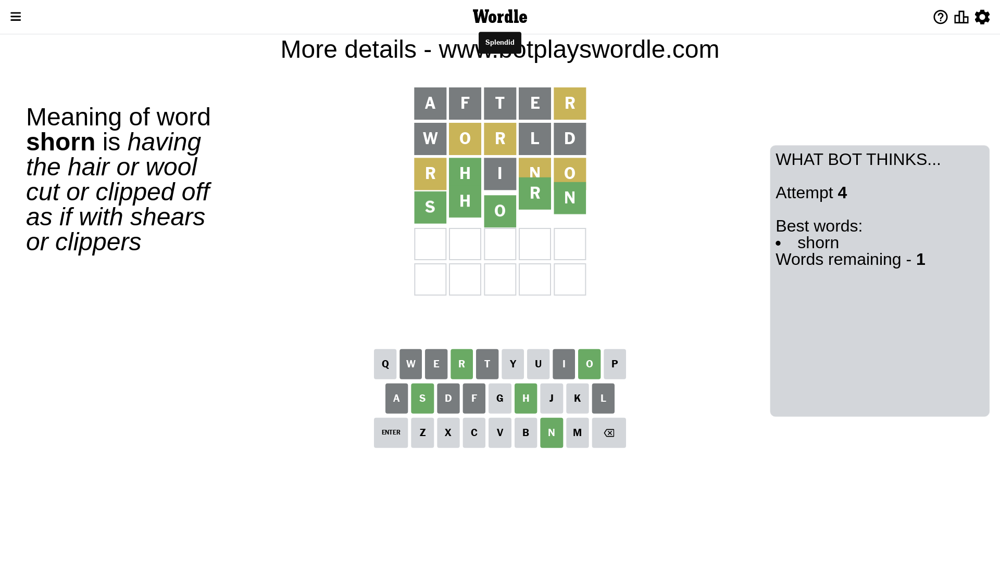

# Wordle for May 18, 2023 - \#698

## Attempt 1

This is the first attempt and we'll choose a random word to start with.

Let's start with word `after`

Attempt for `after` gives us 0 correct letters, 1 present letters and 4 wrong letters.

If we look into details, we can see that:

Letter `a` is not present in the word and we will not use it any more

Letter `f` is not present in the word and we will not use it any more

Letter `t` is not present in the word and we will not use it any more

Letter `e` is not present in the word and we will not use it any more

Letter `r` is on a different spot - this means that it cannot be at position 5

Some letters are missing (like `a`, `f`, `t`, `e`) but it's also important piece of information

Word should contain letters `[r]`

That was a great guess that limited number of remaining words

## Attempt 2

Right now we have 339 words to choose from and best of them seem to be `[knurl lurid lordy round unrid]`

So far we know that possible letters are:

At position 1: `[b c d g h i j k l m n o p q r s u v w x y z]`

At position 2: `[b c d g h i j k l m n o p q r s u v w x y z]`

At position 3: `[b c d g h i j k l m n o p q r s u v w x y z]`

At position 4: `[b c d g h i j k l m n o p q r s u v w x y z]`

At position 5: `[b c d g h i j k l m n o p q s u v w x y z]`

Next guess is `world`, let's see what it gives us

Attempt for `world` gives us 0 correct letters, 2 present letters and 3 wrong letters.

If we look into details, we can see that:

Letter `w` is not present in the word and we will not use it any more

Letter `o` is on a different spot - this means that it cannot be at position 2

Letter `r` is on a different spot - this means that it cannot be at position 3

Letter `l` is not present in the word and we will not use it any more

Letter `d` is not present in the word and we will not use it any more

Some letters are missing (like `w`, `l`, `d`) but it's also important piece of information

Word should contain letters `[r o]`

Not a bad guess in general

## Attempt 3

Right now we have 50 words to choose from and best of them seem to be `[rhino shorn ornis urson irony]`

So far we know that possible letters are:

At position 1: `[b c g h i j k m n o p q r s u v x y z]`

At position 2: `[b c g h i j k m n p q r s u v x y z]`

At position 3: `[b c g h i j k m n o p q s u v x y z]`

At position 4: `[b c g h i j k m n o p q r s u v x y z]`

At position 5: `[b c g h i j k m n o p q s u v x y z]`

Next guess is `rhino`, let's see what it gives us

Attempt for `rhino` gives us 1 correct letters, 3 present letters and 1 wrong letters.

If we look into details, we can see that:

Letter `r` is on a different spot - this means that it cannot be at position 1

Letter `h` should be at position 2

Letter `i` is not present in the word and we will not use it any more

Letter `n` is on a different spot - this means that it cannot be at position 4

Letter `o` is on a different spot - this means that it cannot be at position 5

We got information about the correct letters and it should make next attempt easier

Some letters are missing (like `i`) but it's also important piece of information

Word should contain letters `[r o h n]`

That was a great guess that limited number of remaining words

## Attempt 4

Right now we have 1 words to choose from and best of them seem to be `[shorn]`

So far we know that possible letters are:

At position 1: `[b c g h j k m n o p q s u v x y z]`

At position 2: `[h]`

At position 3: `[b c g h j k m n o p q s u v x y z]`

At position 4: `[b c g h j k m o p q r s u v x y z]`

At position 5: `[b c g h j k m n p q s u v x y z]`

It must be `shorn`

That's the correct answer! The word is `shorn`!

## Conclusion

Today's word is `shorn` and it took 4 attempts to guess it

