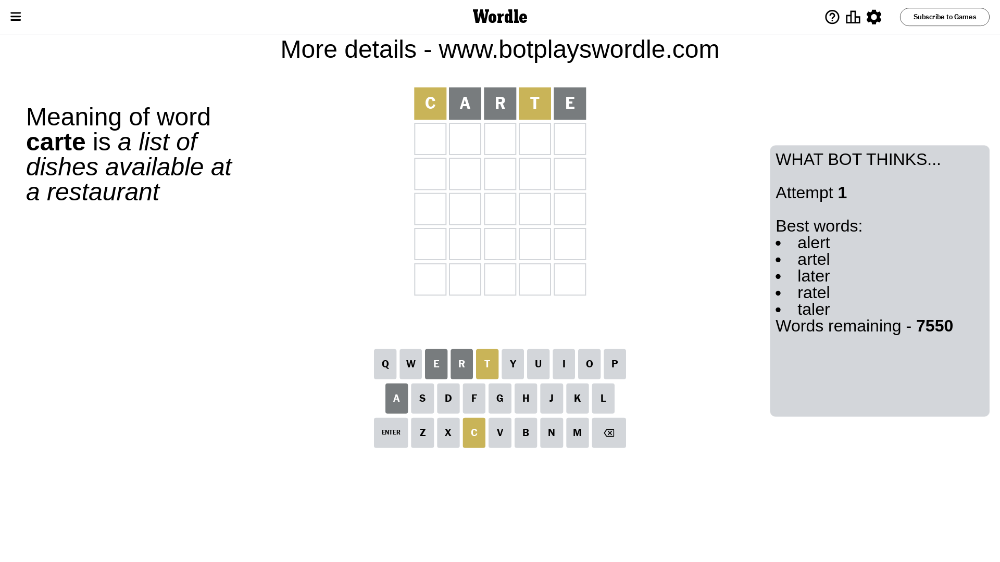
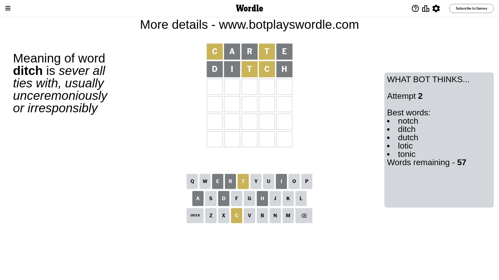
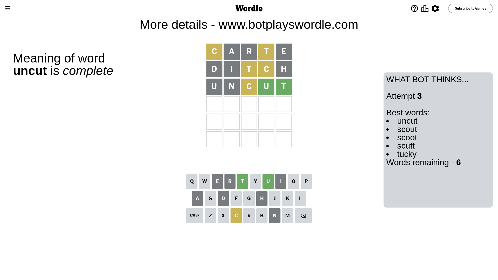
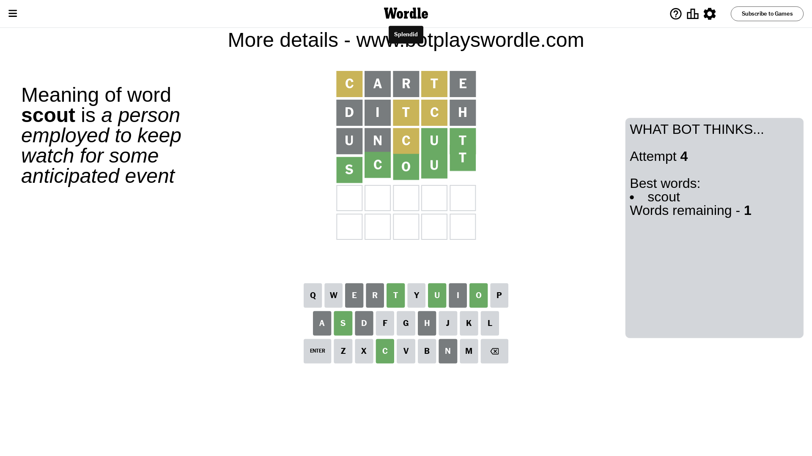

# Wordle for June 6, 2023 - \#717

## Attempt 1

This is the first attempt and we'll choose a random word to start with.

Let's start with word `carte`

Attempt for `carte` gives us 0 correct letters, 2 present letters and 3 wrong letters.

If we look into details, we can see that:

Letter `c` is on a different spot - this means that it cannot be at position 1

Letter `a` is not present in the word and we will not use it any more

Letter `r` is not present in the word and we will not use it any more

Letter `t` is on a different spot - this means that it cannot be at position 4

Letter `e` is not present in the word and we will not use it any more

Some letters are missing (like `a`, `r`, `e`) but it's also important piece of information

Word should contain letters `[c t]`

That was a great guess that limited number of remaining words

## Attempt 2

Right now we have 57 words to choose from and best of them seem to be `[notch ditch dutch lotic tonic]`

So far we know that possible letters are:

At position 1: `[b d f g h i j k l m n o p q s t u v w x y z]`

At position 2: `[b c d f g h i j k l m n o p q s t u v w x y z]`

At position 3: `[b c d f g h i j k l m n o p q s t u v w x y z]`

At position 4: `[b c d f g h i j k l m n o p q s u v w x y z]`

At position 5: `[b c d f g h i j k l m n o p q s t u v w x y z]`

Next guess is `ditch`, let's see what it gives us

Attempt for `ditch` gives us 0 correct letters, 2 present letters and 3 wrong letters.

If we look into details, we can see that:

Letter `d` is not present in the word and we will not use it any more

Letter `i` is not present in the word and we will not use it any more

Letter `t` is on a different spot - this means that it cannot be at position 3

Letter `c` is on a different spot - this means that it cannot be at position 4

Letter `h` is not present in the word and we will not use it any more

Some letters are missing (like `d`, `i`, `h`) but it's also important piece of information

Word should contain letters `[c t]`

That was a great guess that limited number of remaining words

## Attempt 3

Right now we have 6 words to choose from and best of them seem to be `[uncut scout scoot scuft tucky]`

So far we know that possible letters are:

At position 1: `[b f g j k l m n o p q s t u v w x y z]`

At position 2: `[b c f g j k l m n o p q s t u v w x y z]`

At position 3: `[b c f g j k l m n o p q s u v w x y z]`

At position 4: `[b f g j k l m n o p q s u v w x y z]`

At position 5: `[b c f g j k l m n o p q s t u v w x y z]`

Next guess is `uncut`, let's see what it gives us

Attempt for `uncut` gives us 2 correct letters, 1 present letters and 2 wrong letters.

If we look into details, we can see that:

Letter `u` is not present in the word and we will not use it any more

Letter `n` is not present in the word and we will not use it any more

Letter `c` is on a different spot - this means that it cannot be at position 3

Letter `u` should be at position 4

Letter `t` should be at position 5

We got information about the correct letters and it should make next attempt easier

Some letters are missing (like `u`, `n`) but it's also important piece of information

Word should contain letters `[c t u]`

Not a bad guess in general

## Attempt 4

Right now we have 1 words to choose from and best of them seem to be `[scout]`

So far we know that possible letters are:

At position 1: `[b f g j k l m o p q s t v w x y z]`

At position 2: `[b c f g j k l m o p q s t v w x y z]`

At position 3: `[b f g j k l m o p q s v w x y z]`

At position 4: `[u]`

At position 5: `[t]`

It must be `scout`

That's the correct answer! The word is `scout`!

## Conclusion

Today's word is `scout` and it took 4 attempts to guess it

