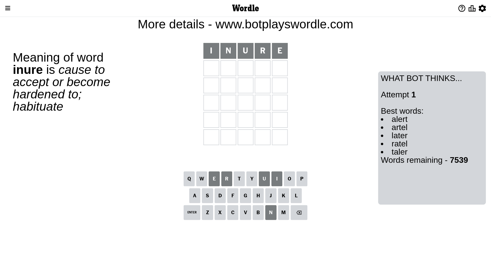
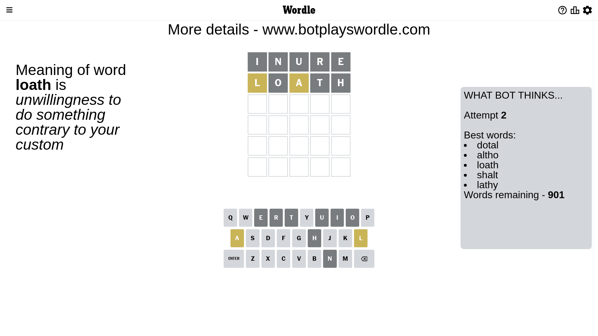
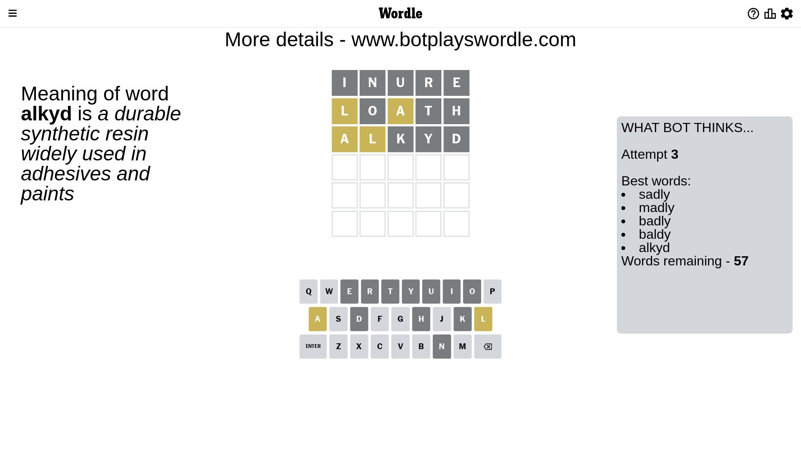
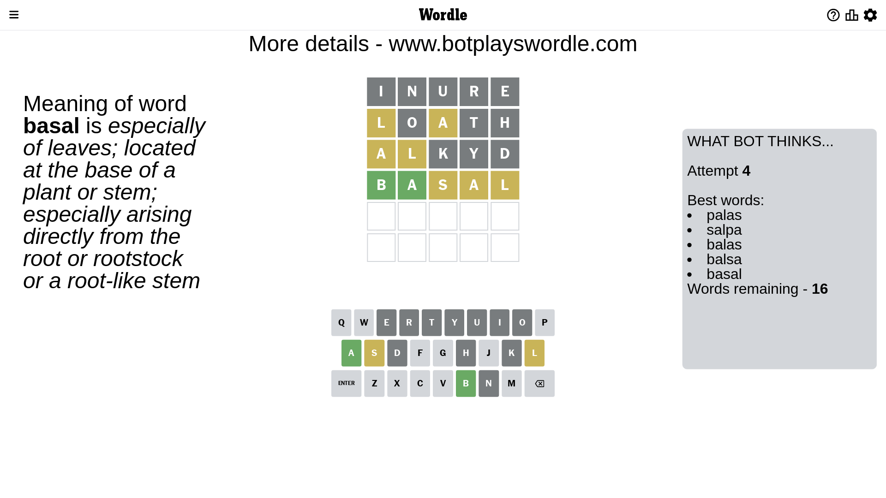
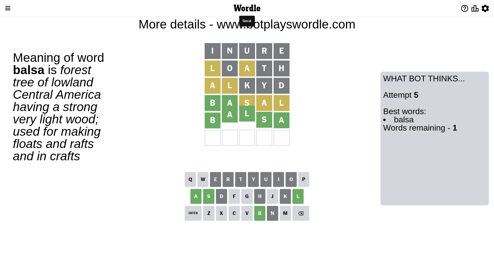

# Wordle for June 9, 2023 - \#720

## Attempt 1

This is the first attempt and we'll choose a random word to start with.

Let's start with word `inure`

Attempt for `inure` gives us 0 correct letters, 0 present letters and 5 wrong letters.

If we look into details, we can see that:

Letter `i` is not present in the word and we will not use it any more

Letter `n` is not present in the word and we will not use it any more

Letter `u` is not present in the word and we will not use it any more

Letter `r` is not present in the word and we will not use it any more

Letter `e` is not present in the word and we will not use it any more

Some letters are missing (like `i`, `n`, `u`, `r`, `e`) but it's also important piece of information

So far we don't know any of the letters!

That was a great guess that limited number of remaining words

## Attempt 2

Right now we have 901 words to choose from and best of them seem to be `[dotal altho loath shalt lathy]`

So far we know that possible letters are:

At position 1: `[a b c d f g h j k l m o p q s t v w x y z]`

At position 2: `[a b c d f g h j k l m o p q s t v w x y z]`

At position 3: `[a b c d f g h j k l m o p q s t v w x y z]`

At position 4: `[a b c d f g h j k l m o p q s t v w x y z]`

At position 5: `[a b c d f g h j k l m o p q s t v w x y z]`

Next guess is `loath`, let's see what it gives us

Attempt for `loath` gives us 0 correct letters, 2 present letters and 3 wrong letters.

If we look into details, we can see that:

Letter `l` is on a different spot - this means that it cannot be at position 1

Letter `o` is not present in the word and we will not use it any more

Letter `a` is on a different spot - this means that it cannot be at position 3

Letter `t` is not present in the word and we will not use it any more

Letter `h` is not present in the word and we will not use it any more

Some letters are missing (like `o`, `t`, `h`) but it's also important piece of information

Word should contain letters `[l a]`

That was a great guess that limited number of remaining words

## Attempt 3

Right now we have 57 words to choose from and best of them seem to be `[sadly madly badly baldy alkyd]`

So far we know that possible letters are:

At position 1: `[a b c d f g j k m p q s v w x y z]`

At position 2: `[a b c d f g j k l m p q s v w x y z]`

At position 3: `[b c d f g j k l m p q s v w x y z]`

At position 4: `[a b c d f g j k l m p q s v w x y z]`

At position 5: `[a b c d f g j k l m p q s v w x y z]`

Next guess is `alkyd`, let's see what it gives us

Attempt for `alkyd` gives us 0 correct letters, 2 present letters and 3 wrong letters.

If we look into details, we can see that:

Letter `a` is on a different spot - this means that it cannot be at position 1

Letter `l` is on a different spot - this means that it cannot be at position 2

Letter `k` is not present in the word and we will not use it any more

Letter `y` is not present in the word and we will not use it any more

Letter `d` is not present in the word and we will not use it any more

Some letters are missing (like `k`, `y`, `d`) but it's also important piece of information

Word should contain letters `[l a]`

Could be a better guess

## Attempt 4

Right now we have 16 words to choose from and best of them seem to be `[palas salpa balas balsa basal]`

So far we know that possible letters are:

At position 1: `[b c f g j m p q s v w x z]`

At position 2: `[a b c f g j m p q s v w x z]`

At position 3: `[b c f g j l m p q s v w x z]`

At position 4: `[a b c f g j l m p q s v w x z]`

At position 5: `[a b c f g j l m p q s v w x z]`

Next guess is `basal`, let's see what it gives us

Attempt for `basal` gives us 2 correct letters, 3 present letters and 0 wrong letters.

If we look into details, we can see that:

Letter `b` should be at position 1

Letter `a` should be at position 2

Letter `s` is on a different spot - this means that it cannot be at position 3

Letter `a` is on a different spot - this means that it cannot be at position 4

Letter `l` is on a different spot - this means that it cannot be at position 5

We got information about the correct letters and it should make next attempt easier

Word should contain letters `[l a b s]`

That was a great guess that limited number of remaining words

## Attempt 5

Right now we have 1 words to choose from and best of them seem to be `[balsa]`

So far we know that possible letters are:

At position 1: `[b]`

At position 2: `[a]`

At position 3: `[b c f g j l m p q v w x z]`

At position 4: `[b c f g j l m p q s v w x z]`

At position 5: `[a b c f g j m p q s v w x z]`

It must be `balsa`

That's the correct answer! The word is `balsa`!

## Conclusion

Today's word is `balsa` and it took 5 attempts to guess it

