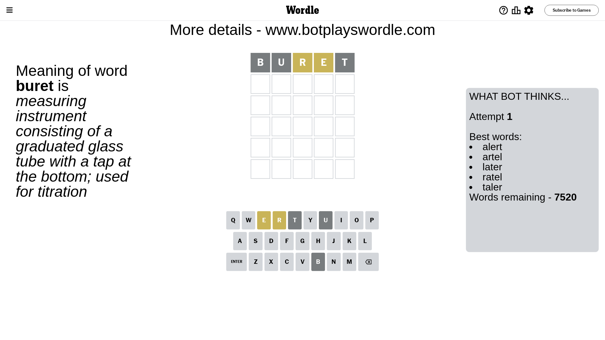
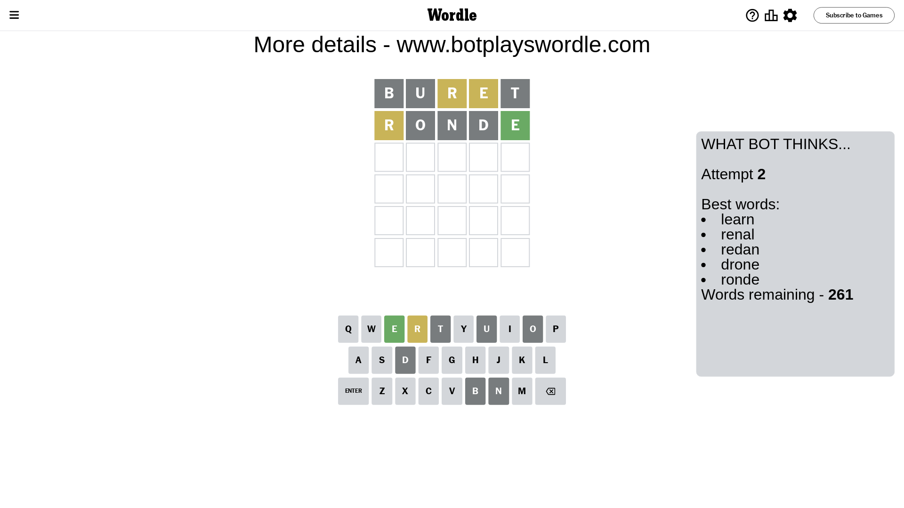
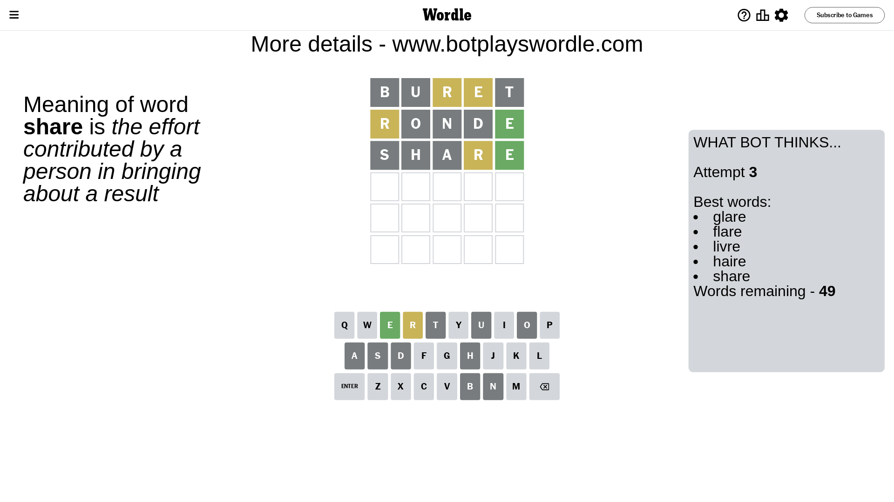
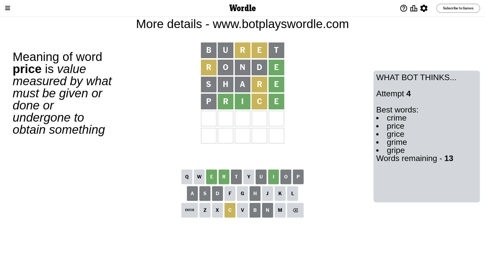
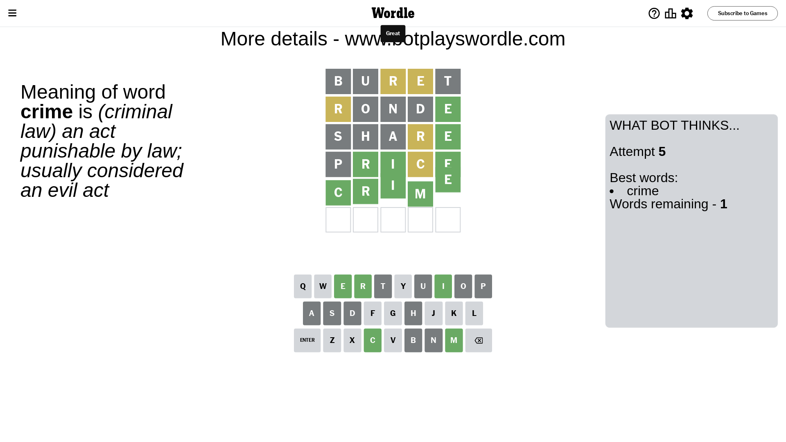

# Wordle for June 14, 2023 - \#725

## Attempt 1

This is the first attempt and we'll choose a random word to start with.

Let's start with word `buret`

Attempt for `buret` gives us 0 correct letters, 2 present letters and 3 wrong letters.

If we look into details, we can see that:

Letter `b` is not present in the word and we will not use it any more

Letter `u` is not present in the word and we will not use it any more

Letter `r` is on a different spot - this means that it cannot be at position 3

Letter `e` is on a different spot - this means that it cannot be at position 4

Letter `t` is not present in the word and we will not use it any more

Some letters are missing (like `b`, `u`, `t`) but it's also important piece of information

Word should contain letters `[r e]`

That was a great guess that limited number of remaining words

## Attempt 2

Right now we have 261 words to choose from and best of them seem to be `[learn renal redan drone ronde]`

So far we know that possible letters are:

At position 1: `[a c d e f g h i j k l m n o p q r s v w x y z]`

At position 2: `[a c d e f g h i j k l m n o p q r s v w x y z]`

At position 3: `[a c d e f g h i j k l m n o p q s v w x y z]`

At position 4: `[a c d f g h i j k l m n o p q r s v w x y z]`

At position 5: `[a c d e f g h i j k l m n o p q r s v w x y z]`

Next guess is `ronde`, let's see what it gives us

Attempt for `ronde` gives us 1 correct letters, 1 present letters and 3 wrong letters.

If we look into details, we can see that:

Letter `r` is on a different spot - this means that it cannot be at position 1

Letter `o` is not present in the word and we will not use it any more

Letter `n` is not present in the word and we will not use it any more

Letter `d` is not present in the word and we will not use it any more

Letter `e` should be at position 5

We got information about the correct letters and it should make next attempt easier

Some letters are missing (like `o`, `n`, `d`) but it's also important piece of information

Word should contain letters `[r e]`

Not a bad guess in general

## Attempt 3

Right now we have 49 words to choose from and best of them seem to be `[glare flare livre haire share]`

So far we know that possible letters are:

At position 1: `[a c e f g h i j k l m p q s v w x y z]`

At position 2: `[a c e f g h i j k l m p q r s v w x y z]`

At position 3: `[a c e f g h i j k l m p q s v w x y z]`

At position 4: `[a c f g h i j k l m p q r s v w x y z]`

At position 5: `[e]`

Next guess is `share`, let's see what it gives us

Attempt for `share` gives us 1 correct letters, 1 present letters and 3 wrong letters.

If we look into details, we can see that:

Letter `s` is not present in the word and we will not use it any more

Letter `h` is not present in the word and we will not use it any more

Letter `a` is not present in the word and we will not use it any more

Letter `r` is on a different spot - this means that it cannot be at position 4

Some letters are missing (like `s`, `h`, `a`) but it's also important piece of information

Word should contain letters `[r e]`

Could be a better guess

## Attempt 4

Right now we have 13 words to choose from and best of them seem to be `[crime price grice grime gripe]`

So far we know that possible letters are:

At position 1: `[c e f g i j k l m p q v w x y z]`

At position 2: `[c e f g i j k l m p q r v w x y z]`

At position 3: `[c e f g i j k l m p q v w x y z]`

At position 4: `[c f g i j k l m p q v w x y z]`

At position 5: `[e]`

Next guess is `price`, let's see what it gives us

Attempt for `price` gives us 3 correct letters, 1 present letters and 1 wrong letters.

If we look into details, we can see that:

Letter `p` is not present in the word and we will not use it any more

Letter `r` should be at position 2

Letter `i` should be at position 3

Letter `c` is on a different spot - this means that it cannot be at position 4

We got information about the correct letters and it should make next attempt easier

Some letters are missing (like `p`) but it's also important piece of information

Word should contain letters `[r e i c]`

That was a great guess that limited number of remaining words

## Attempt 5

Right now we have 1 words to choose from and best of them seem to be `[crime]`

So far we know that possible letters are:

At position 1: `[c e f g i j k l m q v w x y z]`

At position 2: `[r]`

At position 3: `[i]`

At position 4: `[f g i j k l m q v w x y z]`

At position 5: `[e]`

It must be `crime`

That's the correct answer! The word is `crime`!

## Conclusion

Today's word is `crime` and it took 5 attempts to guess it

