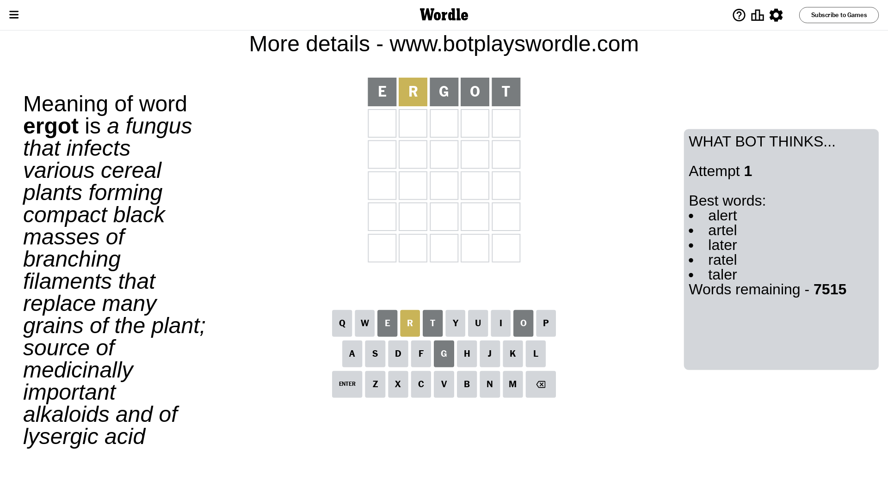
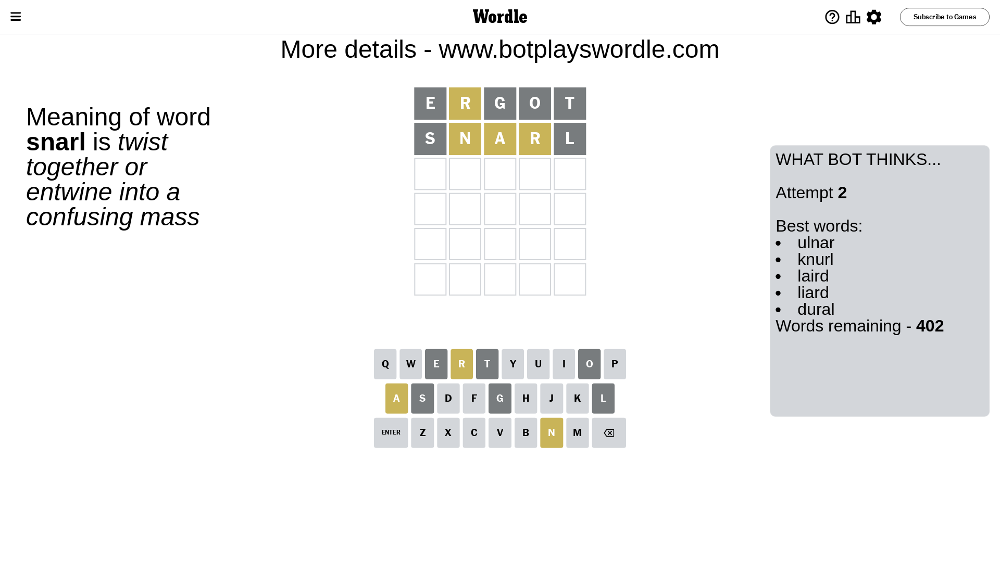
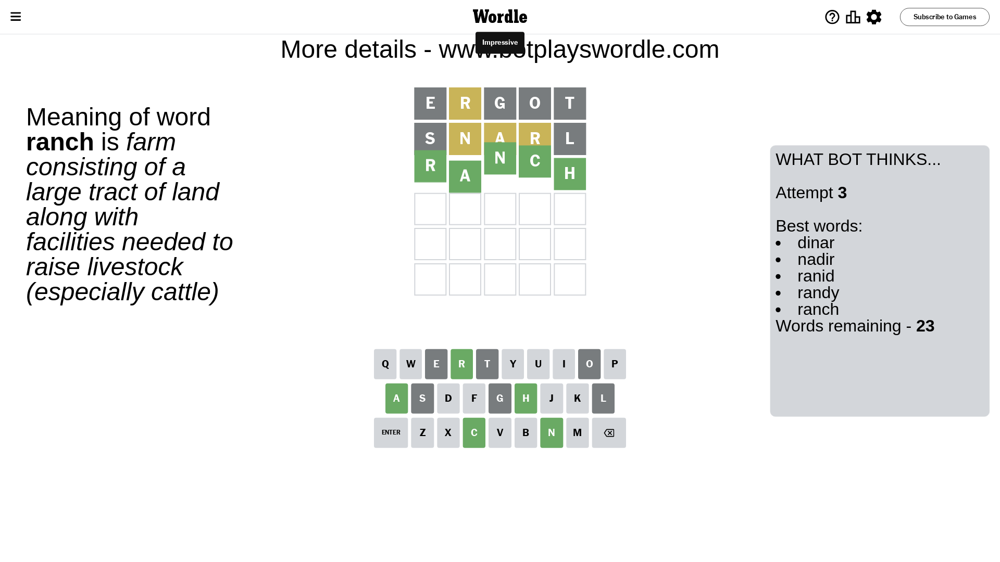

# Wordle for June 17, 2023 - \#728

## Attempt 1

This is the first attempt and we'll choose a random word to start with.

Let's start with word `ergot`

Attempt for `ergot` gives us 0 correct letters, 1 present letters and 4 wrong letters.

If we look into details, we can see that:

Letter `e` is not present in the word and we will not use it any more

Letter `r` is on a different spot - this means that it cannot be at position 2

Letter `g` is not present in the word and we will not use it any more

Letter `o` is not present in the word and we will not use it any more

Letter `t` is not present in the word and we will not use it any more

Some letters are missing (like `e`, `g`, `o`, `t`) but it's also important piece of information

Word should contain letters `[r]`

That was a great guess that limited number of remaining words

## Attempt 2

Right now we have 402 words to choose from and best of them seem to be `[ulnar knurl laird liard dural]`

So far we know that possible letters are:

At position 1: `[a b c d f h i j k l m n p q r s u v w x y z]`

At position 2: `[a b c d f h i j k l m n p q s u v w x y z]`

At position 3: `[a b c d f h i j k l m n p q r s u v w x y z]`

At position 4: `[a b c d f h i j k l m n p q r s u v w x y z]`

At position 5: `[a b c d f h i j k l m n p q r s u v w x y z]`

Next guess is `snarl`, let's see what it gives us

Attempt for `snarl` gives us 0 correct letters, 3 present letters and 2 wrong letters.

If we look into details, we can see that:

Letter `s` is not present in the word and we will not use it any more

Letter `n` is on a different spot - this means that it cannot be at position 2

Letter `a` is on a different spot - this means that it cannot be at position 3

Letter `r` is on a different spot - this means that it cannot be at position 4

Letter `l` is not present in the word and we will not use it any more

Some letters are missing (like `s`, `l`) but it's also important piece of information

Word should contain letters `[r n a]`

That was a great guess that limited number of remaining words

## Attempt 3

Right now we have 23 words to choose from and best of them seem to be `[dinar nadir ranid randy ranch]`

So far we know that possible letters are:

At position 1: `[a b c d f h i j k m n p q r u v w x y z]`

At position 2: `[a b c d f h i j k m p q u v w x y z]`

At position 3: `[b c d f h i j k m n p q r u v w x y z]`

At position 4: `[a b c d f h i j k m n p q u v w x y z]`

At position 5: `[a b c d f h i j k m n p q r u v w x y z]`

Next guess is `ranch`, let's see what it gives us

That's the correct answer! The word is `ranch`!

To be honest that was a pretty lucky guess, but it worked out well.

## Conclusion

Today's word is `ranch` and it took 3 attempts to guess it

