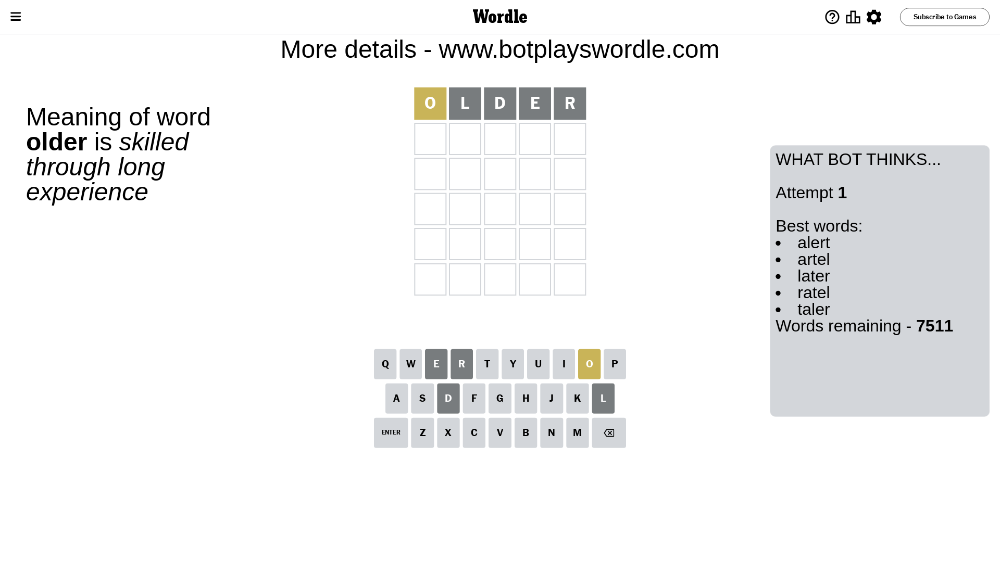
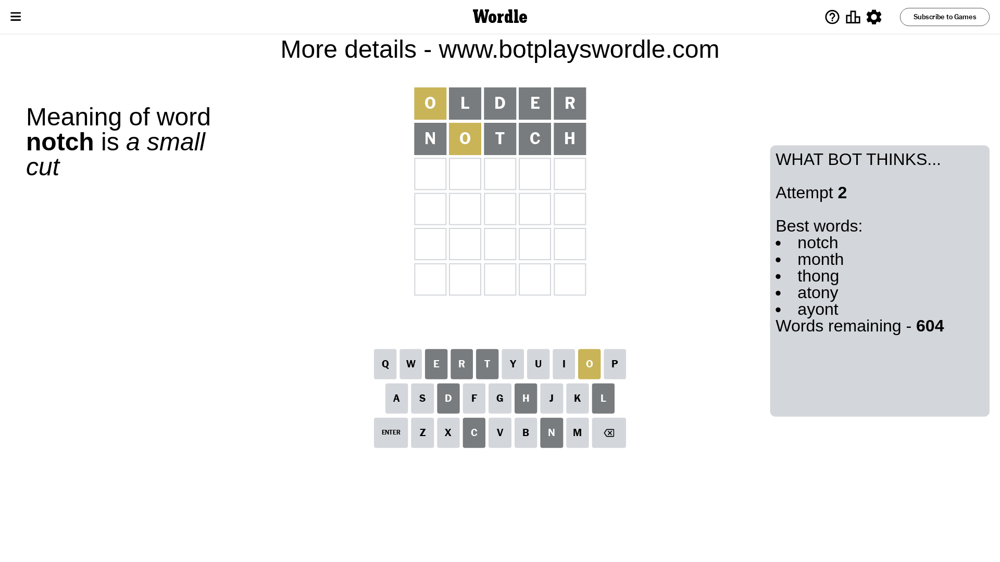
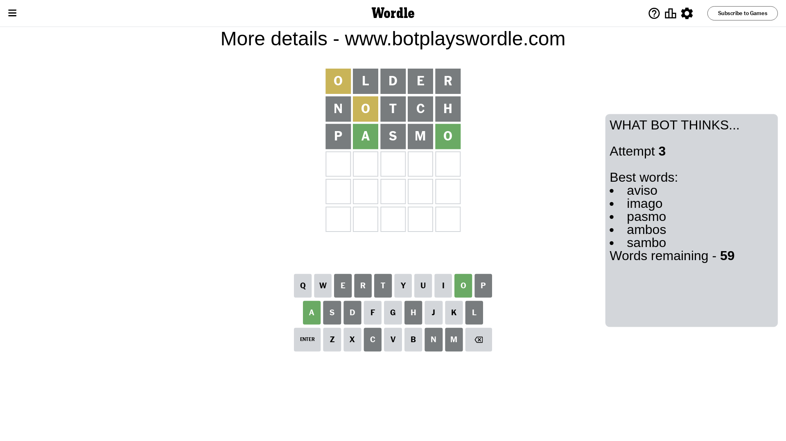
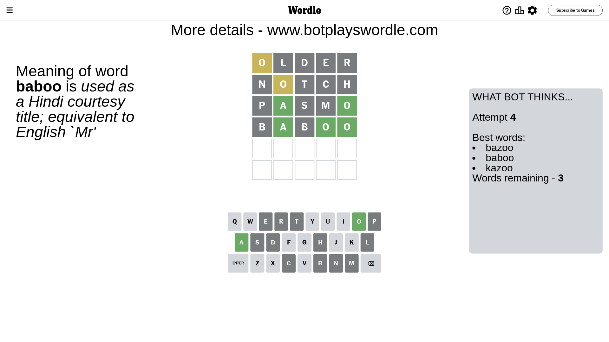
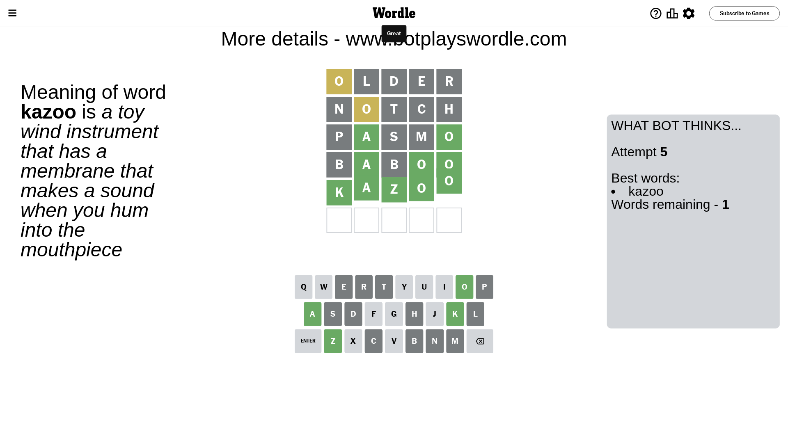

# Wordle for June 19, 2023 - \#730

## Attempt 1

This is the first attempt and we'll choose a random word to start with.

Let's start with word `older`

Attempt for `older` gives us 0 correct letters, 1 present letters and 4 wrong letters.

If we look into details, we can see that:

Letter `o` is on a different spot - this means that it cannot be at position 1

Letter `l` is not present in the word and we will not use it any more

Letter `d` is not present in the word and we will not use it any more

Letter `e` is not present in the word and we will not use it any more

Letter `r` is not present in the word and we will not use it any more

Some letters are missing (like `l`, `d`, `e`, `r`) but it's also important piece of information

Word should contain letters `[o]`

That was a great guess that limited number of remaining words

## Attempt 2

Right now we have 604 words to choose from and best of them seem to be `[notch month thong atony ayont]`

So far we know that possible letters are:

At position 1: `[a b c f g h i j k m n p q s t u v w x y z]`

At position 2: `[a b c f g h i j k m n o p q s t u v w x y z]`

At position 3: `[a b c f g h i j k m n o p q s t u v w x y z]`

At position 4: `[a b c f g h i j k m n o p q s t u v w x y z]`

At position 5: `[a b c f g h i j k m n o p q s t u v w x y z]`

Next guess is `notch`, let's see what it gives us

Attempt for `notch` gives us 0 correct letters, 1 present letters and 4 wrong letters.

If we look into details, we can see that:

Letter `n` is not present in the word and we will not use it any more

Letter `o` is on a different spot - this means that it cannot be at position 2

Letter `t` is not present in the word and we will not use it any more

Letter `c` is not present in the word and we will not use it any more

Letter `h` is not present in the word and we will not use it any more

Some letters are missing (like `n`, `t`, `c`, `h`) but it's also important piece of information

Word should contain letters `[o]`

That was a great guess that limited number of remaining words

## Attempt 3

Right now we have 59 words to choose from and best of them seem to be `[aviso imago pasmo ambos sambo]`

So far we know that possible letters are:

At position 1: `[a b f g i j k m p q s u v w x y z]`

At position 2: `[a b f g i j k m p q s u v w x y z]`

At position 3: `[a b f g i j k m o p q s u v w x y z]`

At position 4: `[a b f g i j k m o p q s u v w x y z]`

At position 5: `[a b f g i j k m o p q s u v w x y z]`

Next guess is `pasmo`, let's see what it gives us

Attempt for `pasmo` gives us 2 correct letters, 0 present letters and 3 wrong letters.

If we look into details, we can see that:

Letter `p` is not present in the word and we will not use it any more

Letter `a` should be at position 2

Letter `s` is not present in the word and we will not use it any more

Letter `m` is not present in the word and we will not use it any more

Letter `o` should be at position 5

We got information about the correct letters and it should make next attempt easier

Some letters are missing (like `p`, `s`, `m`) but it's also important piece of information

Word should contain letters `[o a]`

That was a great guess that limited number of remaining words

## Attempt 4

Right now we have 3 words to choose from and best of them seem to be `[bazoo baboo kazoo]`

So far we know that possible letters are:

At position 1: `[a b f g i j k q u v w x y z]`

At position 2: `[a]`

At position 3: `[a b f g i j k o q u v w x y z]`

At position 4: `[a b f g i j k o q u v w x y z]`

At position 5: `[o]`

Next guess is `baboo`, let's see what it gives us

Attempt for `baboo` gives us 3 correct letters, 0 present letters and 2 wrong letters.

If we look into details, we can see that:

Letter `b` is not present in the word and we will not use it any more

Letter `b` is not present in the word and we will not use it any more

Letter `o` should be at position 4

We got information about the correct letters and it should make next attempt easier

Some letters are missing (like `b`) but it's also important piece of information

Word should contain letters `[o a]`

Could be a better guess

## Attempt 5

Right now we have 1 words to choose from and best of them seem to be `[kazoo]`

So far we know that possible letters are:

At position 1: `[a f g i j k q u v w x y z]`

At position 2: `[a]`

At position 3: `[a f g i j k o q u v w x y z]`

At position 4: `[o]`

At position 5: `[o]`

It must be `kazoo`

That's the correct answer! The word is `kazoo`!

## Conclusion

Today's word is `kazoo` and it took 5 attempts to guess it

