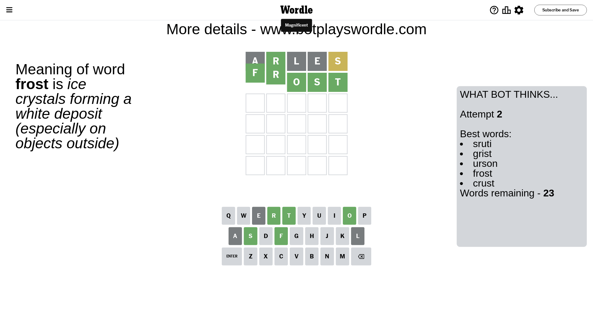

# Wordle for June 20, 2023 - \#731

## Attempt 1

This is the first attempt and we'll choose a random word to start with.

Let's start with word `arles`

Attempt for `arles` gives us 1 correct letters, 1 present letters and 3 wrong letters.

If we look into details, we can see that:

Letter `a` is not present in the word and we will not use it any more

Letter `r` should be at position 2

Letter `l` is not present in the word and we will not use it any more

Letter `e` is not present in the word and we will not use it any more

Letter `s` is on a different spot - this means that it cannot be at position 5

We got information about the correct letters and it should make next attempt easier

Some letters are missing (like `a`, `l`, `e`) but it's also important piece of information

Word should contain letters `[r s]`

That was a great guess that limited number of remaining words

## Attempt 2

Right now we have 23 words to choose from and best of them seem to be `[sruti grist urson frost crust]`

So far we know that possible letters are:

At position 1: `[b c d f g h i j k m n o p q r s t u v w x y z]`

At position 2: `[r]`

At position 3: `[b c d f g h i j k m n o p q r s t u v w x y z]`

At position 4: `[b c d f g h i j k m n o p q r s t u v w x y z]`

At position 5: `[b c d f g h i j k m n o p q r t u v w x y z]`

Next guess is `frost`, let's see what it gives us

That's the correct answer! The word is `frost`!

To be honest that was a pretty lucky guess, but it worked out well.

## Conclusion

Today's word is `frost` and it took 2 attempts to guess it

