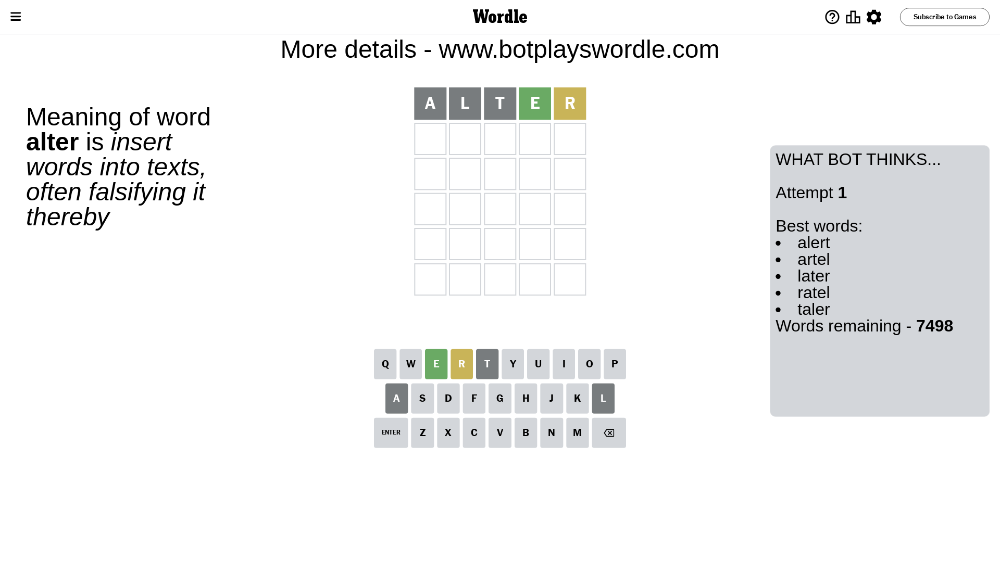

# Wordle for June 25, 2023 - \#736

## Attempt 1

This is the first attempt and we'll choose a random word to start with.

Let's start with word `alter`

Attempt for `alter` gives us 1 correct letters, 1 present letters and 3 wrong letters.

If we look into details, we can see that:

Letter `a` is not present in the word and we will not use it any more

Letter `l` is not present in the word and we will not use it any more

Letter `t` is not present in the word and we will not use it any more

Letter `e` should be at position 4

Letter `r` is on a different spot - this means that it cannot be at position 5

We got information about the correct letters and it should make next attempt easier

Some letters are missing (like `a`, `l`, `t`) but it's also important piece of information

Word should contain letters `[e r]`

That was a great guess that limited number of remaining words

## Attempt 2

Right now we have 82 words to choose from and best of them seem to be `[runed unred hired shred risen]`

So far we know that possible letters are:

At position 1: `[b c d e f g h i j k m n o p q r s u v w x y z]`

At position 2: `[b c d e f g h i j k m n o p q r s u v w x y z]`

At position 3: `[b c d e f g h i j k m n o p q r s u v w x y z]`

At position 4: `[e]`

At position 5: `[b c d e f g h i j k m n o p q s u v w x y z]`

Next guess is `shred`, let's see what it gives us

Attempt for `shred` gives us 1 correct letters, 2 present letters and 2 wrong letters.

If we look into details, we can see that:

Letter `s` is not present in the word and we will not use it any more

Letter `h` is not present in the word and we will not use it any more

Letter `r` is on a different spot - this means that it cannot be at position 3

Letter `d` is on a different spot - this means that it cannot be at position 5

Some letters are missing (like `s`, `h`) but it's also important piece of information

Word should contain letters `[e r d]`

That was a great guess that limited number of remaining words

## Attempt 3

Right now we have 2 words to choose from and best of them seem to be `[rodeo urdee]`

So far we know that possible letters are:

At position 1: `[b c d e f g i j k m n o p q r u v w x y z]`

At position 2: `[b c d e f g i j k m n o p q r u v w x y z]`

At position 3: `[b c d e f g i j k m n o p q u v w x y z]`

At position 4: `[e]`

At position 5: `[b c e f g i j k m n o p q u v w x y z]`

Next guess is `rodeo`, let's see what it gives us

That's the correct answer! The word is `rodeo`!

## Conclusion

Today's word is `rodeo` and it took 3 attempts to guess it

