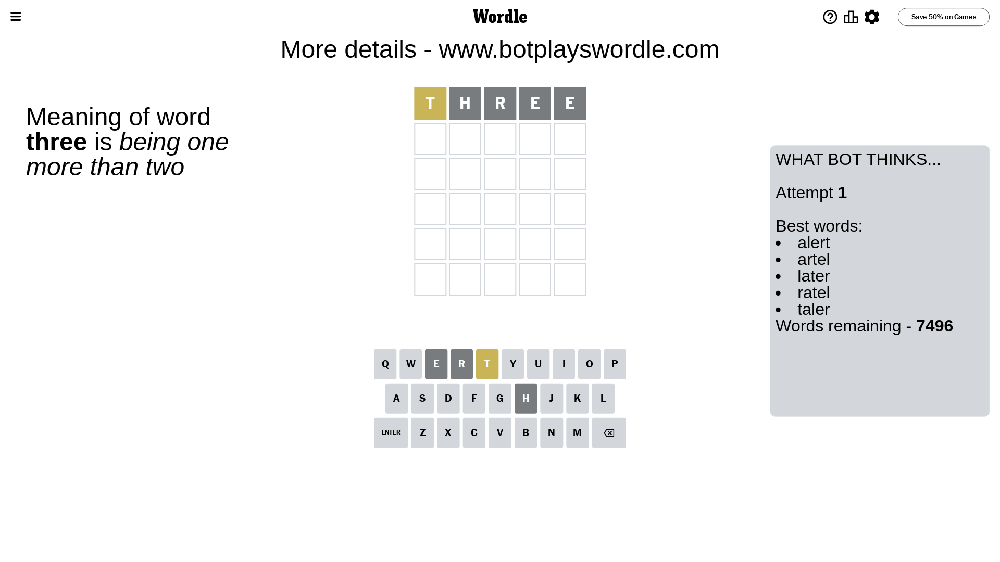
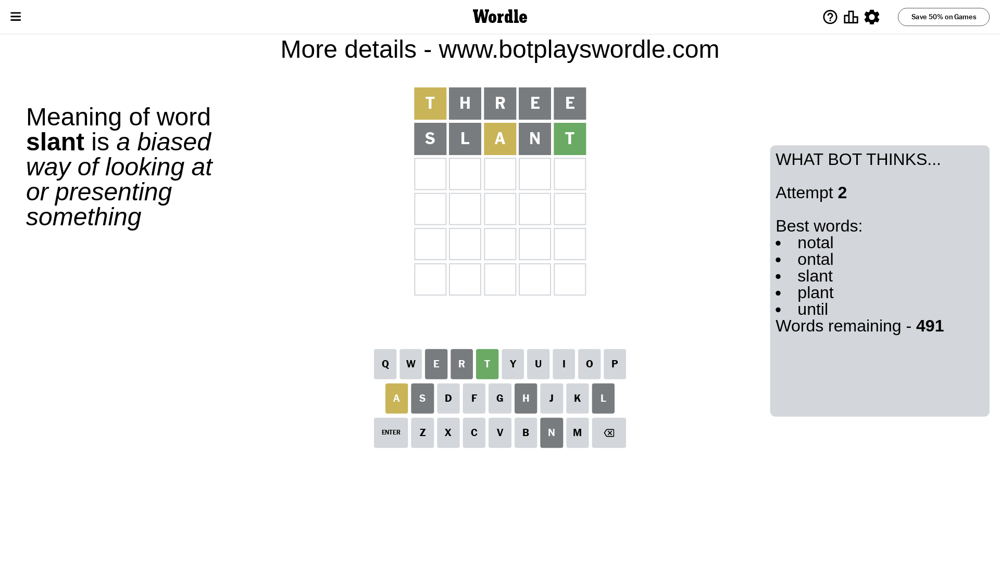
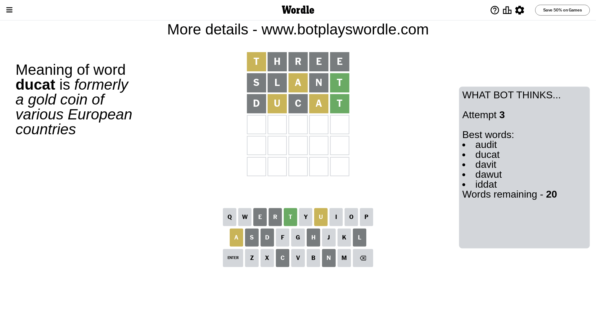
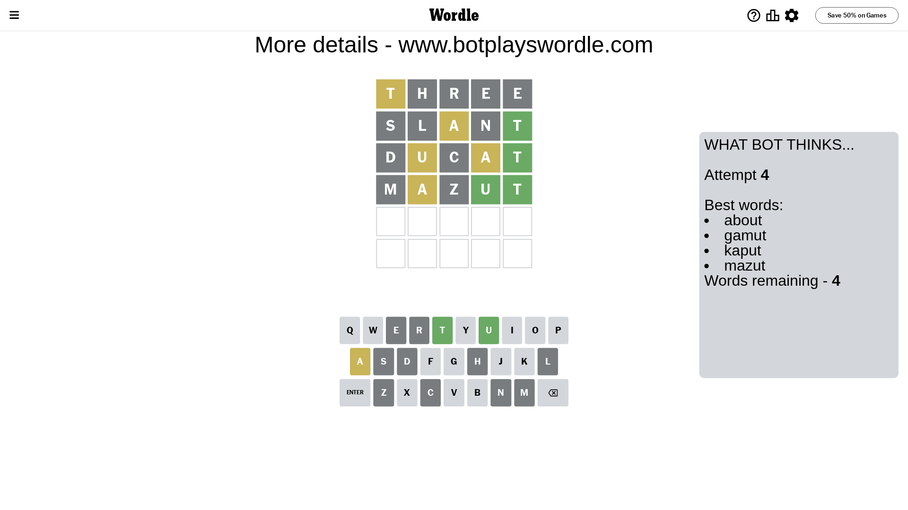
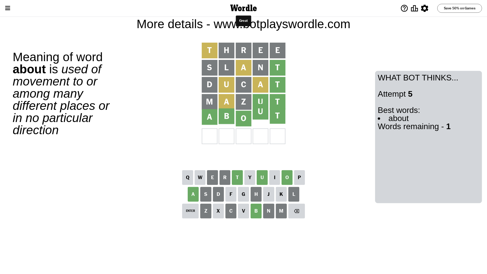

# Wordle for June 27, 2023 - \#738

## Attempt 1

This is the first attempt and we'll choose a random word to start with.

Let's start with word `three`

Attempt for `three` gives us 0 correct letters, 1 present letters and 4 wrong letters.

If we look into details, we can see that:

Letter `t` is on a different spot - this means that it cannot be at position 1

Letter `h` is not present in the word and we will not use it any more

Letter `r` is not present in the word and we will not use it any more

Letter `e` is not present in the word and we will not use it any more

Letter `e` is not present in the word and we will not use it any more

Some letters are missing (like `h`, `r`, `e`) but it's also important piece of information

Word should contain letters `[t]`

That was a great guess that limited number of remaining words

## Attempt 2

Right now we have 491 words to choose from and best of them seem to be `[notal ontal slant plant until]`

So far we know that possible letters are:

At position 1: `[a b c d f g i j k l m n o p q s u v w x y z]`

At position 2: `[a b c d f g i j k l m n o p q s t u v w x y z]`

At position 3: `[a b c d f g i j k l m n o p q s t u v w x y z]`

At position 4: `[a b c d f g i j k l m n o p q s t u v w x y z]`

At position 5: `[a b c d f g i j k l m n o p q s t u v w x y z]`

Next guess is `slant`, let's see what it gives us

Attempt for `slant` gives us 1 correct letters, 1 present letters and 3 wrong letters.

If we look into details, we can see that:

Letter `s` is not present in the word and we will not use it any more

Letter `l` is not present in the word and we will not use it any more

Letter `a` is on a different spot - this means that it cannot be at position 3

Letter `n` is not present in the word and we will not use it any more

Letter `t` should be at position 5

We got information about the correct letters and it should make next attempt easier

Some letters are missing (like `s`, `l`, `n`) but it's also important piece of information

Word should contain letters `[t a]`

That was a great guess that limited number of remaining words

## Attempt 3

Right now we have 20 words to choose from and best of them seem to be `[audit ducat davit dawut iddat]`

So far we know that possible letters are:

At position 1: `[a b c d f g i j k m o p q u v w x y z]`

At position 2: `[a b c d f g i j k m o p q t u v w x y z]`

At position 3: `[b c d f g i j k m o p q t u v w x y z]`

At position 4: `[a b c d f g i j k m o p q t u v w x y z]`

At position 5: `[t]`

Next guess is `ducat`, let's see what it gives us

Attempt for `ducat` gives us 1 correct letters, 2 present letters and 2 wrong letters.

If we look into details, we can see that:

Letter `d` is not present in the word and we will not use it any more

Letter `u` is on a different spot - this means that it cannot be at position 2

Letter `c` is not present in the word and we will not use it any more

Letter `a` is on a different spot - this means that it cannot be at position 4

Some letters are missing (like `d`, `c`) but it's also important piece of information

Word should contain letters `[t a u]`

Not a bad guess in general

## Attempt 4

Right now we have 4 words to choose from and best of them seem to be `[about gamut kaput mazut]`

So far we know that possible letters are:

At position 1: `[a b f g i j k m o p q u v w x y z]`

At position 2: `[a b f g i j k m o p q t v w x y z]`

At position 3: `[b f g i j k m o p q t u v w x y z]`

At position 4: `[b f g i j k m o p q t u v w x y z]`

At position 5: `[t]`

Next guess is `mazut`, let's see what it gives us

Attempt for `mazut` gives us 2 correct letters, 1 present letters and 2 wrong letters.

If we look into details, we can see that:

Letter `m` is not present in the word and we will not use it any more

Letter `a` is on a different spot - this means that it cannot be at position 2

Letter `z` is not present in the word and we will not use it any more

Letter `u` should be at position 4

We got information about the correct letters and it should make next attempt easier

Some letters are missing (like `m`, `z`) but it's also important piece of information

Word should contain letters `[t a u]`

Could be a better guess

## Attempt 5

Right now we have 1 words to choose from and best of them seem to be `[about]`

So far we know that possible letters are:

At position 1: `[a b f g i j k o p q u v w x y]`

At position 2: `[b f g i j k o p q t v w x y]`

At position 3: `[b f g i j k o p q t u v w x y]`

At position 4: `[u]`

At position 5: `[t]`

It must be `about`

That's the correct answer! The word is `about`!

## Conclusion

Today's word is `about` and it took 5 attempts to guess it

