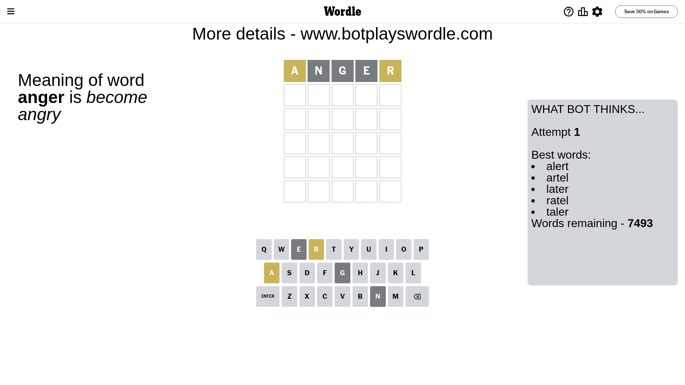
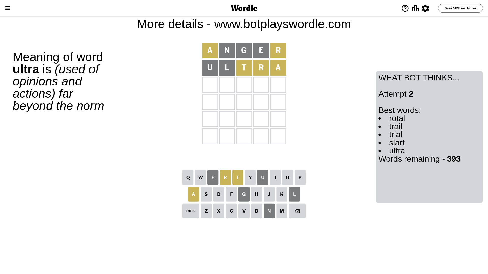
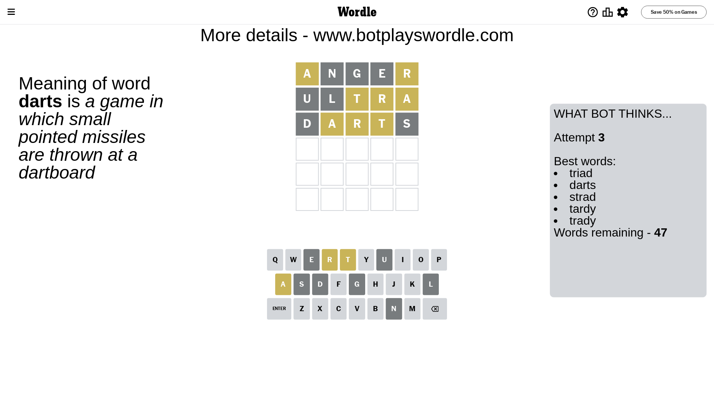
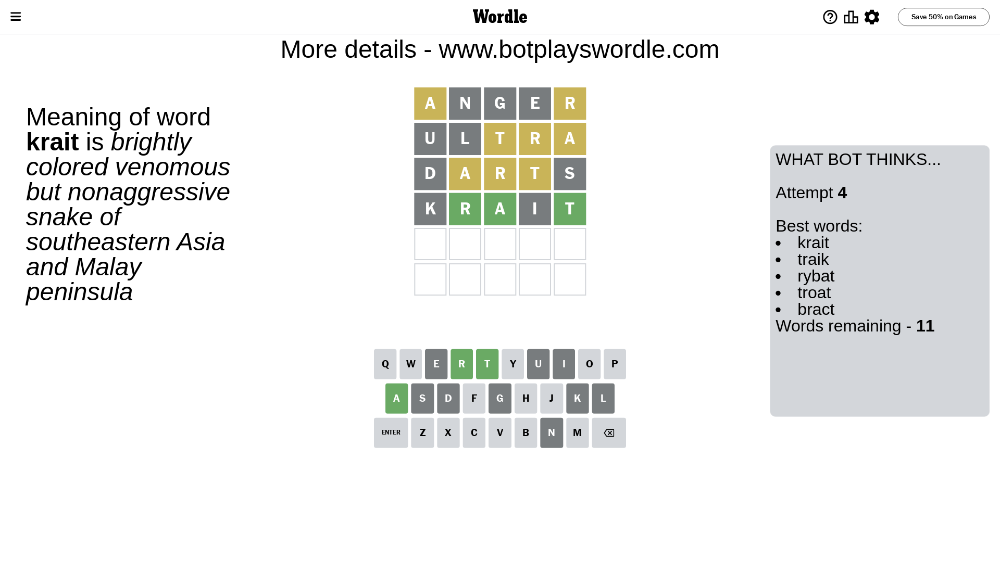
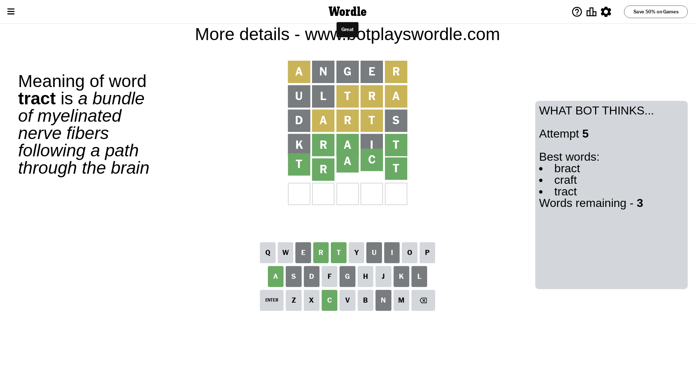

# Wordle for June 28, 2023 - \#739

## Attempt 1

This is the first attempt and we'll choose a random word to start with.

Let's start with word `anger`

Attempt for `anger` gives us 0 correct letters, 2 present letters and 3 wrong letters.

If we look into details, we can see that:

Letter `a` is on a different spot - this means that it cannot be at position 1

Letter `n` is not present in the word and we will not use it any more

Letter `g` is not present in the word and we will not use it any more

Letter `e` is not present in the word and we will not use it any more

Letter `r` is on a different spot - this means that it cannot be at position 5

Some letters are missing (like `n`, `g`, `e`) but it's also important piece of information

Word should contain letters `[a r]`

That was a great guess that limited number of remaining words

## Attempt 2

Right now we have 393 words to choose from and best of them seem to be `[rotal trail trial slart ultra]`

So far we know that possible letters are:

At position 1: `[b c d f h i j k l m o p q r s t u v w x y z]`

At position 2: `[a b c d f h i j k l m o p q r s t u v w x y z]`

At position 3: `[a b c d f h i j k l m o p q r s t u v w x y z]`

At position 4: `[a b c d f h i j k l m o p q r s t u v w x y z]`

At position 5: `[a b c d f h i j k l m o p q s t u v w x y z]`

Next guess is `ultra`, let's see what it gives us

Attempt for `ultra` gives us 0 correct letters, 3 present letters and 2 wrong letters.

If we look into details, we can see that:

Letter `u` is not present in the word and we will not use it any more

Letter `l` is not present in the word and we will not use it any more

Letter `t` is on a different spot - this means that it cannot be at position 3

Letter `r` is on a different spot - this means that it cannot be at position 4

Letter `a` is on a different spot - this means that it cannot be at position 5

Some letters are missing (like `u`, `l`) but it's also important piece of information

Word should contain letters `[a r t]`

That was a great guess that limited number of remaining words

## Attempt 3

Right now we have 47 words to choose from and best of them seem to be `[triad darts strad tardy trady]`

So far we know that possible letters are:

At position 1: `[b c d f h i j k m o p q r s t v w x y z]`

At position 2: `[a b c d f h i j k m o p q r s t v w x y z]`

At position 3: `[a b c d f h i j k m o p q r s v w x y z]`

At position 4: `[a b c d f h i j k m o p q s t v w x y z]`

At position 5: `[b c d f h i j k m o p q s t v w x y z]`

Next guess is `darts`, let's see what it gives us

Attempt for `darts` gives us 0 correct letters, 3 present letters and 2 wrong letters.

If we look into details, we can see that:

Letter `d` is not present in the word and we will not use it any more

Letter `a` is on a different spot - this means that it cannot be at position 2

Letter `r` is on a different spot - this means that it cannot be at position 3

Letter `t` is on a different spot - this means that it cannot be at position 4

Letter `s` is not present in the word and we will not use it any more

Some letters are missing (like `d`, `s`) but it's also important piece of information

Word should contain letters `[a r t]`

Not a bad guess in general

## Attempt 4

Right now we have 11 words to choose from and best of them seem to be `[krait traik rybat troat bract]`

So far we know that possible letters are:

At position 1: `[b c f h i j k m o p q r t v w x y z]`

At position 2: `[b c f h i j k m o p q r t v w x y z]`

At position 3: `[a b c f h i j k m o p q v w x y z]`

At position 4: `[a b c f h i j k m o p q v w x y z]`

At position 5: `[b c f h i j k m o p q t v w x y z]`

Next guess is `krait`, let's see what it gives us

Attempt for `krait` gives us 3 correct letters, 0 present letters and 2 wrong letters.

If we look into details, we can see that:

Letter `k` is not present in the word and we will not use it any more

Letter `r` should be at position 2

Letter `a` should be at position 3

Letter `i` is not present in the word and we will not use it any more

Letter `t` should be at position 5

We got information about the correct letters and it should make next attempt easier

Some letters are missing (like `k`, `i`) but it's also important piece of information

Word should contain letters `[a r t]`

Could be a better guess

## Attempt 5

Right now we have 3 words to choose from and best of them seem to be `[bract craft tract]`

So far we know that possible letters are:

At position 1: `[b c f h j m o p q r t v w x y z]`

At position 2: `[r]`

At position 3: `[a]`

At position 4: `[a b c f h j m o p q v w x y z]`

At position 5: `[t]`

Next guess is `tract`, let's see what it gives us

That's the correct answer! The word is `tract`!

## Conclusion

Today's word is `tract` and it took 5 attempts to guess it

