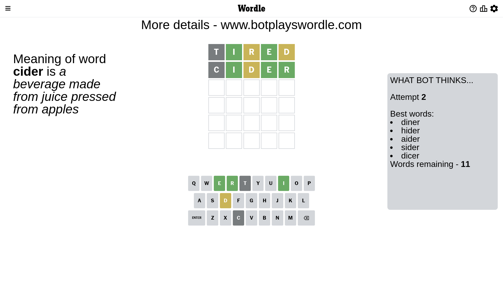

# Wordle for June 29, 2023 - \#740

## Attempt 1

This is the first attempt and we'll choose a random word to start with.

Let's start with word `oiler`

Attempt for `oiler` gives us 3 correct letters, 0 present letters and 2 wrong letters.

If we look into details, we can see that:

Letter `o` is not present in the word and we will not use it any more

Letter `i` should be at position 2

Letter `l` is not present in the word and we will not use it any more

Letter `e` should be at position 4

Letter `r` should be at position 5

We got information about the correct letters and it should make next attempt easier

Some letters are missing (like `o`, `l`) but it's also important piece of information

Word should contain letters `[i e r]`

That was a great guess that limited number of remaining words

## Attempt 2

Right now we have 55 words to choose from and best of them seem to be `[niter hider citer miter timer]`

So far we know that possible letters are:

At position 1: `[a b c d e f g h i j k m n p q r s t u v w x y z]`

At position 2: `[i]`

At position 3: `[a b c d e f g h i j k m n p q r s t u v w x y z]`

At position 4: `[e]`

At position 5: `[r]`

Next guess is `miter`, let's see what it gives us

Attempt for `miter` gives us 3 correct letters, 0 present letters and 2 wrong letters.

If we look into details, we can see that:

Letter `m` is not present in the word and we will not use it any more

Letter `t` is not present in the word and we will not use it any more

Some letters are missing (like `m`, `t`) but it's also important piece of information

Word should contain letters `[i e r]`

This was a waste, almost no valuable information...

## Attempt 3

Right now we have 39 words to choose from and best of them seem to be `[hider piner finer viner aider]`

So far we know that possible letters are:

At position 1: `[a b c d e f g h i j k n p q r s u v w x y z]`

At position 2: `[i]`

At position 3: `[a b c d e f g h i j k n p q r s u v w x y z]`

At position 4: `[e]`

At position 5: `[r]`

Next guess is `diner`, let's see what it gives us

That's the correct answer! The word is `diner`!

To be honest that was a pretty lucky guess, but it worked out well.

## Conclusion

Today's word is `diner` and it took 3 attempts to guess it

