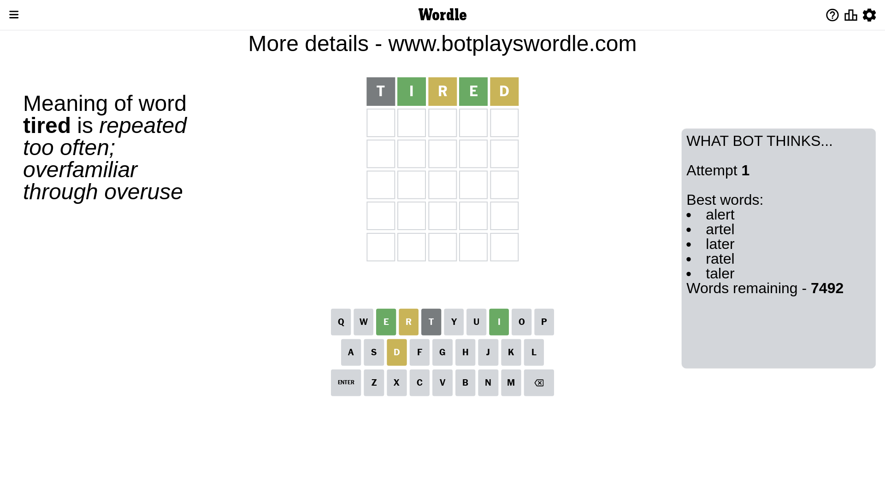

# Wordle for June 29, 2023 - \#740

## Attempt 1

This is the first attempt and we'll choose a random word to start with.

Let's start with word `crone`

Attempt for `crone` gives us 0 correct letters, 3 present letters and 2 wrong letters.

If we look into details, we can see that:

Letter `c` is not present in the word and we will not use it any more

Letter `r` is on a different spot - this means that it cannot be at position 2

Letter `o` is not present in the word and we will not use it any more

Letter `n` is on a different spot - this means that it cannot be at position 4

Letter `e` is on a different spot - this means that it cannot be at position 5

Some letters are missing (like `c`, `o`) but it's also important piece of information

Word should contain letters `[r n e]`

That was a great guess that limited number of remaining words

## Attempt 2

Right now we have 62 words to choose from and best of them seem to be `[learn renal inert inter niter]`

So far we know that possible letters are:

At position 1: `[a b d e f g h i j k l m n p q r s t u v w x y z]`

At position 2: `[a b d e f g h i j k l m n p q s t u v w x y z]`

At position 3: `[a b d e f g h i j k l m n p q r s t u v w x y z]`

At position 4: `[a b d e f g h i j k l m p q r s t u v w x y z]`

At position 5: `[a b d f g h i j k l m n p q r s t u v w x y z]`

Next guess is `learn`, let's see what it gives us

Attempt for `learn` gives us 0 correct letters, 3 present letters and 2 wrong letters.

If we look into details, we can see that:

Letter `l` is not present in the word and we will not use it any more

Letter `e` is on a different spot - this means that it cannot be at position 2

Letter `a` is not present in the word and we will not use it any more

Letter `r` is on a different spot - this means that it cannot be at position 4

Letter `n` is on a different spot - this means that it cannot be at position 5

Some letters are missing (like `l`, `a`) but it's also important piece of information

Word should contain letters `[r n e]`

Could be a better guess

## Attempt 3

Right now we have 16 words to choose from and best of them seem to be `[inter niter tuner enter diner]`

So far we know that possible letters are:

At position 1: `[b d e f g h i j k m n p q r s t u v w x y z]`

At position 2: `[b d f g h i j k m n p q s t u v w x y z]`

At position 3: `[b d e f g h i j k m n p q r s t u v w x y z]`

At position 4: `[b d e f g h i j k m p q s t u v w x y z]`

At position 5: `[b d f g h i j k m p q r s t u v w x y z]`

Next guess is `tuner`, let's see what it gives us

Attempt for `tuner` gives us 3 correct letters, 0 present letters and 2 wrong letters.

If we look into details, we can see that:

Letter `t` is not present in the word and we will not use it any more

Letter `u` is not present in the word and we will not use it any more

Letter `n` should be at position 3

Letter `e` should be at position 4

Letter `r` should be at position 5

We got information about the correct letters and it should make next attempt easier

Some letters are missing (like `t`, `u`) but it's also important piece of information

Word should contain letters `[r n e]`

Could be a better guess

## Attempt 4

Right now we have 6 words to choose from and best of them seem to be `[diner miner piner finer viner]`

So far we know that possible letters are:

At position 1: `[b d e f g h i j k m n p q r s v w x y z]`

At position 2: `[b d f g h i j k m n p q s v w x y z]`

At position 3: `[n]`

At position 4: `[e]`

At position 5: `[r]`

Next guess is `miner`, let's see what it gives us

Attempt for `miner` gives us 4 correct letters, 0 present letters and 1 wrong letters.

If we look into details, we can see that:

Letter `m` is not present in the word and we will not use it any more

Letter `i` should be at position 2

We got information about the correct letters and it should make next attempt easier

Some letters are missing (like `m`) but it's also important piece of information

Word should contain letters `[r n e i]`

This was a waste, almost no valuable information...

## Attempt 5

Right now we have 4 words to choose from and best of them seem to be `[diner piner finer viner]`

So far we know that possible letters are:

At position 1: `[b d e f g h i j k n p q r s v w x y z]`

At position 2: `[i]`

At position 3: `[n]`

At position 4: `[e]`

At position 5: `[r]`

Next guess is `diner`, let's see what it gives us

That's the correct answer! The word is `diner`!

## Conclusion

Today's word is `diner` and it took 5 attempts to guess it

