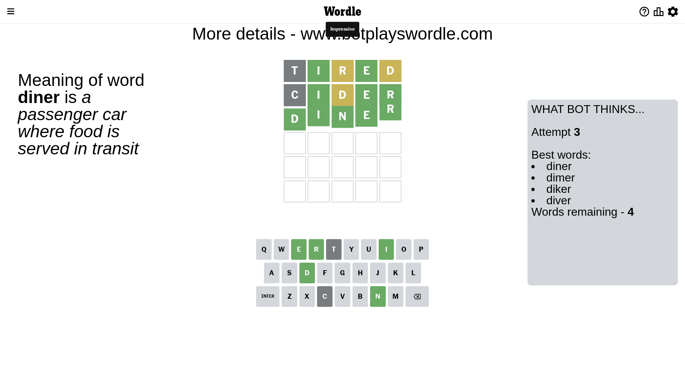

# Wordle for June 29, 2023 - \#740

## Attempt 1

This is the first attempt and we'll choose a random word to start with.

Let's start with word `tired`

Attempt for `tired` gives us 2 correct letters, 2 present letters and 1 wrong letters.

If we look into details, we can see that:

Letter `t` is not present in the word and we will not use it any more

Letter `i` should be at position 2

Letter `r` is on a different spot - this means that it cannot be at position 3

Letter `e` should be at position 4

Letter `d` is on a different spot - this means that it cannot be at position 5

We got information about the correct letters and it should make next attempt easier

Some letters are missing (like `t`) but it's also important piece of information

Word should contain letters `[i r e d]`

That was a great guess that limited number of remaining words

## Attempt 2

Right now we have 11 words to choose from and best of them seem to be `[diner hider aider sider dicer]`

So far we know that possible letters are:

At position 1: `[a b c d e f g h i j k l m n o p q r s u v w x y z]`

At position 2: `[i]`

At position 3: `[a b c d e f g h i j k l m n o p q s u v w x y z]`

At position 4: `[e]`

At position 5: `[a b c e f g h i j k l m n o p q r s u v w x y z]`

Next guess is `cider`, let's see what it gives us

Attempt for `cider` gives us 3 correct letters, 1 present letters and 1 wrong letters.

If we look into details, we can see that:

Letter `c` is not present in the word and we will not use it any more

Letter `d` is on a different spot - this means that it cannot be at position 3

Letter `r` should be at position 5

We got information about the correct letters and it should make next attempt easier

Some letters are missing (like `c`) but it's also important piece of information

Word should contain letters `[i r e d]`

Could be a better guess

## Attempt 3

Right now we have 4 words to choose from and best of them seem to be `[diner dimer diker diver]`

So far we know that possible letters are:

At position 1: `[a b d e f g h i j k l m n o p q r s u v w x y z]`

At position 2: `[i]`

At position 3: `[a b e f g h i j k l m n o p q s u v w x y z]`

At position 4: `[e]`

At position 5: `[r]`

Next guess is `diner`, let's see what it gives us

That's the correct answer! The word is `diner`!

## Conclusion

Today's word is `diner` and it took 3 attempts to guess it

