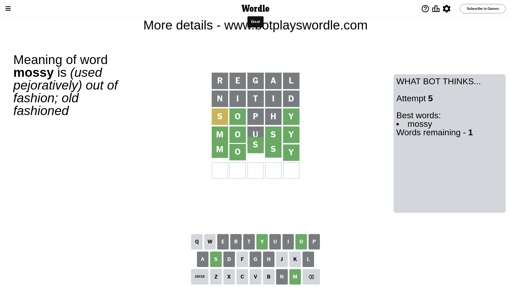

# Wordle for July 2, 2023 - \#743

## Attempt 1

This is the first attempt and we'll choose a random word to start with.

Let's start with word `regal`

Attempt for `regal` gives us 0 correct letters, 0 present letters and 5 wrong letters.

If we look into details, we can see that:

Letter `r` is not present in the word and we will not use it any more

Letter `e` is not present in the word and we will not use it any more

Letter `g` is not present in the word and we will not use it any more

Letter `a` is not present in the word and we will not use it any more

Letter `l` is not present in the word and we will not use it any more

Some letters are missing (like `r`, `e`, `g`, `a`, `l`) but it's also important piece of information

So far we don't know any of the letters!

That was a great guess that limited number of remaining words

## Attempt 2

Right now we have 849 words to choose from and best of them seem to be `[stond notch shunt month nitid]`

So far we know that possible letters are:

At position 1: `[b c d f h i j k m n o p q s t u v w x y z]`

At position 2: `[b c d f h i j k m n o p q s t u v w x y z]`

At position 3: `[b c d f h i j k m n o p q s t u v w x y z]`

At position 4: `[b c d f h i j k m n o p q s t u v w x y z]`

At position 5: `[b c d f h i j k m n o p q s t u v w x y z]`

Next guess is `nitid`, let's see what it gives us

Attempt for `nitid` gives us 0 correct letters, 0 present letters and 5 wrong letters.

If we look into details, we can see that:

Letter `n` is not present in the word and we will not use it any more

Letter `i` is not present in the word and we will not use it any more

Letter `t` is not present in the word and we will not use it any more

Letter `i` is not present in the word and we will not use it any more

Letter `d` is not present in the word and we will not use it any more

Some letters are missing (like `n`, `i`, `t`, `d`) but it's also important piece of information

So far we don't know any of the letters!

Not a bad guess in general

## Attempt 3

Right now we have 181 words to choose from and best of them seem to be `[housy hocus sophy bosch shock]`

So far we know that possible letters are:

At position 1: `[b c f h j k m o p q s u v w x y z]`

At position 2: `[b c f h j k m o p q s u v w x y z]`

At position 3: `[b c f h j k m o p q s u v w x y z]`

At position 4: `[b c f h j k m o p q s u v w x y z]`

At position 5: `[b c f h j k m o p q s u v w x y z]`

Next guess is `sophy`, let's see what it gives us

Attempt for `sophy` gives us 2 correct letters, 1 present letters and 2 wrong letters.

If we look into details, we can see that:

Letter `s` is on a different spot - this means that it cannot be at position 1

Letter `o` should be at position 2

Letter `p` is not present in the word and we will not use it any more

Letter `h` is not present in the word and we will not use it any more

Letter `y` should be at position 5

We got information about the correct letters and it should make next attempt easier

Some letters are missing (like `p`, `h`) but it's also important piece of information

Word should contain letters `[s o y]`

That was a great guess that limited number of remaining words

## Attempt 4

Right now we have 5 words to choose from and best of them seem to be `[mousy bousy bosky mossy bossy]`

So far we know that possible letters are:

At position 1: `[b c f j k m o q u v w x y z]`

At position 2: `[o]`

At position 3: `[b c f j k m o q s u v w x y z]`

At position 4: `[b c f j k m o q s u v w x y z]`

At position 5: `[y]`

Next guess is `mousy`, let's see what it gives us

Attempt for `mousy` gives us 4 correct letters, 0 present letters and 1 wrong letters.

If we look into details, we can see that:

Letter `m` should be at position 1

Letter `u` is not present in the word and we will not use it any more

Letter `s` should be at position 4

We got information about the correct letters and it should make next attempt easier

Some letters are missing (like `u`) but it's also important piece of information

Word should contain letters `[s o y m]`

Not a bad guess in general

## Attempt 5

Right now we have 1 words to choose from and best of them seem to be `[mossy]`

So far we know that possible letters are:

At position 1: `[m]`

At position 2: `[o]`

At position 3: `[b c f j k m o q s v w x y z]`

At position 4: `[s]`

At position 5: `[y]`

It must be `mossy`

That's the correct answer! The word is `mossy`!

## Conclusion

Today's word is `mossy` and it took 5 attempts to guess it

