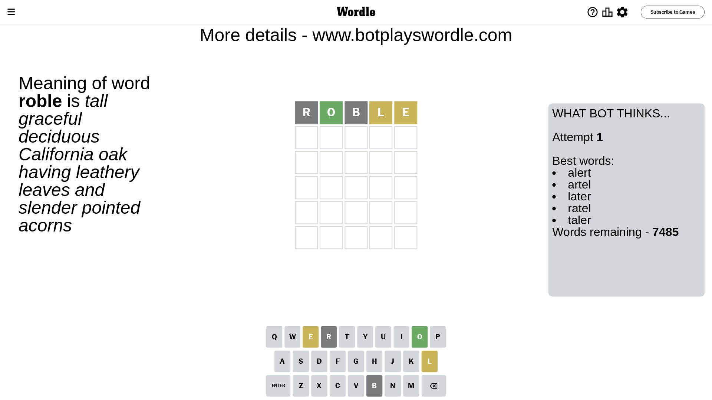
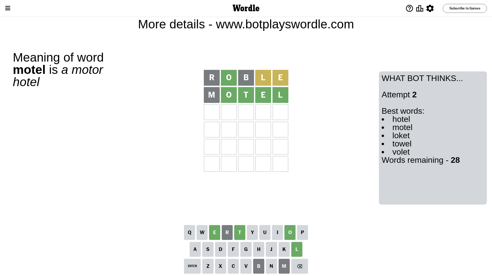
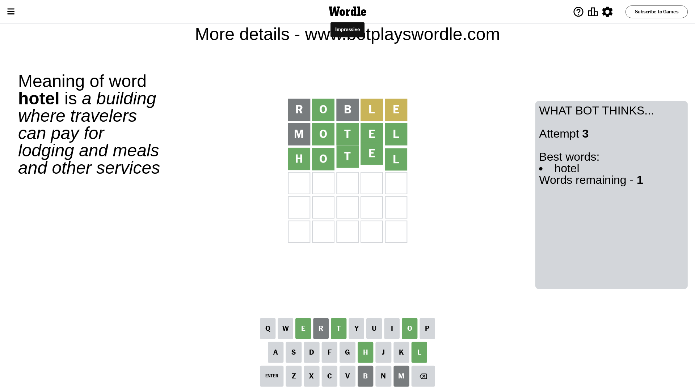

# Wordle for July 3, 2023 - \#744

## Attempt 1

This is the first attempt and we'll choose a random word to start with.

Let's start with word `roble`

Attempt for `roble` gives us 1 correct letters, 2 present letters and 2 wrong letters.

If we look into details, we can see that:

Letter `r` is not present in the word and we will not use it any more

Letter `o` should be at position 2

Letter `b` is not present in the word and we will not use it any more

Letter `l` is on a different spot - this means that it cannot be at position 4

Letter `e` is on a different spot - this means that it cannot be at position 5

We got information about the correct letters and it should make next attempt easier

Some letters are missing (like `r`, `b`) but it's also important piece of information

Word should contain letters `[o l e]`

That was a great guess that limited number of remaining words

## Attempt 2

Right now we have 28 words to choose from and best of them seem to be `[hotel motel loket towel volet]`

So far we know that possible letters are:

At position 1: `[a c d e f g h i j k l m n o p q s t u v w x y z]`

At position 2: `[o]`

At position 3: `[a c d e f g h i j k l m n o p q s t u v w x y z]`

At position 4: `[a c d e f g h i j k m n o p q s t u v w x y z]`

At position 5: `[a c d f g h i j k l m n o p q s t u v w x y z]`

Next guess is `motel`, let's see what it gives us

Attempt for `motel` gives us 4 correct letters, 0 present letters and 1 wrong letters.

If we look into details, we can see that:

Letter `m` is not present in the word and we will not use it any more

Letter `t` should be at position 3

Letter `e` should be at position 4

Letter `l` should be at position 5

We got information about the correct letters and it should make next attempt easier

Some letters are missing (like `m`) but it's also important piece of information

Word should contain letters `[o l e t]`

That was a great guess that limited number of remaining words

## Attempt 3

Right now we have 1 words to choose from and best of them seem to be `[hotel]`

So far we know that possible letters are:

At position 1: `[a c d e f g h i j k l n o p q s t u v w x y z]`

At position 2: `[o]`

At position 3: `[t]`

At position 4: `[e]`

At position 5: `[l]`

It must be `hotel`

That's the correct answer! The word is `hotel`!

## Conclusion

Today's word is `hotel` and it took 3 attempts to guess it

