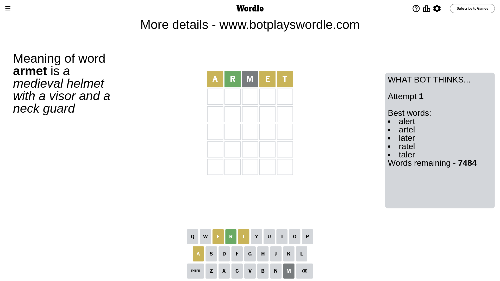
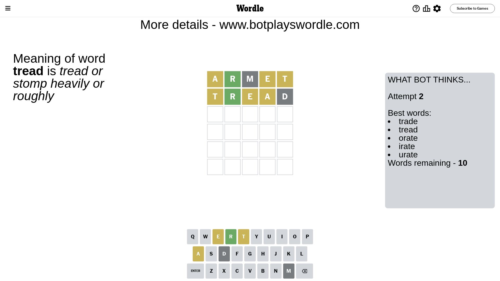
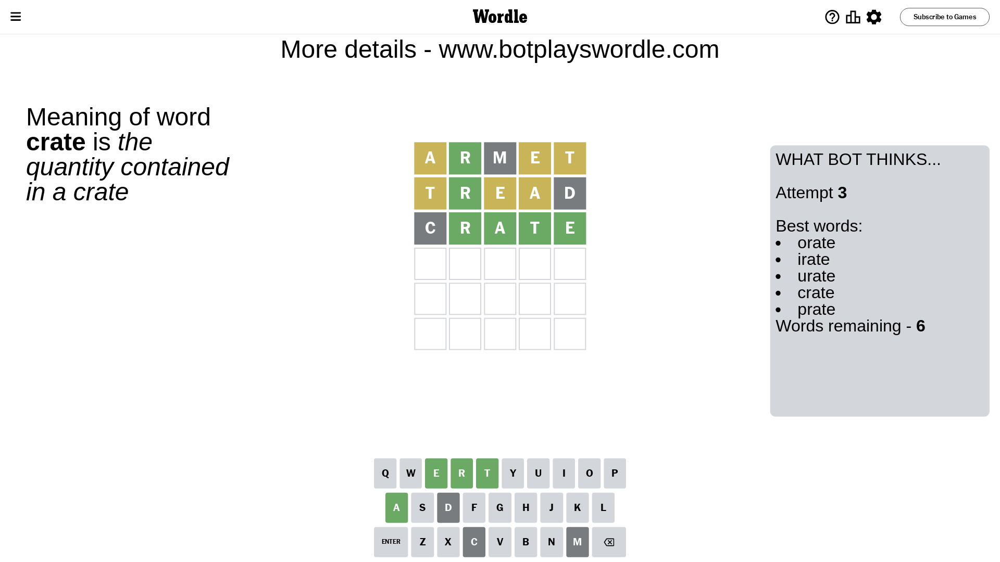
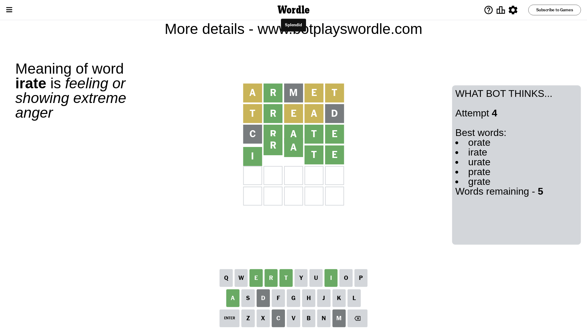

# Wordle for July 4, 2023 - \#745

## Attempt 1

This is the first attempt and we'll choose a random word to start with.

Let's start with word `armet`

Attempt for `armet` gives us 1 correct letters, 3 present letters and 1 wrong letters.

If we look into details, we can see that:

Letter `a` is on a different spot - this means that it cannot be at position 1

Letter `r` should be at position 2

Letter `m` is not present in the word and we will not use it any more

Letter `e` is on a different spot - this means that it cannot be at position 4

Letter `t` is on a different spot - this means that it cannot be at position 5

We got information about the correct letters and it should make next attempt easier

Some letters are missing (like `m`) but it's also important piece of information

Word should contain letters `[a r e t]`

That was a great guess that limited number of remaining words

## Attempt 2

Right now we have 10 words to choose from and best of them seem to be `[trade tread orate irate urate]`

So far we know that possible letters are:

At position 1: `[b c d e f g h i j k l n o p q r s t u v w x y z]`

At position 2: `[r]`

At position 3: `[a b c d e f g h i j k l n o p q r s t u v w x y z]`

At position 4: `[a b c d f g h i j k l n o p q r s t u v w x y z]`

At position 5: `[a b c d e f g h i j k l n o p q r s u v w x y z]`

Next guess is `tread`, let's see what it gives us

Attempt for `tread` gives us 1 correct letters, 3 present letters and 1 wrong letters.

If we look into details, we can see that:

Letter `t` is on a different spot - this means that it cannot be at position 1

Letter `e` is on a different spot - this means that it cannot be at position 3

Letter `a` is on a different spot - this means that it cannot be at position 4

Letter `d` is not present in the word and we will not use it any more

Some letters are missing (like `d`) but it's also important piece of information

Word should contain letters `[a r e t]`

This was a waste, almost no valuable information...

## Attempt 3

Right now we have 6 words to choose from and best of them seem to be `[orate irate urate crate prate]`

So far we know that possible letters are:

At position 1: `[b c e f g h i j k l n o p q r s u v w x y z]`

At position 2: `[r]`

At position 3: `[a b c f g h i j k l n o p q r s t u v w x y z]`

At position 4: `[b c f g h i j k l n o p q r s t u v w x y z]`

At position 5: `[a b c e f g h i j k l n o p q r s u v w x y z]`

Next guess is `crate`, let's see what it gives us

Attempt for `crate` gives us 4 correct letters, 0 present letters and 1 wrong letters.

If we look into details, we can see that:

Letter `c` is not present in the word and we will not use it any more

Letter `a` should be at position 3

Letter `t` should be at position 4

Letter `e` should be at position 5

We got information about the correct letters and it should make next attempt easier

Some letters are missing (like `c`) but it's also important piece of information

Word should contain letters `[a r e t]`

This was a waste, almost no valuable information...

## Attempt 4

Right now we have 5 words to choose from and best of them seem to be `[orate irate urate prate grate]`

So far we know that possible letters are:

At position 1: `[b e f g h i j k l n o p q r s u v w x y z]`

At position 2: `[r]`

At position 3: `[a]`

At position 4: `[t]`

At position 5: `[e]`

Next guess is `irate`, let's see what it gives us

That's the correct answer! The word is `irate`!

## Conclusion

Today's word is `irate` and it took 4 attempts to guess it

