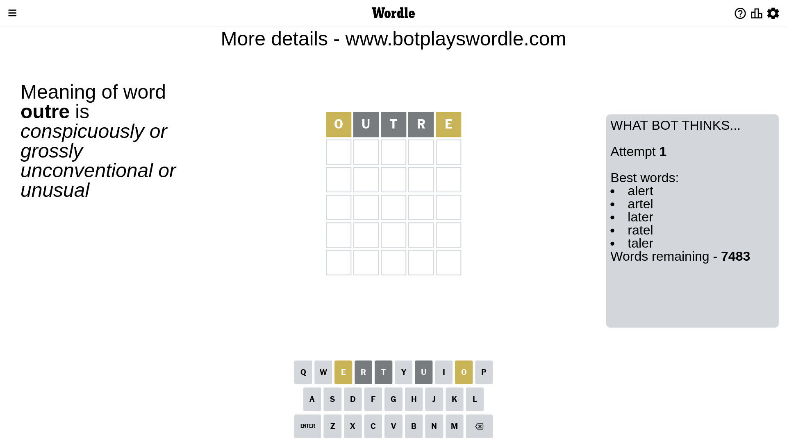
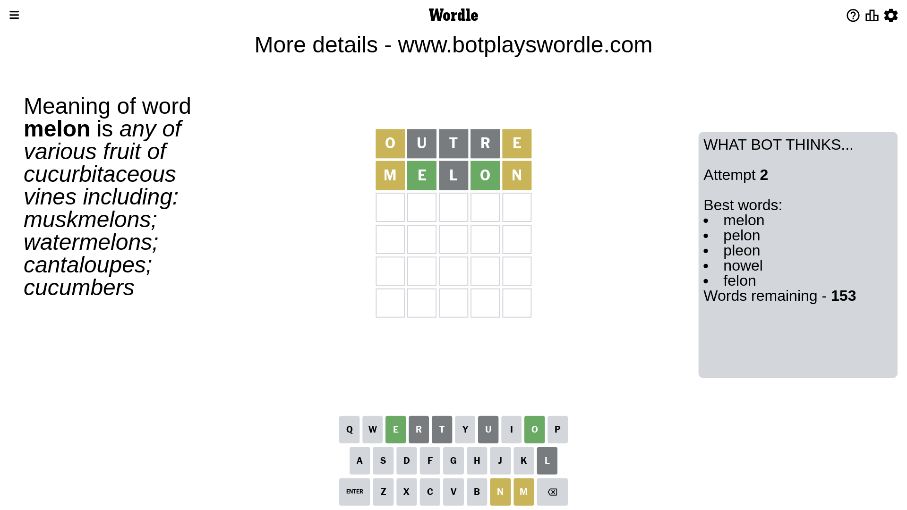
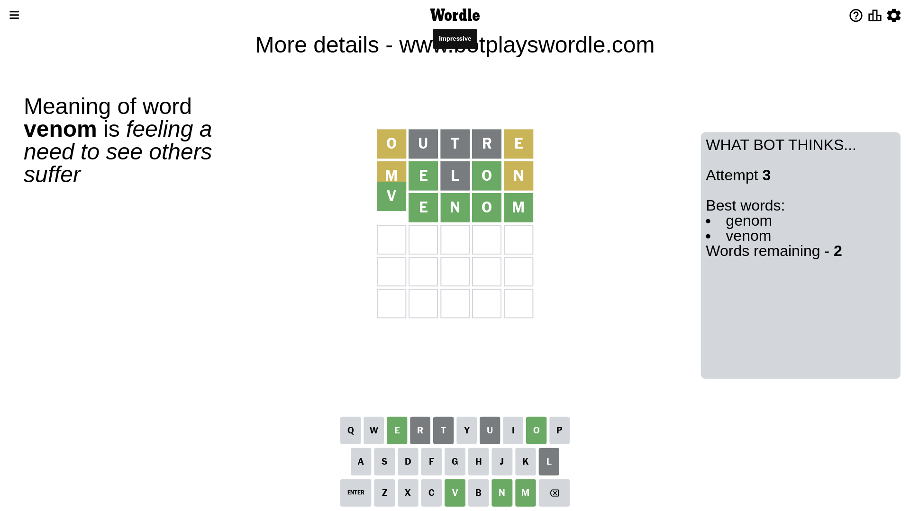

# Wordle for July 5, 2023 - \#746

## Attempt 1

This is the first attempt and we'll choose a random word to start with.

Let's start with word `outre`

Attempt for `outre` gives us 0 correct letters, 2 present letters and 3 wrong letters.

If we look into details, we can see that:

Letter `o` is on a different spot - this means that it cannot be at position 1

Letter `u` is not present in the word and we will not use it any more

Letter `t` is not present in the word and we will not use it any more

Letter `r` is not present in the word and we will not use it any more

Letter `e` is on a different spot - this means that it cannot be at position 5

Some letters are missing (like `u`, `t`, `r`) but it's also important piece of information

Word should contain letters `[o e]`

That was a great guess that limited number of remaining words

## Attempt 2

Right now we have 153 words to choose from and best of them seem to be `[melon pelon pleon nowel felon]`

So far we know that possible letters are:

At position 1: `[a b c d e f g h i j k l m n p q s v w x y z]`

At position 2: `[a b c d e f g h i j k l m n o p q s v w x y z]`

At position 3: `[a b c d e f g h i j k l m n o p q s v w x y z]`

At position 4: `[a b c d e f g h i j k l m n o p q s v w x y z]`

At position 5: `[a b c d f g h i j k l m n o p q s v w x y z]`

Next guess is `melon`, let's see what it gives us

Attempt for `melon` gives us 2 correct letters, 2 present letters and 1 wrong letters.

If we look into details, we can see that:

Letter `m` is on a different spot - this means that it cannot be at position 1

Letter `e` should be at position 2

Letter `l` is not present in the word and we will not use it any more

Letter `o` should be at position 4

Letter `n` is on a different spot - this means that it cannot be at position 5

We got information about the correct letters and it should make next attempt easier

Some letters are missing (like `l`) but it's also important piece of information

Word should contain letters `[o e m n]`

That was a great guess that limited number of remaining words

## Attempt 3

Right now we have 2 words to choose from and best of them seem to be `[genom venom]`

So far we know that possible letters are:

At position 1: `[a b c d e f g h i j k n p q s v w x y z]`

At position 2: `[e]`

At position 3: `[a b c d e f g h i j k m n o p q s v w x y z]`

At position 4: `[o]`

At position 5: `[a b c d f g h i j k m o p q s v w x y z]`

Next guess is `venom`, let's see what it gives us

That's the correct answer! The word is `venom`!

## Conclusion

Today's word is `venom` and it took 3 attempts to guess it

