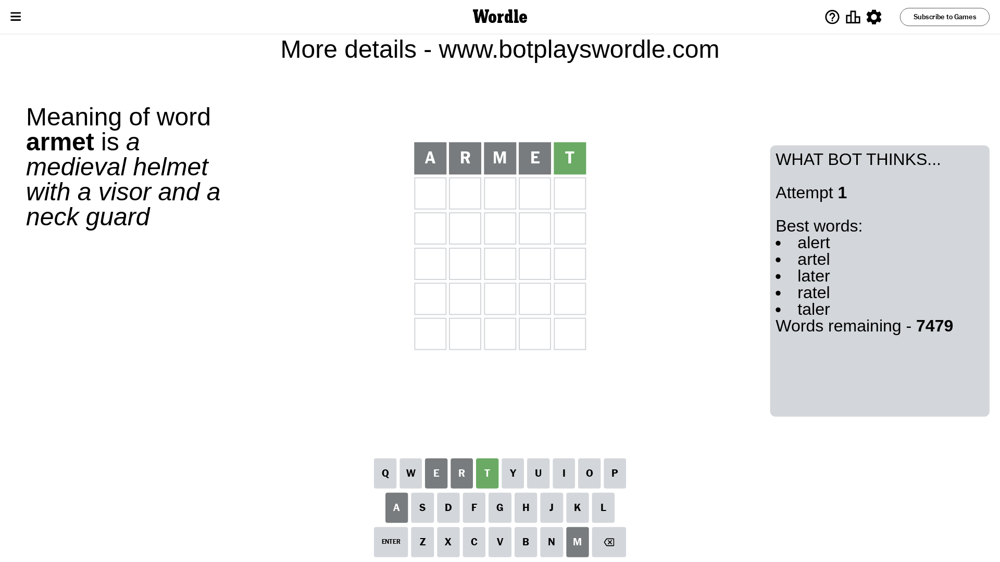
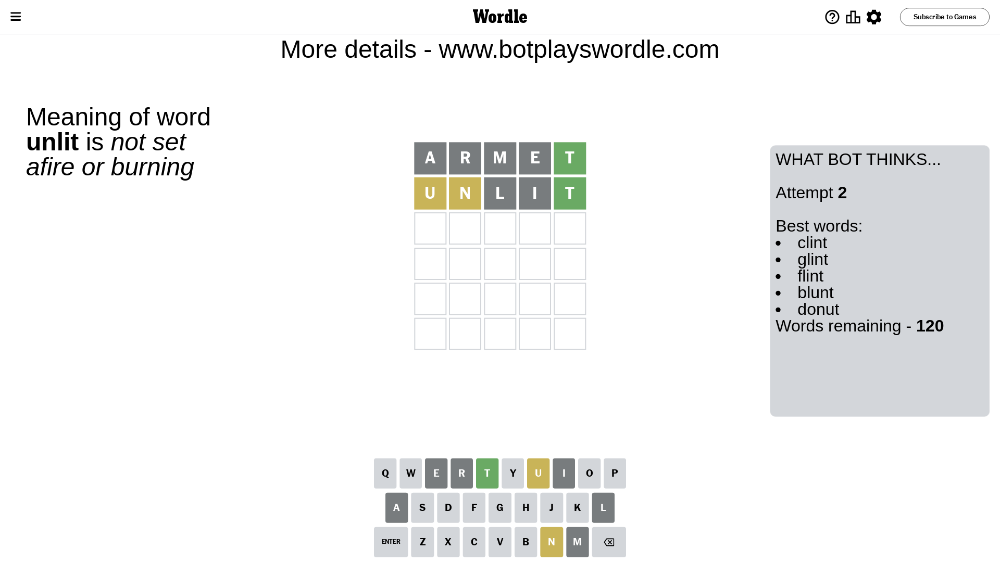
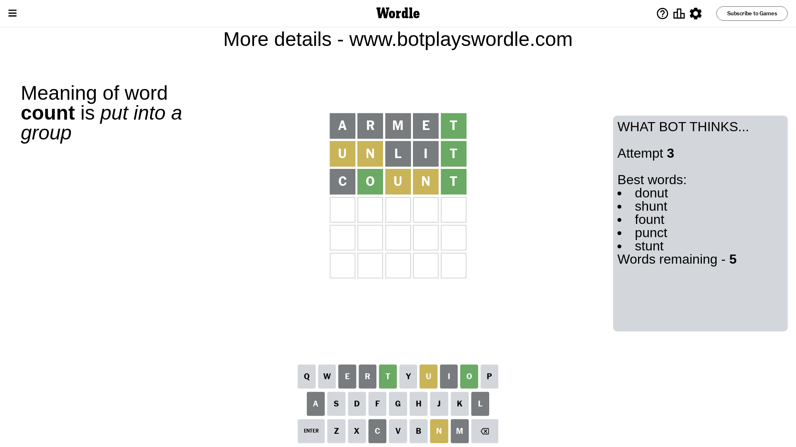
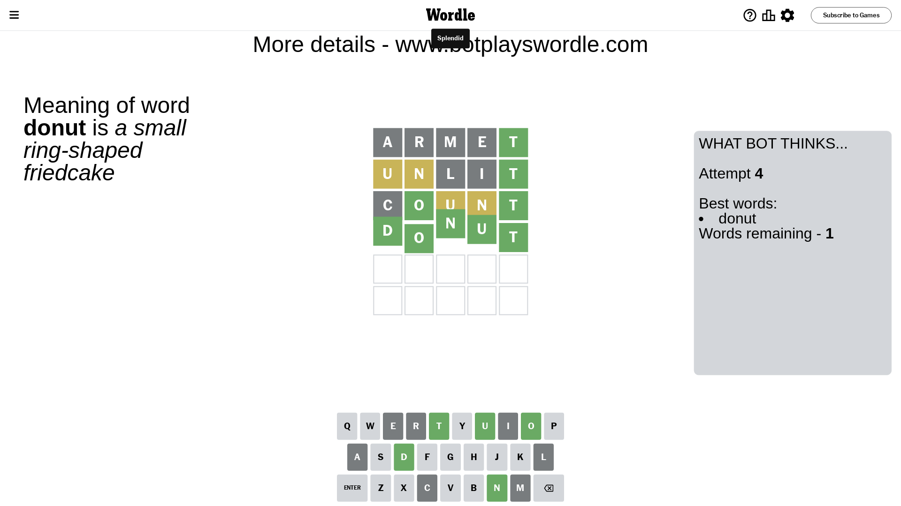

# Wordle for July 7, 2023 - \#748

## Attempt 1

This is the first attempt and we'll choose a random word to start with.

Let's start with word `armet`

Attempt for `armet` gives us 1 correct letters, 0 present letters and 4 wrong letters.

If we look into details, we can see that:

Letter `a` is not present in the word and we will not use it any more

Letter `r` is not present in the word and we will not use it any more

Letter `m` is not present in the word and we will not use it any more

Letter `e` is not present in the word and we will not use it any more

Letter `t` should be at position 5

We got information about the correct letters and it should make next attempt easier

Some letters are missing (like `a`, `r`, `m`, `e`) but it's also important piece of information

Word should contain letters `[t]`

That was a great guess that limited number of remaining words

## Attempt 2

Right now we have 120 words to choose from and best of them seem to be `[clint glint flint blunt donut]`

So far we know that possible letters are:

At position 1: `[b c d f g h i j k l n o p q s t u v w x y z]`

At position 2: `[b c d f g h i j k l n o p q s t u v w x y z]`

At position 3: `[b c d f g h i j k l n o p q s t u v w x y z]`

At position 4: `[b c d f g h i j k l n o p q s t u v w x y z]`

At position 5: `[t]`

Next guess is `unlit`, let's see what it gives us

Attempt for `unlit` gives us 1 correct letters, 2 present letters and 2 wrong letters.

If we look into details, we can see that:

Letter `u` is on a different spot - this means that it cannot be at position 1

Letter `n` is on a different spot - this means that it cannot be at position 2

Letter `l` is not present in the word and we will not use it any more

Letter `i` is not present in the word and we will not use it any more

Some letters are missing (like `l`, `i`) but it's also important piece of information

Word should contain letters `[t u n]`

That was a great guess that limited number of remaining words

## Attempt 3

Right now we have 5 words to choose from and best of them seem to be `[donut shunt fount punct stunt]`

So far we know that possible letters are:

At position 1: `[b c d f g h j k n o p q s t v w x y z]`

At position 2: `[b c d f g h j k o p q s t u v w x y z]`

At position 3: `[b c d f g h j k n o p q s t u v w x y z]`

At position 4: `[b c d f g h j k n o p q s t u v w x y z]`

At position 5: `[t]`

Next guess is `count`, let's see what it gives us

Attempt for `count` gives us 2 correct letters, 2 present letters and 1 wrong letters.

If we look into details, we can see that:

Letter `c` is not present in the word and we will not use it any more

Letter `o` should be at position 2

Letter `u` is on a different spot - this means that it cannot be at position 3

Letter `n` is on a different spot - this means that it cannot be at position 4

We got information about the correct letters and it should make next attempt easier

Some letters are missing (like `c`) but it's also important piece of information

Word should contain letters `[t u n o]`

Not a bad guess in general

## Attempt 4

Right now we have 1 words to choose from and best of them seem to be `[donut]`

So far we know that possible letters are:

At position 1: `[b d f g h j k n o p q s t v w x y z]`

At position 2: `[o]`

At position 3: `[b d f g h j k n o p q s t v w x y z]`

At position 4: `[b d f g h j k o p q s t u v w x y z]`

At position 5: `[t]`

It must be `donut`

That's the correct answer! The word is `donut`!

## Conclusion

Today's word is `donut` and it took 4 attempts to guess it

