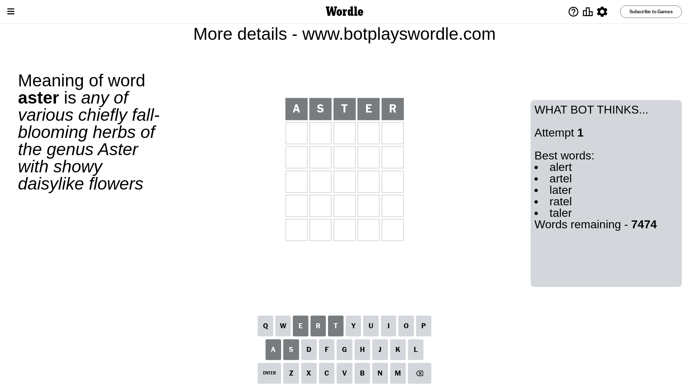
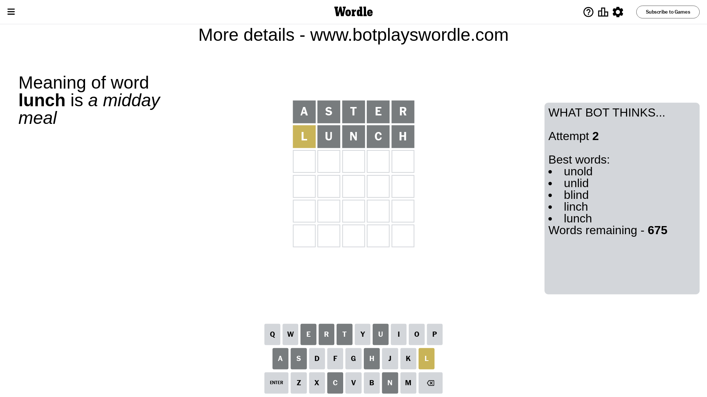
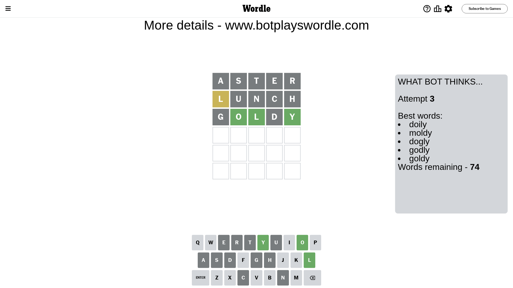
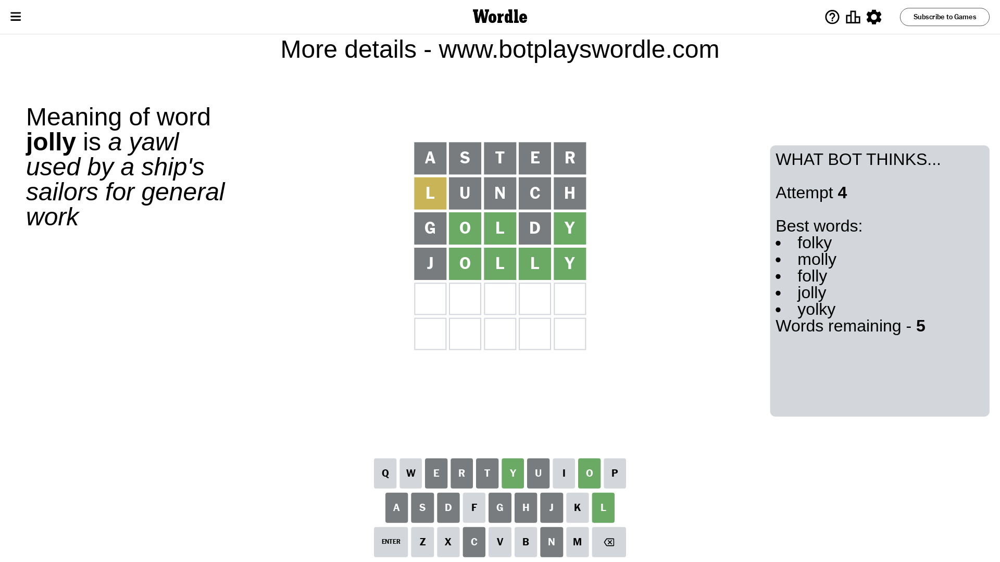
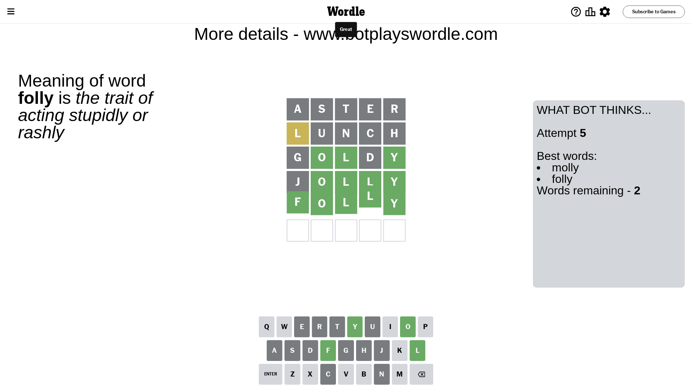

# Wordle for July 10, 2023 - \#751

## Attempt 1

This is the first attempt and we'll choose a random word to start with.

Let's start with word `aster`

Attempt for `aster` gives us 0 correct letters, 0 present letters and 5 wrong letters.

If we look into details, we can see that:

Letter `a` is not present in the word and we will not use it any more

Letter `s` is not present in the word and we will not use it any more

Letter `t` is not present in the word and we will not use it any more

Letter `e` is not present in the word and we will not use it any more

Letter `r` is not present in the word and we will not use it any more

Some letters are missing (like `a`, `s`, `t`, `e`, `r`) but it's also important piece of information

So far we don't know any of the letters!

That was a great guess that limited number of remaining words

## Attempt 2

Right now we have 675 words to choose from and best of them seem to be `[unold unlid blind linch lunch]`

So far we know that possible letters are:

At position 1: `[b c d f g h i j k l m n o p q u v w x y z]`

At position 2: `[b c d f g h i j k l m n o p q u v w x y z]`

At position 3: `[b c d f g h i j k l m n o p q u v w x y z]`

At position 4: `[b c d f g h i j k l m n o p q u v w x y z]`

At position 5: `[b c d f g h i j k l m n o p q u v w x y z]`

Next guess is `lunch`, let's see what it gives us

Attempt for `lunch` gives us 0 correct letters, 1 present letters and 4 wrong letters.

If we look into details, we can see that:

Letter `l` is on a different spot - this means that it cannot be at position 1

Letter `u` is not present in the word and we will not use it any more

Letter `n` is not present in the word and we will not use it any more

Letter `c` is not present in the word and we will not use it any more

Letter `h` is not present in the word and we will not use it any more

Some letters are missing (like `u`, `n`, `c`, `h`) but it's also important piece of information

Word should contain letters `[l]`

That was a great guess that limited number of remaining words

## Attempt 3

Right now we have 74 words to choose from and best of them seem to be `[doily moldy dogly godly goldy]`

So far we know that possible letters are:

At position 1: `[b d f g i j k m o p q v w x y z]`

At position 2: `[b d f g i j k l m o p q v w x y z]`

At position 3: `[b d f g i j k l m o p q v w x y z]`

At position 4: `[b d f g i j k l m o p q v w x y z]`

At position 5: `[b d f g i j k l m o p q v w x y z]`

Next guess is `goldy`, let's see what it gives us

Attempt for `goldy` gives us 3 correct letters, 0 present letters and 2 wrong letters.

If we look into details, we can see that:

Letter `g` is not present in the word and we will not use it any more

Letter `o` should be at position 2

Letter `l` should be at position 3

Letter `d` is not present in the word and we will not use it any more

Letter `y` should be at position 5

We got information about the correct letters and it should make next attempt easier

Some letters are missing (like `g`, `d`) but it's also important piece of information

Word should contain letters `[l o y]`

That was a great guess that limited number of remaining words

## Attempt 4

Right now we have 5 words to choose from and best of them seem to be `[folky molly folly jolly yolky]`

So far we know that possible letters are:

At position 1: `[b f i j k m o p q v w x y z]`

At position 2: `[o]`

At position 3: `[l]`

At position 4: `[b f i j k l m o p q v w x y z]`

At position 5: `[y]`

Next guess is `jolly`, let's see what it gives us

Attempt for `jolly` gives us 4 correct letters, 0 present letters and 1 wrong letters.

If we look into details, we can see that:

Letter `j` is not present in the word and we will not use it any more

Letter `l` should be at position 4

We got information about the correct letters and it should make next attempt easier

Some letters are missing (like `j`) but it's also important piece of information

Word should contain letters `[l o y]`

Could be a better guess

## Attempt 5

Right now we have 2 words to choose from and best of them seem to be `[molly folly]`

So far we know that possible letters are:

At position 1: `[b f i k m o p q v w x y z]`

At position 2: `[o]`

At position 3: `[l]`

At position 4: `[l]`

At position 5: `[y]`

Next guess is `folly`, let's see what it gives us

That's the correct answer! The word is `folly`!

## Conclusion

Today's word is `folly` and it took 5 attempts to guess it

