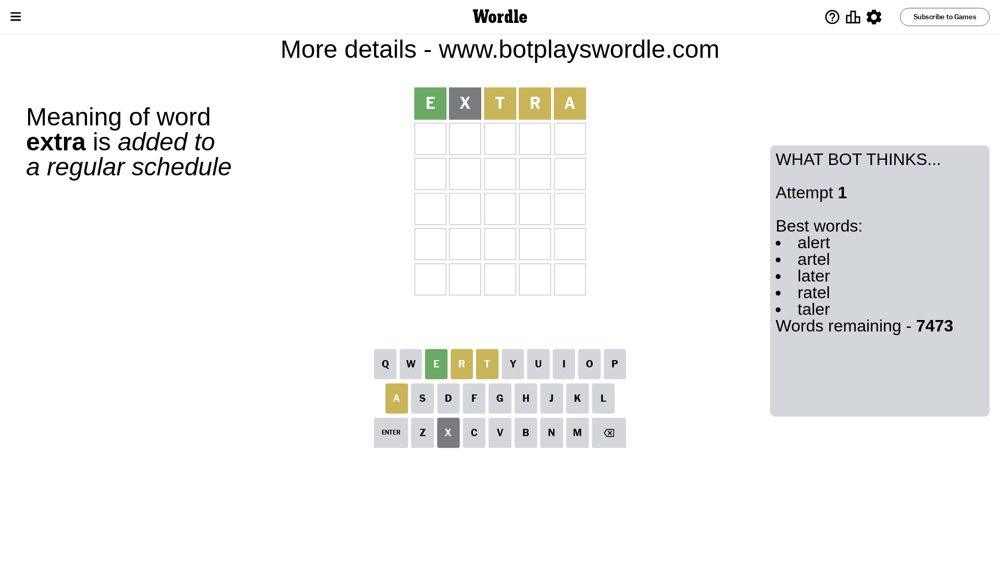
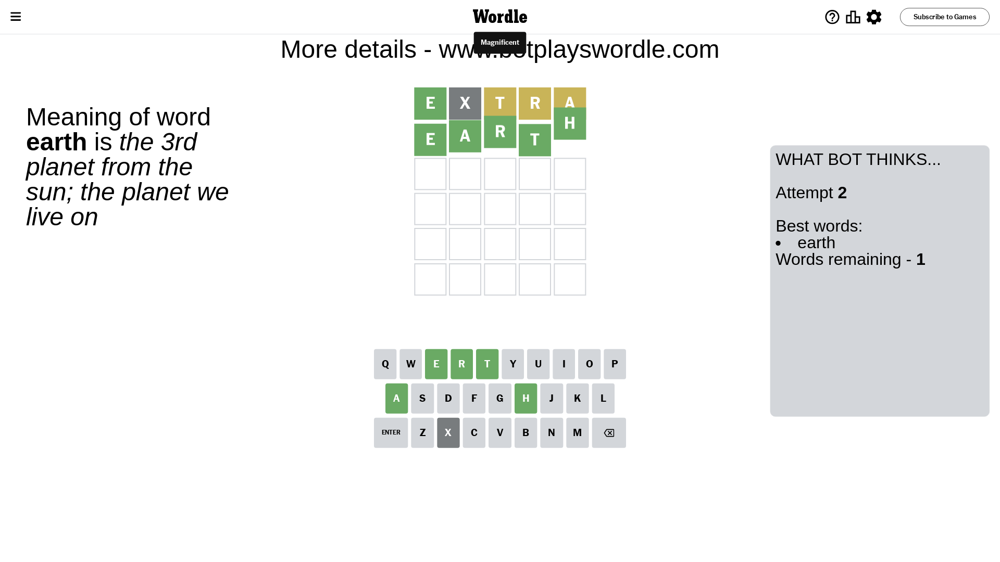

# Wordle for July 11, 2023 - \#752

## Attempt 1

This is the first attempt and we'll choose a random word to start with.

Let's start with word `extra`

Attempt for `extra` gives us 1 correct letters, 3 present letters and 1 wrong letters.

If we look into details, we can see that:

Letter `e` should be at position 1

Letter `x` is not present in the word and we will not use it any more

Letter `t` is on a different spot - this means that it cannot be at position 3

Letter `r` is on a different spot - this means that it cannot be at position 4

Letter `a` is on a different spot - this means that it cannot be at position 5

We got information about the correct letters and it should make next attempt easier

Some letters are missing (like `x`) but it's also important piece of information

Word should contain letters `[e t r a]`

That was a great guess that limited number of remaining words

## Attempt 2

Right now we have 1 words to choose from and best of them seem to be `[earth]`

So far we know that possible letters are:

At position 1: `[e]`

At position 2: `[a b c d e f g h i j k l m n o p q r s t u v w y z]`

At position 3: `[a b c d e f g h i j k l m n o p q r s u v w y z]`

At position 4: `[a b c d e f g h i j k l m n o p q s t u v w y z]`

At position 5: `[b c d e f g h i j k l m n o p q r s t u v w y z]`

It must be `earth`

That's the correct answer! The word is `earth`!

## Conclusion

Today's word is `earth` and it took 2 attempts to guess it

