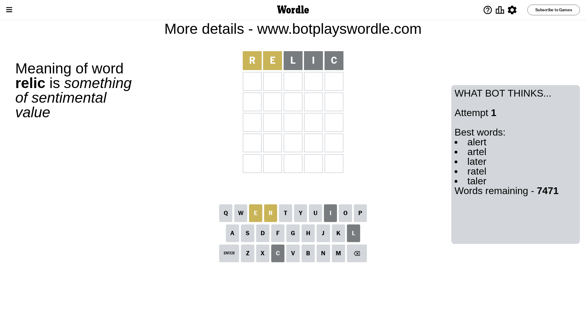
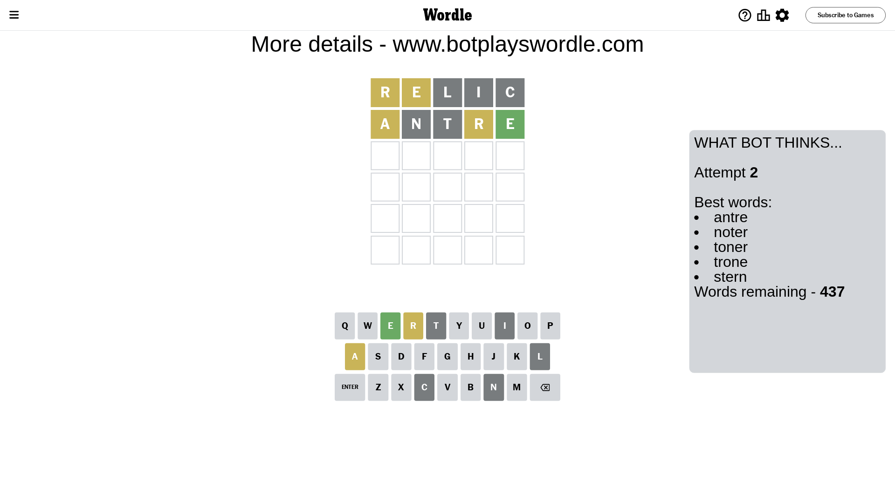
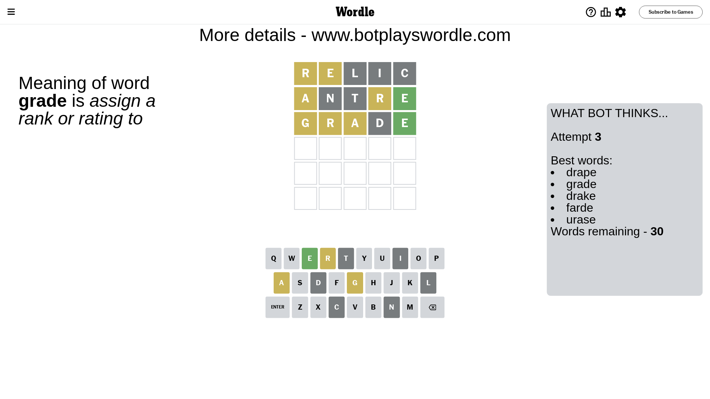
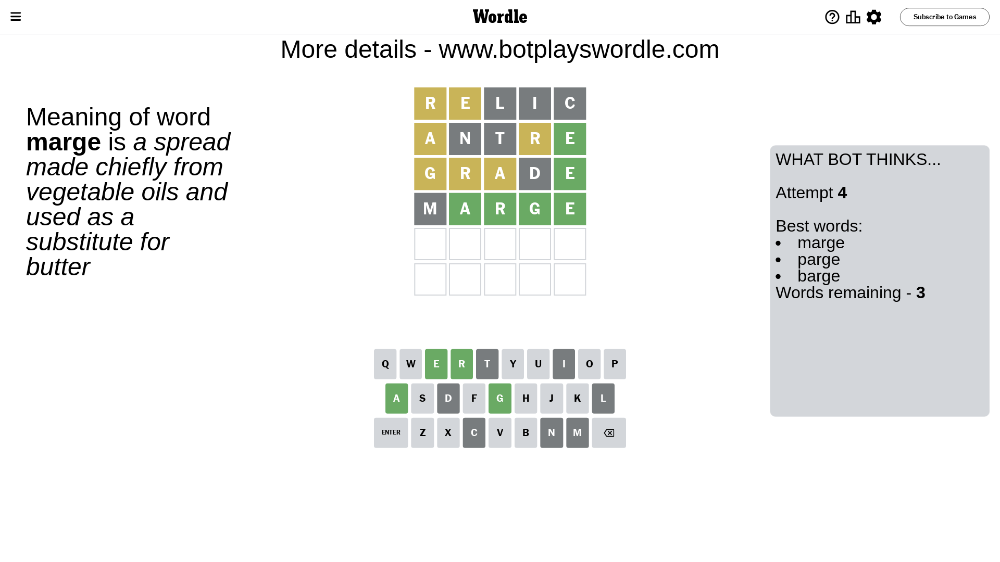
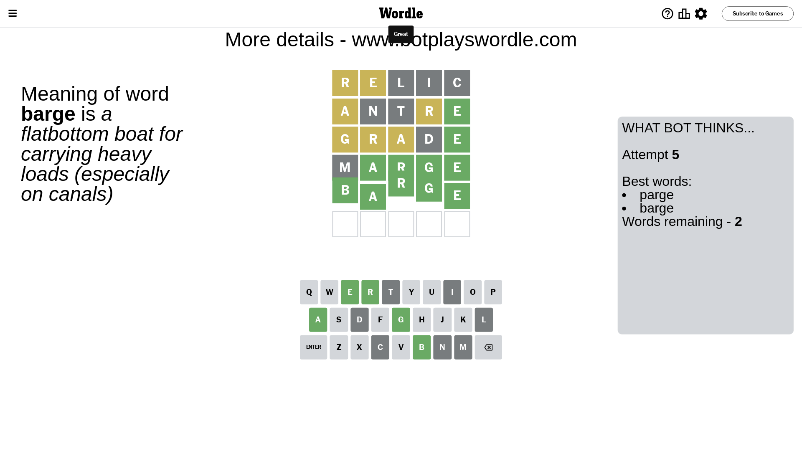

# Wordle for July 13, 2023 - \#754

## Attempt 1

This is the first attempt and we'll choose a random word to start with.

Let's start with word `relic`

Attempt for `relic` gives us 0 correct letters, 2 present letters and 3 wrong letters.

If we look into details, we can see that:

Letter `r` is on a different spot - this means that it cannot be at position 1

Letter `e` is on a different spot - this means that it cannot be at position 2

Letter `l` is not present in the word and we will not use it any more

Letter `i` is not present in the word and we will not use it any more

Letter `c` is not present in the word and we will not use it any more

Some letters are missing (like `l`, `i`, `c`) but it's also important piece of information

Word should contain letters `[r e]`

That was a great guess that limited number of remaining words

## Attempt 2

Right now we have 437 words to choose from and best of them seem to be `[antre noter toner trone stern]`

So far we know that possible letters are:

At position 1: `[a b d e f g h j k m n o p q s t u v w x y z]`

At position 2: `[a b d f g h j k m n o p q r s t u v w x y z]`

At position 3: `[a b d e f g h j k m n o p q r s t u v w x y z]`

At position 4: `[a b d e f g h j k m n o p q r s t u v w x y z]`

At position 5: `[a b d e f g h j k m n o p q r s t u v w x y z]`

Next guess is `antre`, let's see what it gives us

Attempt for `antre` gives us 1 correct letters, 2 present letters and 2 wrong letters.

If we look into details, we can see that:

Letter `a` is on a different spot - this means that it cannot be at position 1

Letter `n` is not present in the word and we will not use it any more

Letter `t` is not present in the word and we will not use it any more

Letter `r` is on a different spot - this means that it cannot be at position 4

Letter `e` should be at position 5

We got information about the correct letters and it should make next attempt easier

Some letters are missing (like `n`, `t`) but it's also important piece of information

Word should contain letters `[r e a]`

That was a great guess that limited number of remaining words

## Attempt 3

Right now we have 30 words to choose from and best of them seem to be `[drape grade drake farde urase]`

So far we know that possible letters are:

At position 1: `[b d e f g h j k m o p q s u v w x y z]`

At position 2: `[a b d f g h j k m o p q r s u v w x y z]`

At position 3: `[a b d e f g h j k m o p q r s u v w x y z]`

At position 4: `[a b d e f g h j k m o p q s u v w x y z]`

At position 5: `[e]`

Next guess is `grade`, let's see what it gives us

Attempt for `grade` gives us 1 correct letters, 3 present letters and 1 wrong letters.

If we look into details, we can see that:

Letter `g` is on a different spot - this means that it cannot be at position 1

Letter `r` is on a different spot - this means that it cannot be at position 2

Letter `a` is on a different spot - this means that it cannot be at position 3

Letter `d` is not present in the word and we will not use it any more

Some letters are missing (like `d`) but it's also important piece of information

Word should contain letters `[r e a g]`

That was a great guess that limited number of remaining words

## Attempt 4

Right now we have 3 words to choose from and best of them seem to be `[marge parge barge]`

So far we know that possible letters are:

At position 1: `[b e f h j k m o p q s u v w x y z]`

At position 2: `[a b f g h j k m o p q s u v w x y z]`

At position 3: `[b e f g h j k m o p q r s u v w x y z]`

At position 4: `[a b e f g h j k m o p q s u v w x y z]`

At position 5: `[e]`

Next guess is `marge`, let's see what it gives us

Attempt for `marge` gives us 4 correct letters, 0 present letters and 1 wrong letters.

If we look into details, we can see that:

Letter `m` is not present in the word and we will not use it any more

Letter `a` should be at position 2

Letter `r` should be at position 3

Letter `g` should be at position 4

We got information about the correct letters and it should make next attempt easier

Some letters are missing (like `m`) but it's also important piece of information

Word should contain letters `[r e a g]`

This was a waste, almost no valuable information...

## Attempt 5

Right now we have 2 words to choose from and best of them seem to be `[parge barge]`

So far we know that possible letters are:

At position 1: `[b e f h j k o p q s u v w x y z]`

At position 2: `[a]`

At position 3: `[r]`

At position 4: `[g]`

At position 5: `[e]`

Next guess is `barge`, let's see what it gives us

That's the correct answer! The word is `barge`!

## Conclusion

Today's word is `barge` and it took 5 attempts to guess it

