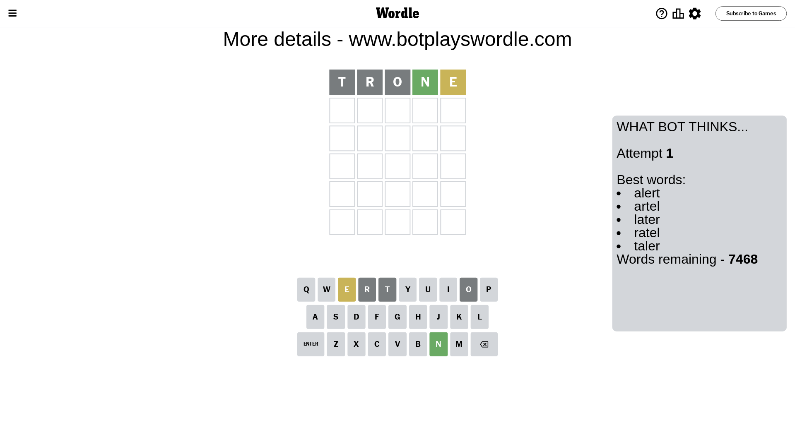
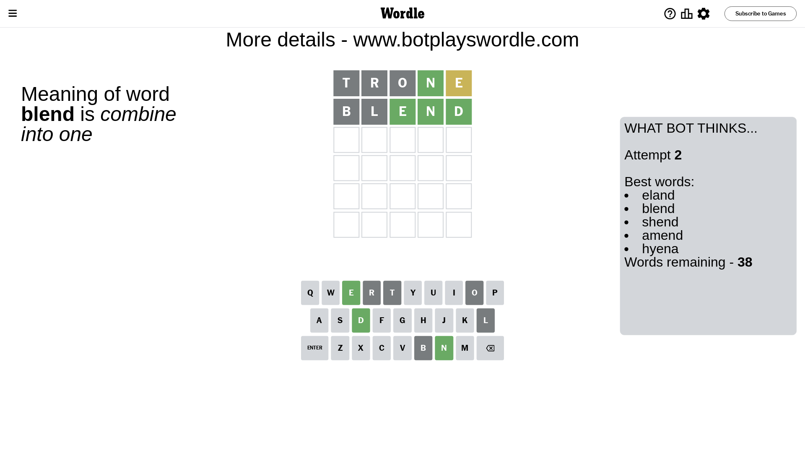
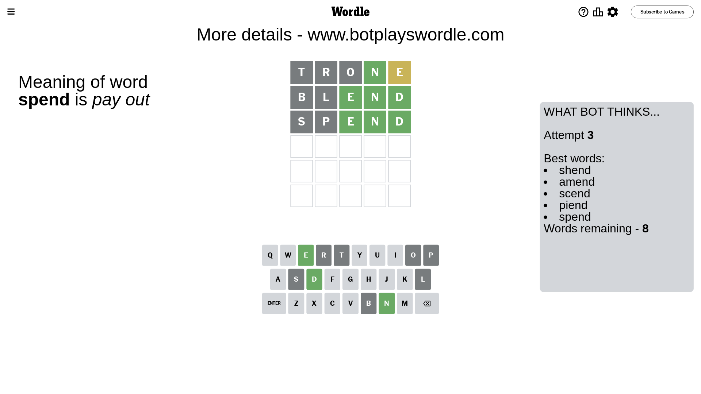
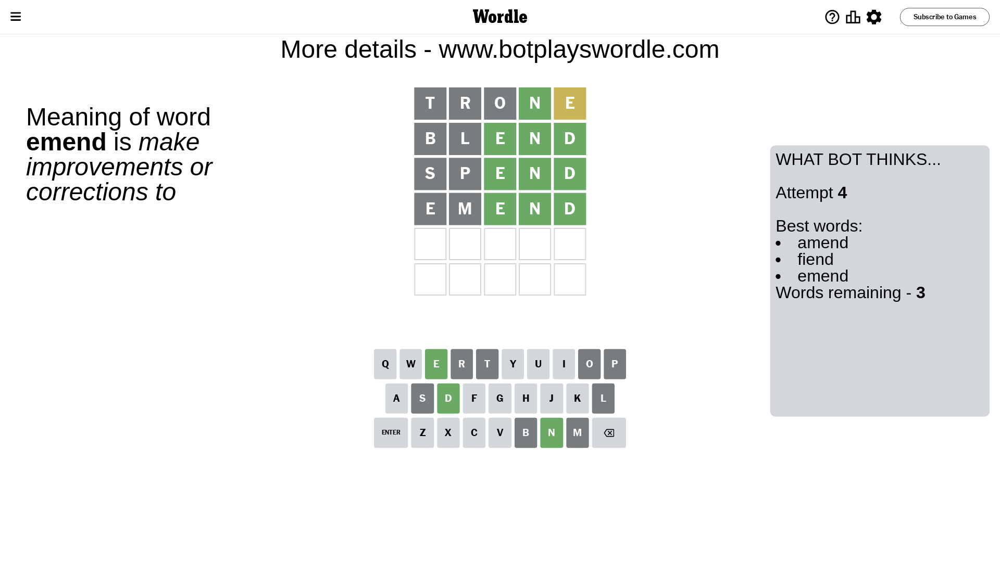
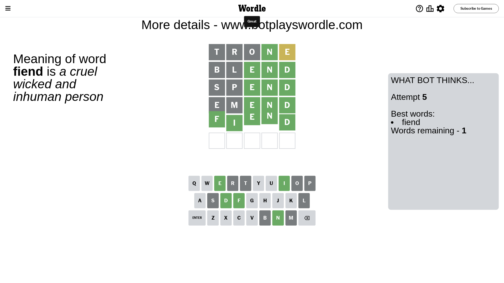

# Wordle for July 14, 2023 - \#755

## Attempt 1

This is the first attempt and we'll choose a random word to start with.

Let's start with word `trone`

Attempt for `trone` gives us 1 correct letters, 1 present letters and 3 wrong letters.

If we look into details, we can see that:

Letter `t` is not present in the word and we will not use it any more

Letter `r` is not present in the word and we will not use it any more

Letter `o` is not present in the word and we will not use it any more

Letter `n` should be at position 4

Letter `e` is on a different spot - this means that it cannot be at position 5

We got information about the correct letters and it should make next attempt easier

Some letters are missing (like `t`, `r`, `o`) but it's also important piece of information

Word should contain letters `[n e]`

That was a great guess that limited number of remaining words

## Attempt 2

Right now we have 38 words to choose from and best of them seem to be `[eland blend shend amend hyena]`

So far we know that possible letters are:

At position 1: `[a b c d e f g h i j k l m n p q s u v w x y z]`

At position 2: `[a b c d e f g h i j k l m n p q s u v w x y z]`

At position 3: `[a b c d e f g h i j k l m n p q s u v w x y z]`

At position 4: `[n]`

At position 5: `[a b c d f g h i j k l m n p q s u v w x y z]`

Next guess is `blend`, let's see what it gives us

Attempt for `blend` gives us 3 correct letters, 0 present letters and 2 wrong letters.

If we look into details, we can see that:

Letter `b` is not present in the word and we will not use it any more

Letter `l` is not present in the word and we will not use it any more

Letter `e` should be at position 3

Letter `d` should be at position 5

We got information about the correct letters and it should make next attempt easier

Some letters are missing (like `b`, `l`) but it's also important piece of information

Word should contain letters `[n e d]`

Not a bad guess in general

## Attempt 3

Right now we have 8 words to choose from and best of them seem to be `[shend amend scend piend spend]`

So far we know that possible letters are:

At position 1: `[a c d e f g h i j k m n p q s u v w x y z]`

At position 2: `[a c d e f g h i j k m n p q s u v w x y z]`

At position 3: `[e]`

At position 4: `[n]`

At position 5: `[d]`

Next guess is `spend`, let's see what it gives us

Attempt for `spend` gives us 3 correct letters, 0 present letters and 2 wrong letters.

If we look into details, we can see that:

Letter `s` is not present in the word and we will not use it any more

Letter `p` is not present in the word and we will not use it any more

Some letters are missing (like `s`, `p`) but it's also important piece of information

Word should contain letters `[n e d]`

Could be a better guess

## Attempt 4

Right now we have 3 words to choose from and best of them seem to be `[amend fiend emend]`

So far we know that possible letters are:

At position 1: `[a c d e f g h i j k m n q u v w x y z]`

At position 2: `[a c d e f g h i j k m n q u v w x y z]`

At position 3: `[e]`

At position 4: `[n]`

At position 5: `[d]`

Next guess is `emend`, let's see what it gives us

Attempt for `emend` gives us 3 correct letters, 0 present letters and 2 wrong letters.

If we look into details, we can see that:

Letter `e` is not present in the word and we will not use it any more

Letter `m` is not present in the word and we will not use it any more

Some letters are missing (like `e`, `m`) but it's also important piece of information

Word should contain letters `[n e d]`

Could be a better guess

## Attempt 5

Right now we have 1 words to choose from and best of them seem to be `[fiend]`

So far we know that possible letters are:

At position 1: `[a c d f g h i j k n q u v w x y z]`

At position 2: `[a c d f g h i j k n q u v w x y z]`

At position 3: `[e]`

At position 4: `[n]`

At position 5: `[d]`

It must be `fiend`

That's the correct answer! The word is `fiend`!

## Conclusion

Today's word is `fiend` and it took 5 attempts to guess it

