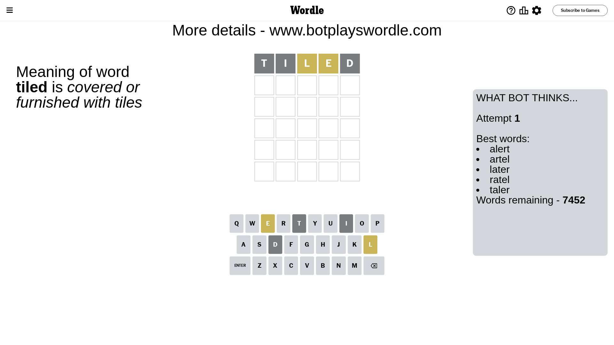
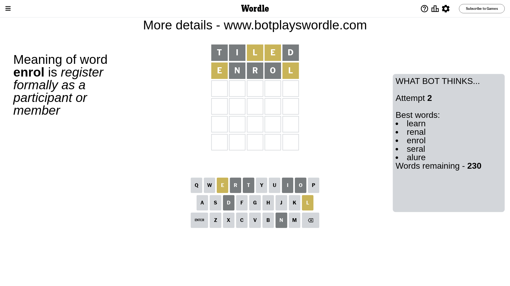
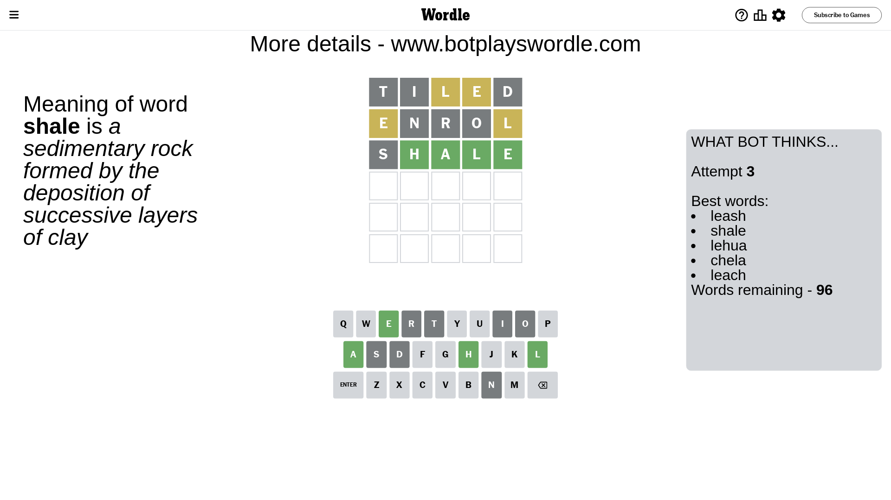
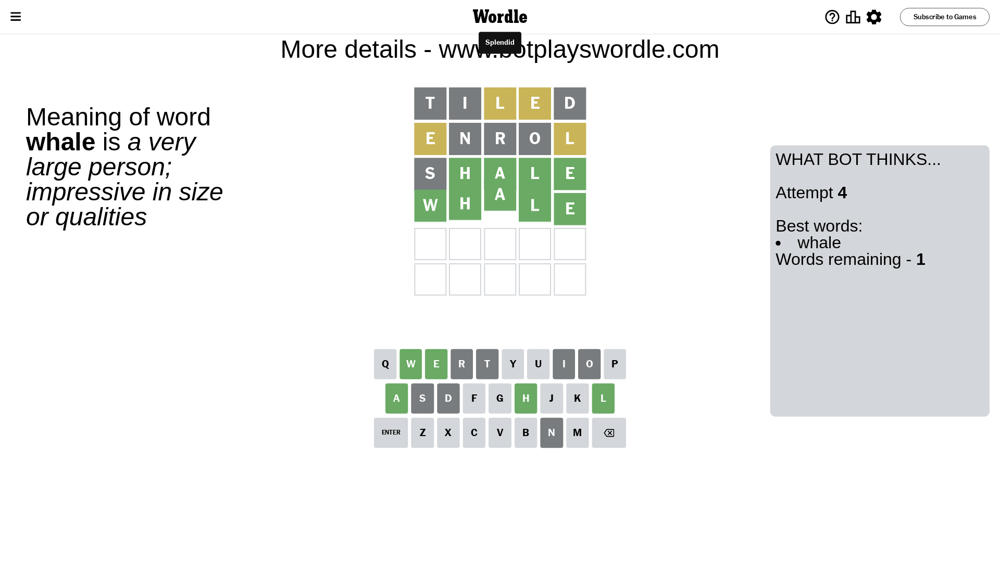

# Wordle for July 23, 2023 - \#764

## Attempt 1

This is the first attempt and we'll choose a random word to start with.

Let's start with word `tiled`

Attempt for `tiled` gives us 0 correct letters, 2 present letters and 3 wrong letters.

If we look into details, we can see that:

Letter `t` is not present in the word and we will not use it any more

Letter `i` is not present in the word and we will not use it any more

Letter `l` is on a different spot - this means that it cannot be at position 3

Letter `e` is on a different spot - this means that it cannot be at position 4

Letter `d` is not present in the word and we will not use it any more

Some letters are missing (like `t`, `i`, `d`) but it's also important piece of information

Word should contain letters `[l e]`

That was a great guess that limited number of remaining words

## Attempt 2

Right now we have 230 words to choose from and best of them seem to be `[learn renal enrol seral alure]`

So far we know that possible letters are:

At position 1: `[a b c e f g h j k l m n o p q r s u v w x y z]`

At position 2: `[a b c e f g h j k l m n o p q r s u v w x y z]`

At position 3: `[a b c e f g h j k m n o p q r s u v w x y z]`

At position 4: `[a b c f g h j k l m n o p q r s u v w x y z]`

At position 5: `[a b c e f g h j k l m n o p q r s u v w x y z]`

Next guess is `enrol`, let's see what it gives us

Attempt for `enrol` gives us 0 correct letters, 2 present letters and 3 wrong letters.

If we look into details, we can see that:

Letter `e` is on a different spot - this means that it cannot be at position 1

Letter `n` is not present in the word and we will not use it any more

Letter `r` is not present in the word and we will not use it any more

Letter `o` is not present in the word and we will not use it any more

Letter `l` is on a different spot - this means that it cannot be at position 5

Some letters are missing (like `n`, `r`, `o`) but it's also important piece of information

Word should contain letters `[l e]`

Could be a better guess

## Attempt 3

Right now we have 96 words to choose from and best of them seem to be `[leash shale lehua chela leach]`

So far we know that possible letters are:

At position 1: `[a b c f g h j k l m p q s u v w x y z]`

At position 2: `[a b c e f g h j k l m p q s u v w x y z]`

At position 3: `[a b c e f g h j k m p q s u v w x y z]`

At position 4: `[a b c f g h j k l m p q s u v w x y z]`

At position 5: `[a b c e f g h j k m p q s u v w x y z]`

Next guess is `shale`, let's see what it gives us

Attempt for `shale` gives us 4 correct letters, 0 present letters and 1 wrong letters.

If we look into details, we can see that:

Letter `s` is not present in the word and we will not use it any more

Letter `h` should be at position 2

Letter `a` should be at position 3

Letter `l` should be at position 4

Letter `e` should be at position 5

We got information about the correct letters and it should make next attempt easier

Some letters are missing (like `s`) but it's also important piece of information

Word should contain letters `[l e h a]`

That was a great guess that limited number of remaining words

## Attempt 4

Right now we have 1 words to choose from and best of them seem to be `[whale]`

So far we know that possible letters are:

At position 1: `[a b c f g h j k l m p q u v w x y z]`

At position 2: `[h]`

At position 3: `[a]`

At position 4: `[l]`

At position 5: `[e]`

It must be `whale`

That's the correct answer! The word is `whale`!

## Conclusion

Today's word is `whale` and it took 4 attempts to guess it

