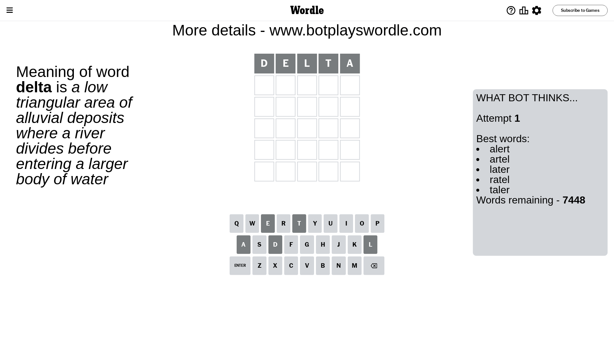
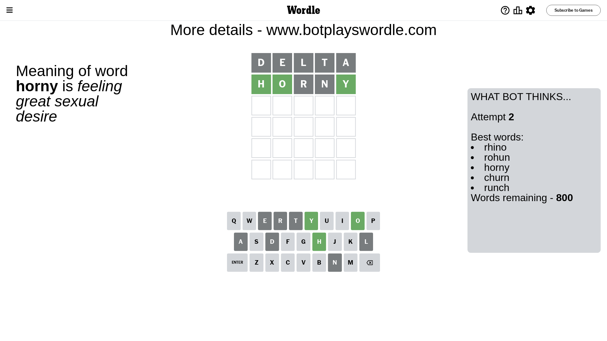
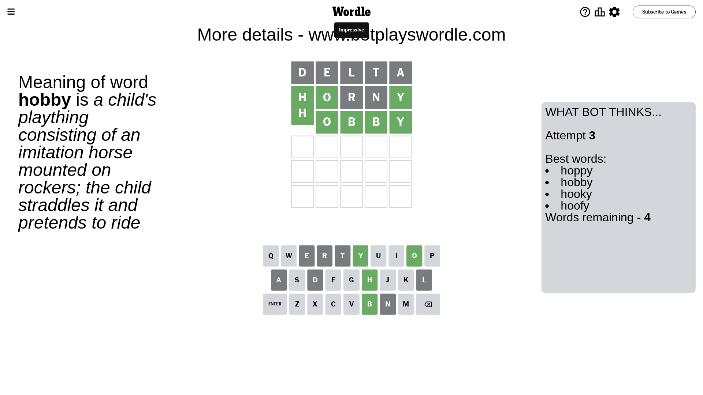

# Wordle for July 24, 2023 - \#765

## Attempt 1

This is the first attempt and we'll choose a random word to start with.

Let's start with word `delta`

Attempt for `delta` gives us 0 correct letters, 0 present letters and 5 wrong letters.

If we look into details, we can see that:

Letter `d` is not present in the word and we will not use it any more

Letter `e` is not present in the word and we will not use it any more

Letter `l` is not present in the word and we will not use it any more

Letter `t` is not present in the word and we will not use it any more

Letter `a` is not present in the word and we will not use it any more

Some letters are missing (like `d`, `e`, `l`, `t`, `a`) but it's also important piece of information

So far we don't know any of the letters!

That was a great guess that limited number of remaining words

## Attempt 2

Right now we have 800 words to choose from and best of them seem to be `[rhino rohun horny churn runch]`

So far we know that possible letters are:

At position 1: `[b c f g h i j k m n o p q r s u v w x y z]`

At position 2: `[b c f g h i j k m n o p q r s u v w x y z]`

At position 3: `[b c f g h i j k m n o p q r s u v w x y z]`

At position 4: `[b c f g h i j k m n o p q r s u v w x y z]`

At position 5: `[b c f g h i j k m n o p q r s u v w x y z]`

Next guess is `horny`, let's see what it gives us

Attempt for `horny` gives us 3 correct letters, 0 present letters and 2 wrong letters.

If we look into details, we can see that:

Letter `h` should be at position 1

Letter `o` should be at position 2

Letter `r` is not present in the word and we will not use it any more

Letter `n` is not present in the word and we will not use it any more

Letter `y` should be at position 5

We got information about the correct letters and it should make next attempt easier

Some letters are missing (like `r`, `n`) but it's also important piece of information

Word should contain letters `[h o y]`

That was a great guess that limited number of remaining words

## Attempt 3

Right now we have 4 words to choose from and best of them seem to be `[hoppy hobby hooky hoofy]`

So far we know that possible letters are:

At position 1: `[h]`

At position 2: `[o]`

At position 3: `[b c f g h i j k m o p q s u v w x y z]`

At position 4: `[b c f g h i j k m o p q s u v w x y z]`

At position 5: `[y]`

Next guess is `hobby`, let's see what it gives us

That's the correct answer! The word is `hobby`!

## Conclusion

Today's word is `hobby` and it took 3 attempts to guess it

