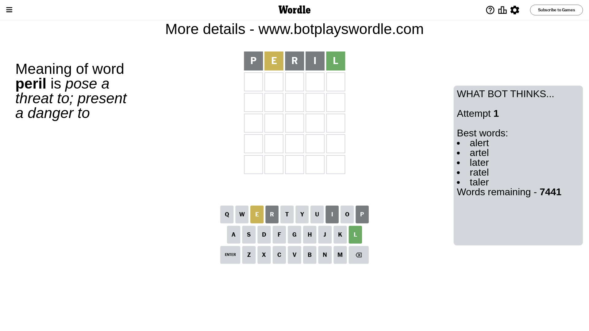
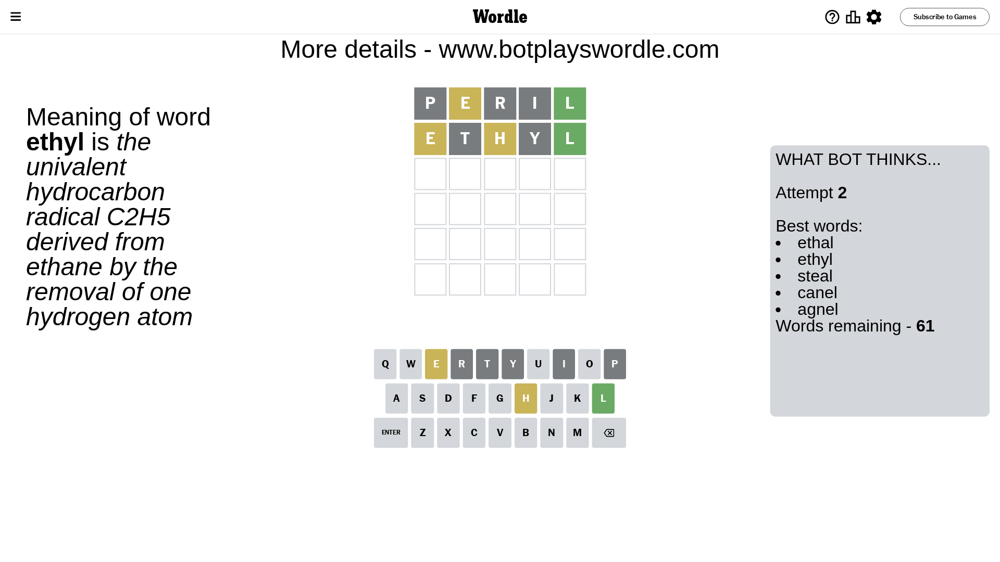
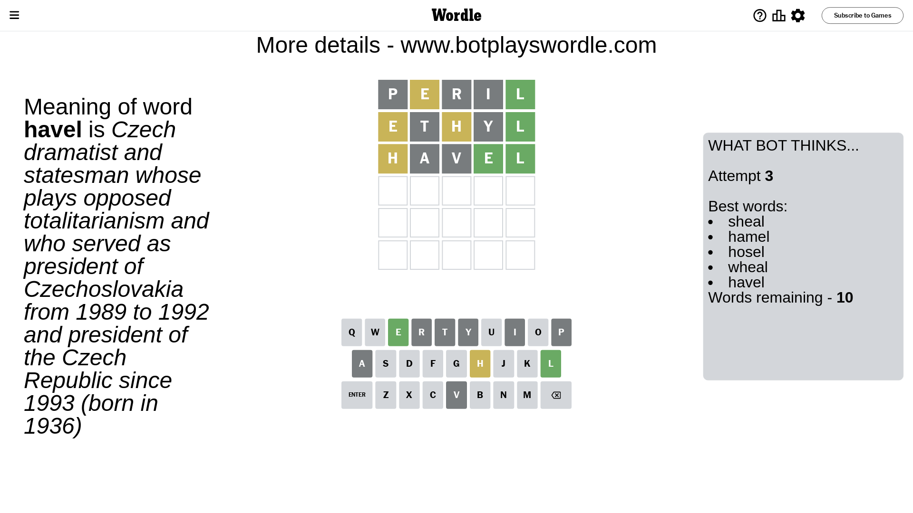
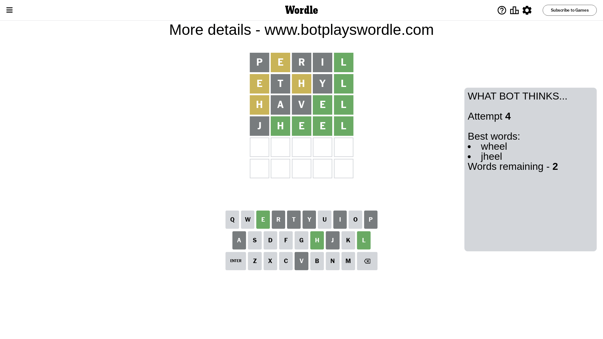
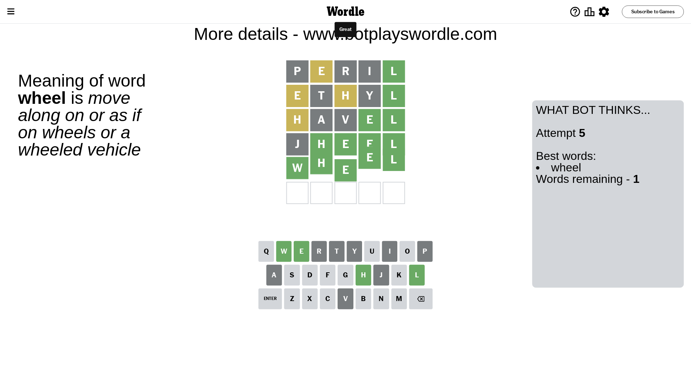

# Wordle for July 25, 2023 - \#766

## Attempt 1

This is the first attempt and we'll choose a random word to start with.

Let's start with word `peril`

Attempt for `peril` gives us 1 correct letters, 1 present letters and 3 wrong letters.

If we look into details, we can see that:

Letter `p` is not present in the word and we will not use it any more

Letter `e` is on a different spot - this means that it cannot be at position 2

Letter `r` is not present in the word and we will not use it any more

Letter `i` is not present in the word and we will not use it any more

Letter `l` should be at position 5

We got information about the correct letters and it should make next attempt easier

Some letters are missing (like `p`, `r`, `i`) but it's also important piece of information

Word should contain letters `[e l]`

That was a great guess that limited number of remaining words

## Attempt 2

Right now we have 61 words to choose from and best of them seem to be `[ethal ethyl steal canel agnel]`

So far we know that possible letters are:

At position 1: `[a b c d e f g h j k l m n o q s t u v w x y z]`

At position 2: `[a b c d f g h j k l m n o q s t u v w x y z]`

At position 3: `[a b c d e f g h j k l m n o q s t u v w x y z]`

At position 4: `[a b c d e f g h j k l m n o q s t u v w x y z]`

At position 5: `[l]`

Next guess is `ethyl`, let's see what it gives us

Attempt for `ethyl` gives us 1 correct letters, 2 present letters and 2 wrong letters.

If we look into details, we can see that:

Letter `e` is on a different spot - this means that it cannot be at position 1

Letter `t` is not present in the word and we will not use it any more

Letter `h` is on a different spot - this means that it cannot be at position 3

Letter `y` is not present in the word and we will not use it any more

Some letters are missing (like `t`, `y`) but it's also important piece of information

Word should contain letters `[e l h]`

Not a bad guess in general

## Attempt 3

Right now we have 10 words to choose from and best of them seem to be `[sheal hamel hosel wheal havel]`

So far we know that possible letters are:

At position 1: `[a b c d f g h j k l m n o q s u v w x z]`

At position 2: `[a b c d f g h j k l m n o q s u v w x z]`

At position 3: `[a b c d e f g j k l m n o q s u v w x z]`

At position 4: `[a b c d e f g h j k l m n o q s u v w x z]`

At position 5: `[l]`

Next guess is `havel`, let's see what it gives us

Attempt for `havel` gives us 2 correct letters, 1 present letters and 2 wrong letters.

If we look into details, we can see that:

Letter `h` is on a different spot - this means that it cannot be at position 1

Letter `a` is not present in the word and we will not use it any more

Letter `v` is not present in the word and we will not use it any more

Letter `e` should be at position 4

We got information about the correct letters and it should make next attempt easier

Some letters are missing (like `a`, `v`) but it's also important piece of information

Word should contain letters `[e l h]`

Not a bad guess in general

## Attempt 4

Right now we have 2 words to choose from and best of them seem to be `[wheel jheel]`

So far we know that possible letters are:

At position 1: `[b c d f g j k l m n o q s u w x z]`

At position 2: `[b c d f g h j k l m n o q s u w x z]`

At position 3: `[b c d e f g j k l m n o q s u w x z]`

At position 4: `[e]`

At position 5: `[l]`

Next guess is `jheel`, let's see what it gives us

Attempt for `jheel` gives us 4 correct letters, 0 present letters and 1 wrong letters.

If we look into details, we can see that:

Letter `j` is not present in the word and we will not use it any more

Letter `h` should be at position 2

Letter `e` should be at position 3

We got information about the correct letters and it should make next attempt easier

Some letters are missing (like `j`) but it's also important piece of information

Word should contain letters `[e l h]`

This was a waste, almost no valuable information...

## Attempt 5

Right now we have 1 words to choose from and best of them seem to be `[wheel]`

So far we know that possible letters are:

At position 1: `[b c d f g k l m n o q s u w x z]`

At position 2: `[h]`

At position 3: `[e]`

At position 4: `[e]`

At position 5: `[l]`

It must be `wheel`

That's the correct answer! The word is `wheel`!

## Conclusion

Today's word is `wheel` and it took 5 attempts to guess it

