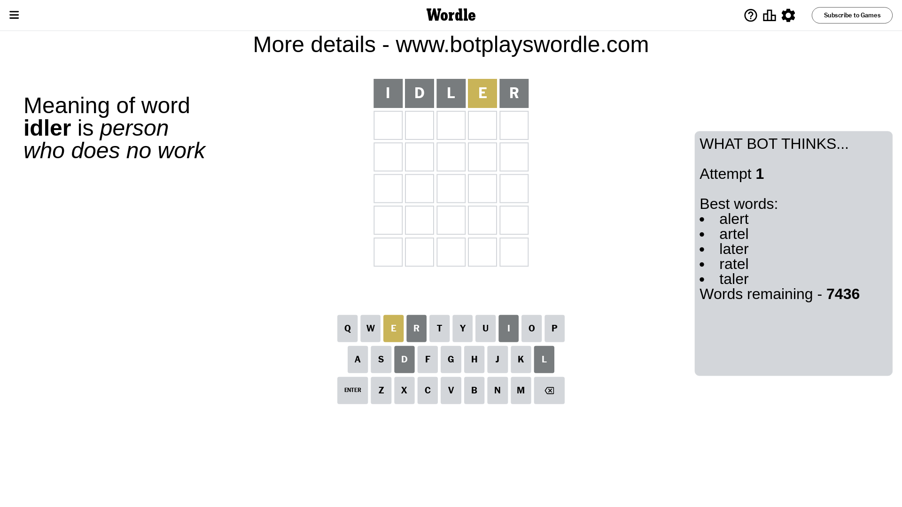
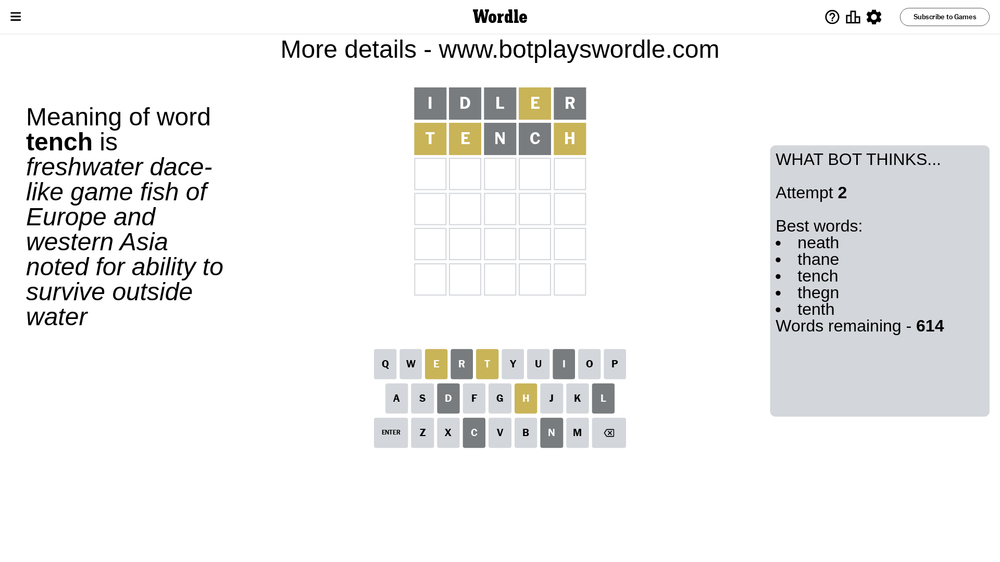
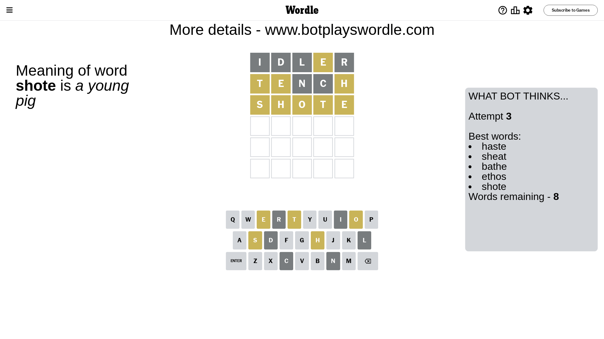
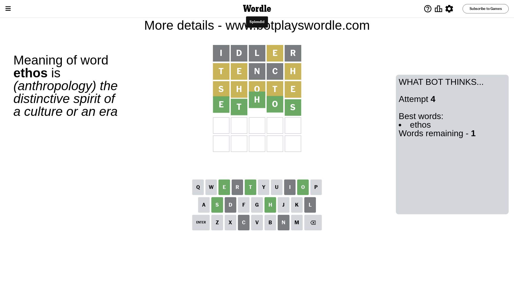

# Wordle for July 28, 2023 - \#769

## Attempt 1

This is the first attempt and we'll choose a random word to start with.

Let's start with word `idler`

Attempt for `idler` gives us 0 correct letters, 1 present letters and 4 wrong letters.

If we look into details, we can see that:

Letter `i` is not present in the word and we will not use it any more

Letter `d` is not present in the word and we will not use it any more

Letter `l` is not present in the word and we will not use it any more

Letter `e` is on a different spot - this means that it cannot be at position 4

Letter `r` is not present in the word and we will not use it any more

Some letters are missing (like `i`, `d`, `l`, `r`) but it's also important piece of information

Word should contain letters `[e]`

That was a great guess that limited number of remaining words

## Attempt 2

Right now we have 614 words to choose from and best of them seem to be `[neath thane tench thegn tenth]`

So far we know that possible letters are:

At position 1: `[a b c e f g h j k m n o p q s t u v w x y z]`

At position 2: `[a b c e f g h j k m n o p q s t u v w x y z]`

At position 3: `[a b c e f g h j k m n o p q s t u v w x y z]`

At position 4: `[a b c f g h j k m n o p q s t u v w x y z]`

At position 5: `[a b c e f g h j k m n o p q s t u v w x y z]`

Next guess is `tench`, let's see what it gives us

Attempt for `tench` gives us 0 correct letters, 3 present letters and 2 wrong letters.

If we look into details, we can see that:

Letter `t` is on a different spot - this means that it cannot be at position 1

Letter `e` is on a different spot - this means that it cannot be at position 2

Letter `n` is not present in the word and we will not use it any more

Letter `c` is not present in the word and we will not use it any more

Letter `h` is on a different spot - this means that it cannot be at position 5

Some letters are missing (like `n`, `c`) but it's also important piece of information

Word should contain letters `[e t h]`

That was a great guess that limited number of remaining words

## Attempt 3

Right now we have 8 words to choose from and best of them seem to be `[haste sheat bathe ethos shote]`

So far we know that possible letters are:

At position 1: `[a b e f g h j k m o p q s u v w x y z]`

At position 2: `[a b f g h j k m o p q s t u v w x y z]`

At position 3: `[a b e f g h j k m o p q s t u v w x y z]`

At position 4: `[a b f g h j k m o p q s t u v w x y z]`

At position 5: `[a b e f g j k m o p q s t u v w x y z]`

Next guess is `shote`, let's see what it gives us

Attempt for `shote` gives us 0 correct letters, 5 present letters and 0 wrong letters.

If we look into details, we can see that:

Letter `s` is on a different spot - this means that it cannot be at position 1

Letter `h` is on a different spot - this means that it cannot be at position 2

Letter `o` is on a different spot - this means that it cannot be at position 3

Letter `t` is on a different spot - this means that it cannot be at position 4

Letter `e` is on a different spot - this means that it cannot be at position 5

Word should contain letters `[e t h s o]`

Not a bad guess in general

## Attempt 4

Right now we have 1 words to choose from and best of them seem to be `[ethos]`

So far we know that possible letters are:

At position 1: `[a b e f g h j k m o p q u v w x y z]`

At position 2: `[a b f g j k m o p q s t u v w x y z]`

At position 3: `[a b e f g h j k m p q s t u v w x y z]`

At position 4: `[a b f g h j k m o p q s u v w x y z]`

At position 5: `[a b f g j k m o p q s t u v w x y z]`

It must be `ethos`

That's the correct answer! The word is `ethos`!

## Conclusion

Today's word is `ethos` and it took 4 attempts to guess it

