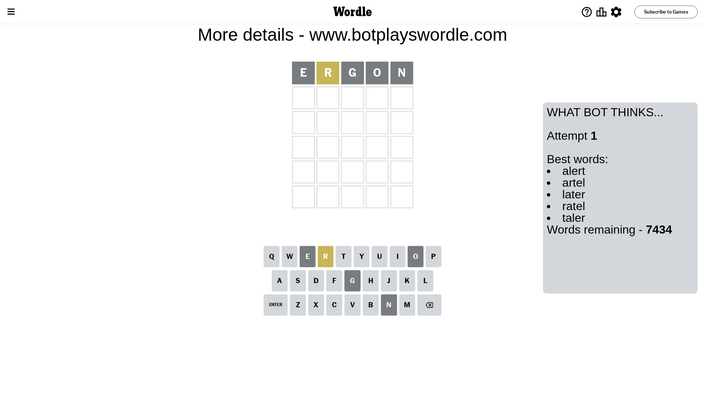
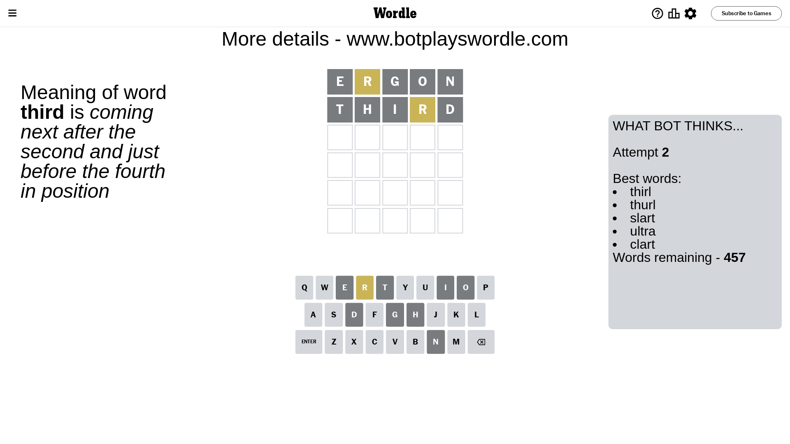
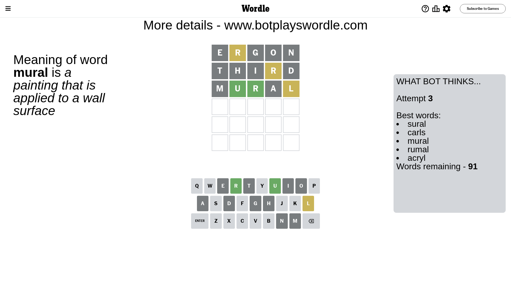
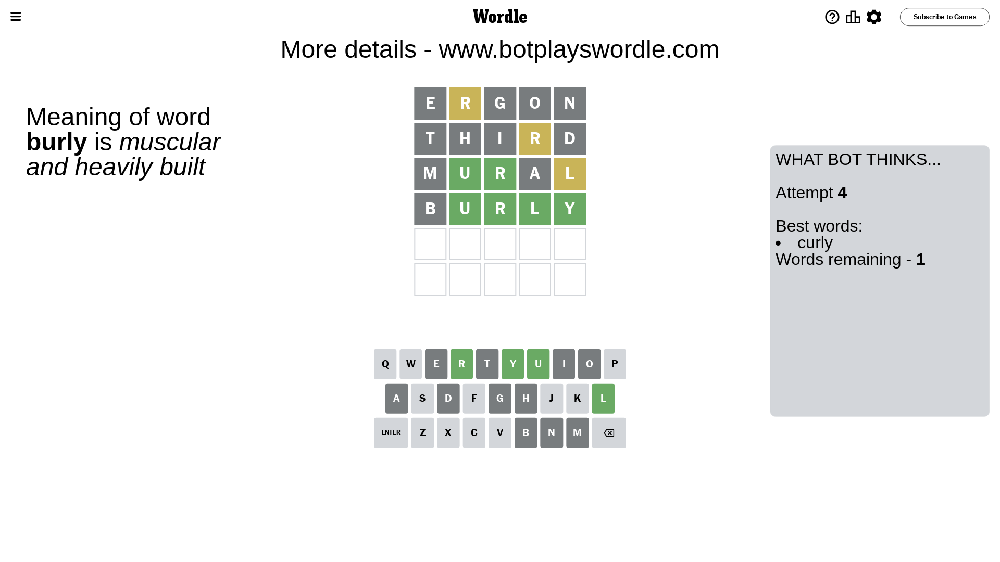
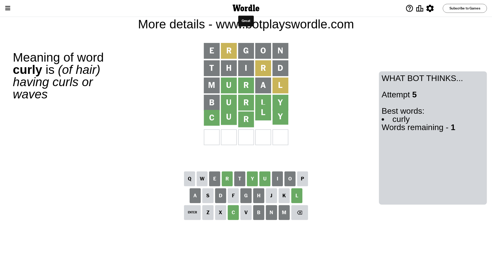

# Wordle for July 29, 2023 - \#770

## Attempt 1

This is the first attempt and we'll choose a random word to start with.

Let's start with word `ergon`

Attempt for `ergon` gives us 0 correct letters, 1 present letters and 4 wrong letters.

If we look into details, we can see that:

Letter `e` is not present in the word and we will not use it any more

Letter `r` is on a different spot - this means that it cannot be at position 2

Letter `g` is not present in the word and we will not use it any more

Letter `o` is not present in the word and we will not use it any more

Letter `n` is not present in the word and we will not use it any more

Some letters are missing (like `e`, `g`, `o`, `n`) but it's also important piece of information

Word should contain letters `[r]`

That was a great guess that limited number of remaining words

## Attempt 2

Right now we have 457 words to choose from and best of them seem to be `[thirl thurl slart ultra clart]`

So far we know that possible letters are:

At position 1: `[a b c d f h i j k l m p q r s t u v w x y z]`

At position 2: `[a b c d f h i j k l m p q s t u v w x y z]`

At position 3: `[a b c d f h i j k l m p q r s t u v w x y z]`

At position 4: `[a b c d f h i j k l m p q r s t u v w x y z]`

At position 5: `[a b c d f h i j k l m p q r s t u v w x y z]`

Next guess is `third`, let's see what it gives us

Attempt for `third` gives us 0 correct letters, 1 present letters and 4 wrong letters.

If we look into details, we can see that:

Letter `t` is not present in the word and we will not use it any more

Letter `h` is not present in the word and we will not use it any more

Letter `i` is not present in the word and we will not use it any more

Letter `r` is on a different spot - this means that it cannot be at position 4

Letter `d` is not present in the word and we will not use it any more

Some letters are missing (like `t`, `h`, `i`, `d`) but it's also important piece of information

Word should contain letters `[r]`

Not a bad guess in general

## Attempt 3

Right now we have 91 words to choose from and best of them seem to be `[sural carls mural rumal acryl]`

So far we know that possible letters are:

At position 1: `[a b c f j k l m p q r s u v w x y z]`

At position 2: `[a b c f j k l m p q s u v w x y z]`

At position 3: `[a b c f j k l m p q r s u v w x y z]`

At position 4: `[a b c f j k l m p q s u v w x y z]`

At position 5: `[a b c f j k l m p q r s u v w x y z]`

Next guess is `mural`, let's see what it gives us

Attempt for `mural` gives us 2 correct letters, 1 present letters and 2 wrong letters.

If we look into details, we can see that:

Letter `m` is not present in the word and we will not use it any more

Letter `u` should be at position 2

Letter `r` should be at position 3

Letter `a` is not present in the word and we will not use it any more

Letter `l` is on a different spot - this means that it cannot be at position 5

We got information about the correct letters and it should make next attempt easier

Some letters are missing (like `m`, `a`) but it's also important piece of information

Word should contain letters `[r u l]`

That was a great guess that limited number of remaining words

## Attempt 4

Right now we have 1 words to choose from and best of them seem to be `[curly]`

So far we know that possible letters are:

At position 1: `[b c f j k l p q r s u v w x y z]`

At position 2: `[u]`

At position 3: `[r]`

At position 4: `[b c f j k l p q s u v w x y z]`

At position 5: `[b c f j k p q r s u v w x y z]`

It must be `burly`

Attempt for `burly` gives us 4 correct letters, 0 present letters and 1 wrong letters.

If we look into details, we can see that:

Letter `b` is not present in the word and we will not use it any more

Letter `l` should be at position 4

Letter `y` should be at position 5

We got information about the correct letters and it should make next attempt easier

Some letters are missing (like `b`) but it's also important piece of information

Word should contain letters `[r u l y]`

This was a waste, almost no valuable information...

## Attempt 5

Right now we have 1 words to choose from and best of them seem to be `[curly]`

So far we know that possible letters are:

At position 1: `[c f j k l p q r s u v w x y z]`

At position 2: `[u]`

At position 3: `[r]`

At position 4: `[l]`

At position 5: `[y]`

It must be `curly`

That's the correct answer! The word is `curly`!

## Conclusion

Today's word is `curly` and it took 5 attempts to guess it

