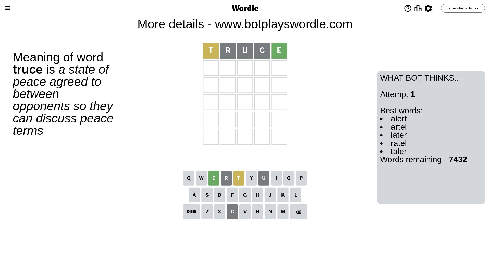
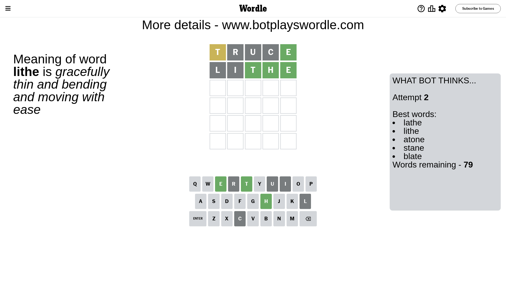
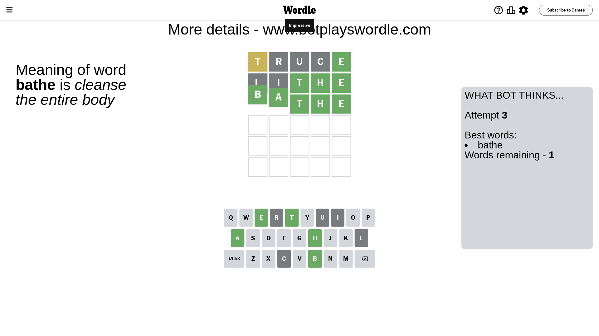

# Wordle for July 30, 2023 - \#771

## Attempt 1

This is the first attempt and we'll choose a random word to start with.

Let's start with word `truce`

Attempt for `truce` gives us 1 correct letters, 1 present letters and 3 wrong letters.

If we look into details, we can see that:

Letter `t` is on a different spot - this means that it cannot be at position 1

Letter `r` is not present in the word and we will not use it any more

Letter `u` is not present in the word and we will not use it any more

Letter `c` is not present in the word and we will not use it any more

Letter `e` should be at position 5

We got information about the correct letters and it should make next attempt easier

Some letters are missing (like `r`, `u`, `c`) but it's also important piece of information

Word should contain letters `[t e]`

That was a great guess that limited number of remaining words

## Attempt 2

Right now we have 79 words to choose from and best of them seem to be `[lathe lithe atone stane blate]`

So far we know that possible letters are:

At position 1: `[a b d e f g h i j k l m n o p q s v w x y z]`

At position 2: `[a b d e f g h i j k l m n o p q s t v w x y z]`

At position 3: `[a b d e f g h i j k l m n o p q s t v w x y z]`

At position 4: `[a b d e f g h i j k l m n o p q s t v w x y z]`

At position 5: `[e]`

Next guess is `lithe`, let's see what it gives us

Attempt for `lithe` gives us 3 correct letters, 0 present letters and 2 wrong letters.

If we look into details, we can see that:

Letter `l` is not present in the word and we will not use it any more

Letter `i` is not present in the word and we will not use it any more

Letter `t` should be at position 3

Letter `h` should be at position 4

We got information about the correct letters and it should make next attempt easier

Some letters are missing (like `l`, `i`) but it's also important piece of information

Word should contain letters `[t e h]`

That was a great guess that limited number of remaining words

## Attempt 3

Right now we have 1 words to choose from and best of them seem to be `[bathe]`

So far we know that possible letters are:

At position 1: `[a b d e f g h j k m n o p q s v w x y z]`

At position 2: `[a b d e f g h j k m n o p q s t v w x y z]`

At position 3: `[t]`

At position 4: `[h]`

At position 5: `[e]`

It must be `bathe`

That's the correct answer! The word is `bathe`!

## Conclusion

Today's word is `bathe` and it took 3 attempts to guess it

