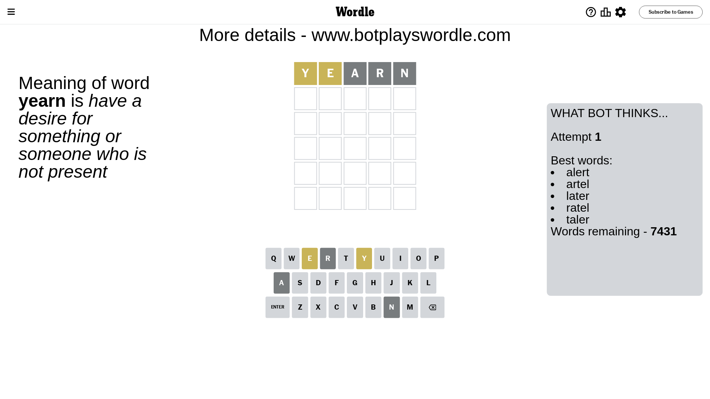
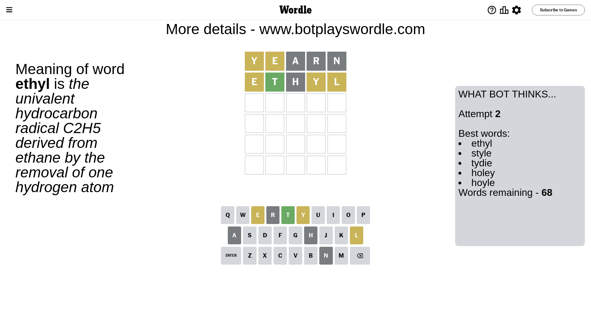
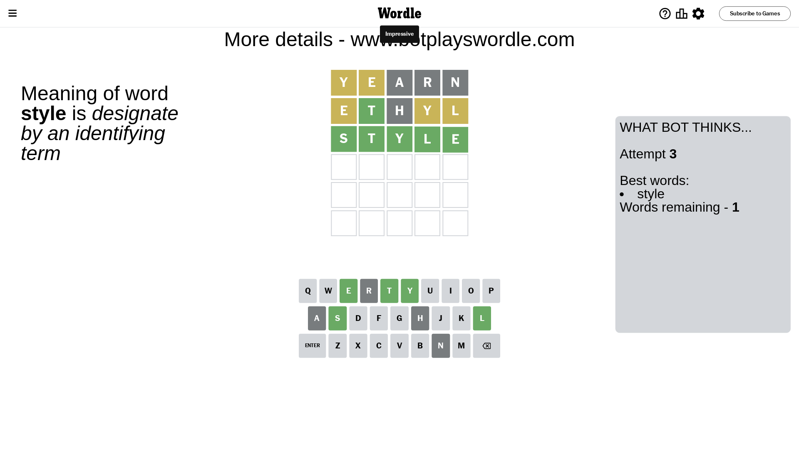

# Wordle for July 31, 2023 - \#772

## Attempt 1

This is the first attempt and we'll choose a random word to start with.

Let's start with word `yearn`

Attempt for `yearn` gives us 0 correct letters, 2 present letters and 3 wrong letters.

If we look into details, we can see that:

Letter `y` is on a different spot - this means that it cannot be at position 1

Letter `e` is on a different spot - this means that it cannot be at position 2

Letter `a` is not present in the word and we will not use it any more

Letter `r` is not present in the word and we will not use it any more

Letter `n` is not present in the word and we will not use it any more

Some letters are missing (like `a`, `r`, `n`) but it's also important piece of information

Word should contain letters `[y e]`

That was a great guess that limited number of remaining words

## Attempt 2

Right now we have 68 words to choose from and best of them seem to be `[ethyl style tydie holey hoyle]`

So far we know that possible letters are:

At position 1: `[b c d e f g h i j k l m o p q s t u v w x z]`

At position 2: `[b c d f g h i j k l m o p q s t u v w x y z]`

At position 3: `[b c d e f g h i j k l m o p q s t u v w x y z]`

At position 4: `[b c d e f g h i j k l m o p q s t u v w x y z]`

At position 5: `[b c d e f g h i j k l m o p q s t u v w x y z]`

Next guess is `ethyl`, let's see what it gives us

Attempt for `ethyl` gives us 1 correct letters, 3 present letters and 1 wrong letters.

If we look into details, we can see that:

Letter `e` is on a different spot - this means that it cannot be at position 1

Letter `t` should be at position 2

Letter `h` is not present in the word and we will not use it any more

Letter `y` is on a different spot - this means that it cannot be at position 4

Letter `l` is on a different spot - this means that it cannot be at position 5

We got information about the correct letters and it should make next attempt easier

Some letters are missing (like `h`) but it's also important piece of information

Word should contain letters `[y e t l]`

That was a great guess that limited number of remaining words

## Attempt 3

Right now we have 1 words to choose from and best of them seem to be `[style]`

So far we know that possible letters are:

At position 1: `[b c d f g i j k l m o p q s t u v w x z]`

At position 2: `[t]`

At position 3: `[b c d e f g i j k l m o p q s t u v w x y z]`

At position 4: `[b c d e f g i j k l m o p q s t u v w x z]`

At position 5: `[b c d e f g i j k m o p q s t u v w x y z]`

It must be `style`

That's the correct answer! The word is `style`!

## Conclusion

Today's word is `style` and it took 3 attempts to guess it

