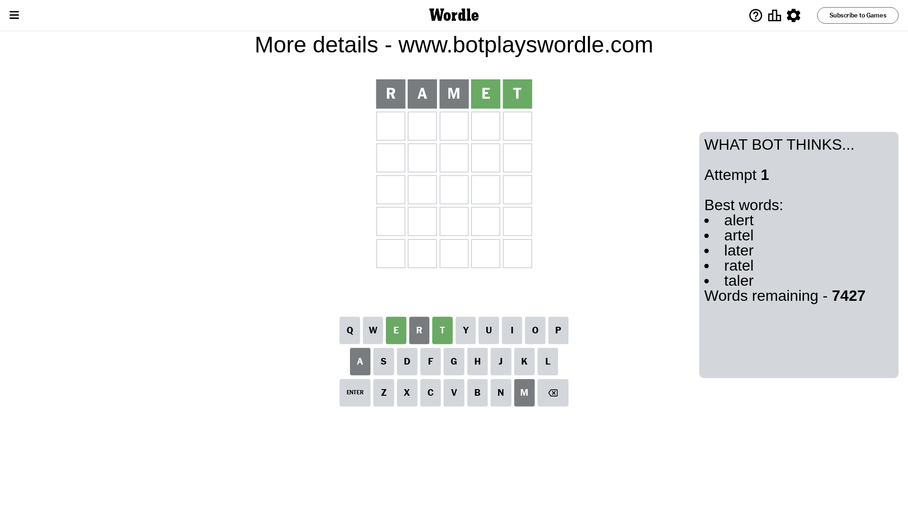
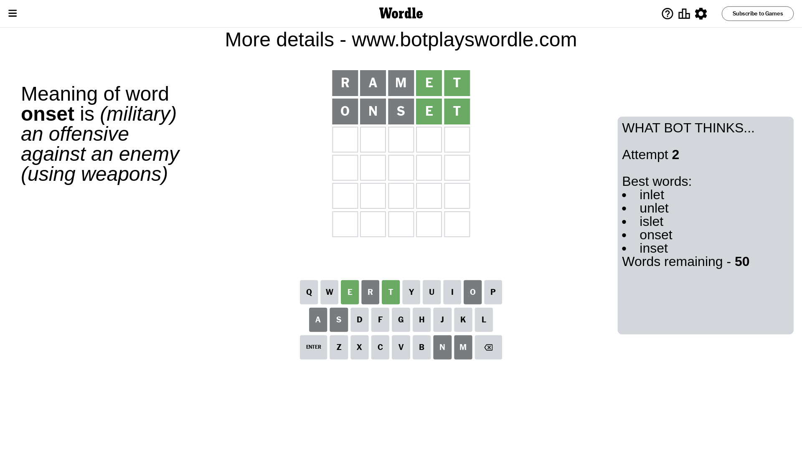
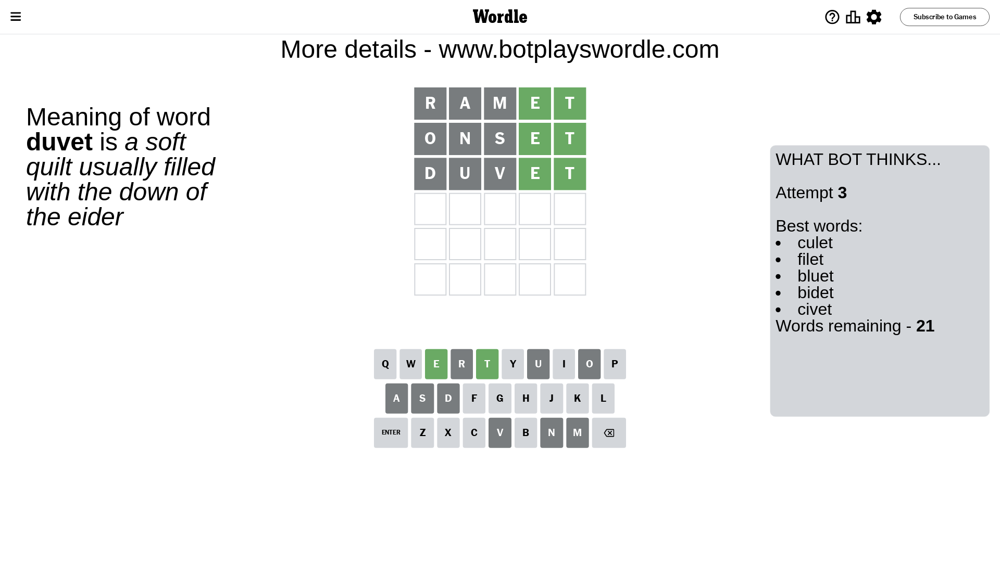
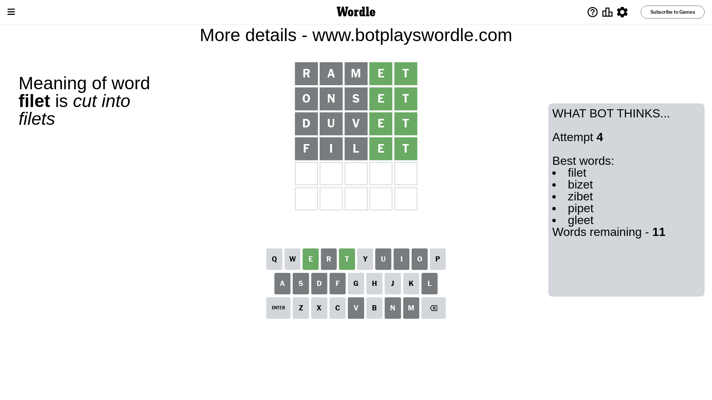
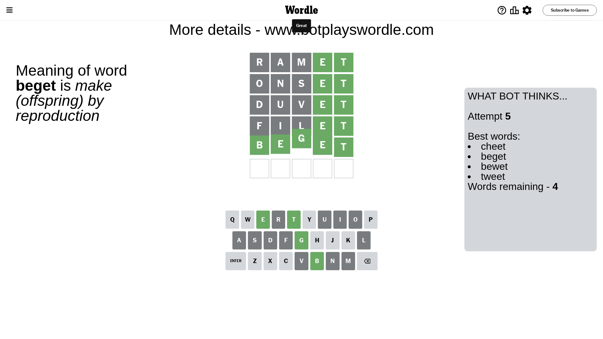

# Wordle for August 2, 2023 - \#774

## Attempt 1

This is the first attempt and we'll choose a random word to start with.

Let's start with word `ramet`

Attempt for `ramet` gives us 2 correct letters, 0 present letters and 3 wrong letters.

If we look into details, we can see that:

Letter `r` is not present in the word and we will not use it any more

Letter `a` is not present in the word and we will not use it any more

Letter `m` is not present in the word and we will not use it any more

Letter `e` should be at position 4

Letter `t` should be at position 5

We got information about the correct letters and it should make next attempt easier

Some letters are missing (like `r`, `a`, `m`) but it's also important piece of information

Word should contain letters `[e t]`

That was a great guess that limited number of remaining words

## Attempt 2

Right now we have 50 words to choose from and best of them seem to be `[inlet unlet islet onset inset]`

So far we know that possible letters are:

At position 1: `[b c d e f g h i j k l n o p q s t u v w x y z]`

At position 2: `[b c d e f g h i j k l n o p q s t u v w x y z]`

At position 3: `[b c d e f g h i j k l n o p q s t u v w x y z]`

At position 4: `[e]`

At position 5: `[t]`

Next guess is `onset`, let's see what it gives us

Attempt for `onset` gives us 2 correct letters, 0 present letters and 3 wrong letters.

If we look into details, we can see that:

Letter `o` is not present in the word and we will not use it any more

Letter `n` is not present in the word and we will not use it any more

Letter `s` is not present in the word and we will not use it any more

Some letters are missing (like `o`, `n`, `s`) but it's also important piece of information

Word should contain letters `[e t]`

Could be a better guess

## Attempt 3

Right now we have 21 words to choose from and best of them seem to be `[culet filet bluet bidet civet]`

So far we know that possible letters are:

At position 1: `[b c d e f g h i j k l p q t u v w x y z]`

At position 2: `[b c d e f g h i j k l p q t u v w x y z]`

At position 3: `[b c d e f g h i j k l p q t u v w x y z]`

At position 4: `[e]`

At position 5: `[t]`

Next guess is `duvet`, let's see what it gives us

Attempt for `duvet` gives us 2 correct letters, 0 present letters and 3 wrong letters.

If we look into details, we can see that:

Letter `d` is not present in the word and we will not use it any more

Letter `u` is not present in the word and we will not use it any more

Letter `v` is not present in the word and we will not use it any more

Some letters are missing (like `d`, `u`, `v`) but it's also important piece of information

Word should contain letters `[e t]`

This was a waste, almost no valuable information...

## Attempt 4

Right now we have 11 words to choose from and best of them seem to be `[filet bizet zibet pipet gleet]`

So far we know that possible letters are:

At position 1: `[b c e f g h i j k l p q t w x y z]`

At position 2: `[b c e f g h i j k l p q t w x y z]`

At position 3: `[b c e f g h i j k l p q t w x y z]`

At position 4: `[e]`

At position 5: `[t]`

Next guess is `filet`, let's see what it gives us

Attempt for `filet` gives us 2 correct letters, 0 present letters and 3 wrong letters.

If we look into details, we can see that:

Letter `f` is not present in the word and we will not use it any more

Letter `i` is not present in the word and we will not use it any more

Letter `l` is not present in the word and we will not use it any more

Some letters are missing (like `f`, `i`, `l`) but it's also important piece of information

Word should contain letters `[e t]`

Could be a better guess

## Attempt 5

Right now we have 4 words to choose from and best of them seem to be `[cheet beget bewet tweet]`

So far we know that possible letters are:

At position 1: `[b c e g h j k p q t w x y z]`

At position 2: `[b c e g h j k p q t w x y z]`

At position 3: `[b c e g h j k p q t w x y z]`

At position 4: `[e]`

At position 5: `[t]`

Next guess is `beget`, let's see what it gives us

That's the correct answer! The word is `beget`!

## Conclusion

Today's word is `beget` and it took 5 attempts to guess it

