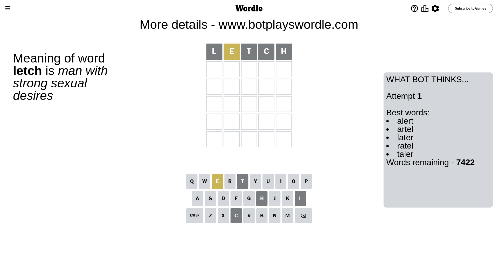
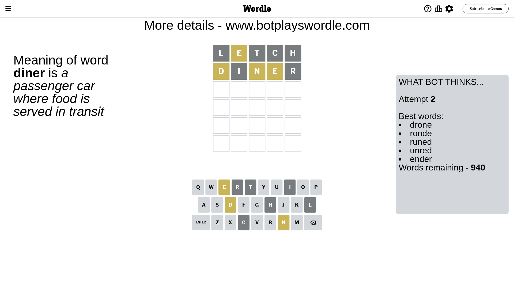
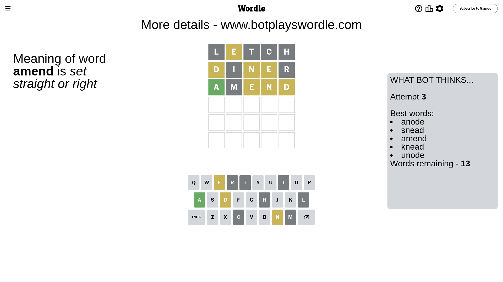
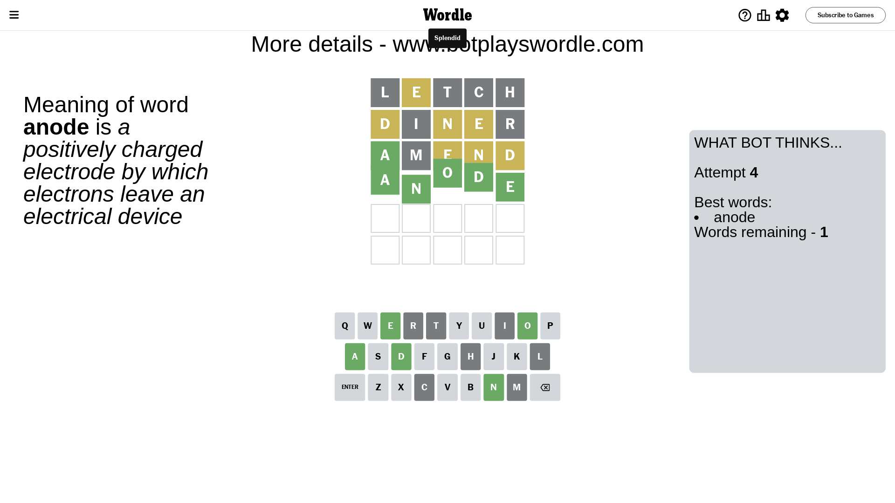

# Wordle for August 5, 2023 - \#777

## Attempt 1

This is the first attempt and we'll choose a random word to start with.

Let's start with word `letch`

Attempt for `letch` gives us 0 correct letters, 1 present letters and 4 wrong letters.

If we look into details, we can see that:

Letter `l` is not present in the word and we will not use it any more

Letter `e` is on a different spot - this means that it cannot be at position 2

Letter `t` is not present in the word and we will not use it any more

Letter `c` is not present in the word and we will not use it any more

Letter `h` is not present in the word and we will not use it any more

Some letters are missing (like `l`, `t`, `c`, `h`) but it's also important piece of information

Word should contain letters `[e]`

Not a bad guess in general

## Attempt 2

Right now we have 940 words to choose from and best of them seem to be `[drone ronde runed unred ender]`

So far we know that possible letters are:

At position 1: `[a b d e f g i j k m n o p q r s u v w x y z]`

At position 2: `[a b d f g i j k m n o p q r s u v w x y z]`

At position 3: `[a b d e f g i j k m n o p q r s u v w x y z]`

At position 4: `[a b d e f g i j k m n o p q r s u v w x y z]`

At position 5: `[a b d e f g i j k m n o p q r s u v w x y z]`

Next guess is `diner`, let's see what it gives us

Attempt for `diner` gives us 0 correct letters, 3 present letters and 2 wrong letters.

If we look into details, we can see that:

Letter `d` is on a different spot - this means that it cannot be at position 1

Letter `i` is not present in the word and we will not use it any more

Letter `n` is on a different spot - this means that it cannot be at position 3

Letter `e` is on a different spot - this means that it cannot be at position 4

Letter `r` is not present in the word and we will not use it any more

Some letters are missing (like `i`, `r`) but it's also important piece of information

Word should contain letters `[e d n]`

That was a great guess that limited number of remaining words

## Attempt 3

Right now we have 13 words to choose from and best of them seem to be `[anode snead amend knead unode]`

So far we know that possible letters are:

At position 1: `[a b e f g j k m n o p q s u v w x y z]`

At position 2: `[a b d f g j k m n o p q s u v w x y z]`

At position 3: `[a b d e f g j k m o p q s u v w x y z]`

At position 4: `[a b d f g j k m n o p q s u v w x y z]`

At position 5: `[a b d e f g j k m n o p q s u v w x y z]`

Next guess is `amend`, let's see what it gives us

Attempt for `amend` gives us 1 correct letters, 3 present letters and 1 wrong letters.

If we look into details, we can see that:

Letter `a` should be at position 1

Letter `m` is not present in the word and we will not use it any more

Letter `e` is on a different spot - this means that it cannot be at position 3

Letter `n` is on a different spot - this means that it cannot be at position 4

Letter `d` is on a different spot - this means that it cannot be at position 5

We got information about the correct letters and it should make next attempt easier

Some letters are missing (like `m`) but it's also important piece of information

Word should contain letters `[e d n a]`

That was a great guess that limited number of remaining words

## Attempt 4

Right now we have 1 words to choose from and best of them seem to be `[anode]`

So far we know that possible letters are:

At position 1: `[a]`

At position 2: `[a b d f g j k n o p q s u v w x y z]`

At position 3: `[a b d f g j k o p q s u v w x y z]`

At position 4: `[a b d f g j k o p q s u v w x y z]`

At position 5: `[a b e f g j k n o p q s u v w x y z]`

It must be `anode`

That's the correct answer! The word is `anode`!

## Conclusion

Today's word is `anode` and it took 4 attempts to guess it

