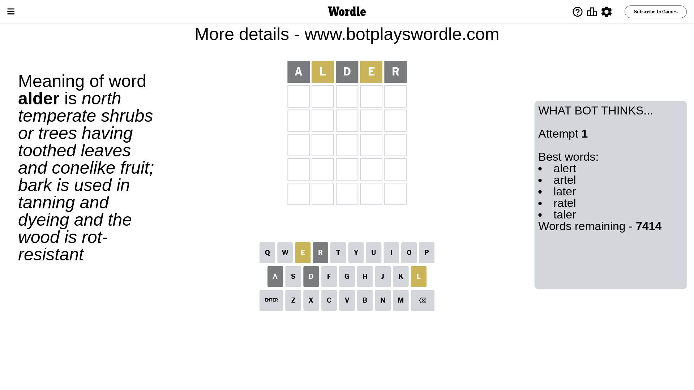
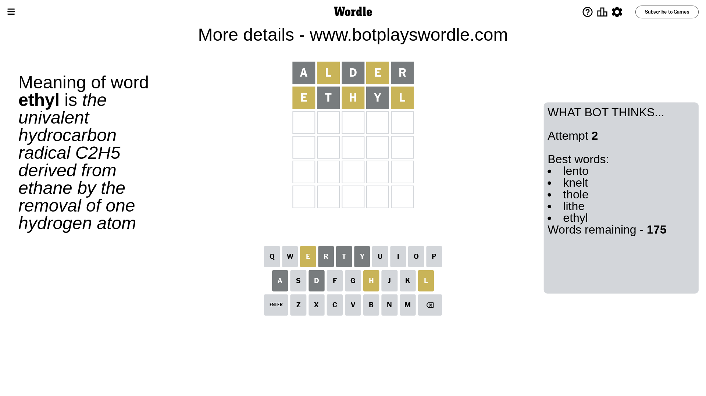
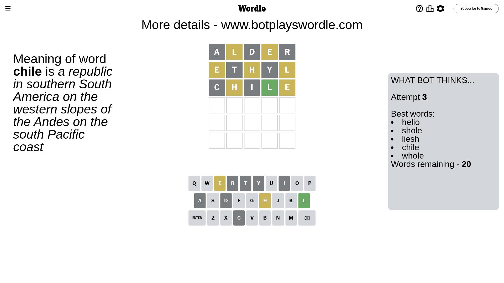
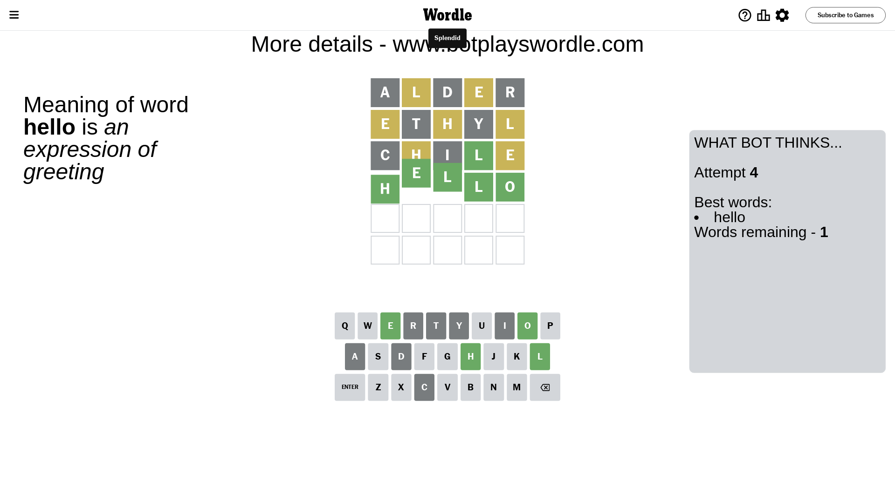

# Wordle for August 11, 2023 - \#783

## Attempt 1

This is the first attempt and we'll choose a random word to start with.

Let's start with word `alder`

Attempt for `alder` gives us 0 correct letters, 2 present letters and 3 wrong letters.

If we look into details, we can see that:

Letter `a` is not present in the word and we will not use it any more

Letter `l` is on a different spot - this means that it cannot be at position 2

Letter `d` is not present in the word and we will not use it any more

Letter `e` is on a different spot - this means that it cannot be at position 4

Letter `r` is not present in the word and we will not use it any more

Some letters are missing (like `a`, `d`, `r`) but it's also important piece of information

Word should contain letters `[l e]`

That was a great guess that limited number of remaining words

## Attempt 2

Right now we have 175 words to choose from and best of them seem to be `[lento knelt thole lithe ethyl]`

So far we know that possible letters are:

At position 1: `[b c e f g h i j k l m n o p q s t u v w x y z]`

At position 2: `[b c e f g h i j k m n o p q s t u v w x y z]`

At position 3: `[b c e f g h i j k l m n o p q s t u v w x y z]`

At position 4: `[b c f g h i j k l m n o p q s t u v w x y z]`

At position 5: `[b c e f g h i j k l m n o p q s t u v w x y z]`

Next guess is `ethyl`, let's see what it gives us

Attempt for `ethyl` gives us 0 correct letters, 3 present letters and 2 wrong letters.

If we look into details, we can see that:

Letter `e` is on a different spot - this means that it cannot be at position 1

Letter `t` is not present in the word and we will not use it any more

Letter `h` is on a different spot - this means that it cannot be at position 3

Letter `y` is not present in the word and we will not use it any more

Letter `l` is on a different spot - this means that it cannot be at position 5

Some letters are missing (like `t`, `y`) but it's also important piece of information

Word should contain letters `[l e h]`

That was a great guess that limited number of remaining words

## Attempt 3

Right now we have 20 words to choose from and best of them seem to be `[helio shole liesh chile whole]`

So far we know that possible letters are:

At position 1: `[b c f g h i j k l m n o p q s u v w x z]`

At position 2: `[b c e f g h i j k m n o p q s u v w x z]`

At position 3: `[b c e f g i j k l m n o p q s u v w x z]`

At position 4: `[b c f g h i j k l m n o p q s u v w x z]`

At position 5: `[b c e f g h i j k m n o p q s u v w x z]`

Next guess is `chile`, let's see what it gives us

Attempt for `chile` gives us 1 correct letters, 2 present letters and 2 wrong letters.

If we look into details, we can see that:

Letter `c` is not present in the word and we will not use it any more

Letter `h` is on a different spot - this means that it cannot be at position 2

Letter `i` is not present in the word and we will not use it any more

Letter `l` should be at position 4

Letter `e` is on a different spot - this means that it cannot be at position 5

We got information about the correct letters and it should make next attempt easier

Some letters are missing (like `c`, `i`) but it's also important piece of information

Word should contain letters `[l e h]`

That was a great guess that limited number of remaining words

## Attempt 4

Right now we have 1 words to choose from and best of them seem to be `[hello]`

So far we know that possible letters are:

At position 1: `[b f g h j k l m n o p q s u v w x z]`

At position 2: `[b e f g j k m n o p q s u v w x z]`

At position 3: `[b e f g j k l m n o p q s u v w x z]`

At position 4: `[l]`

At position 5: `[b f g h j k m n o p q s u v w x z]`

It must be `hello`

That's the correct answer! The word is `hello`!

## Conclusion

Today's word is `hello` and it took 4 attempts to guess it

