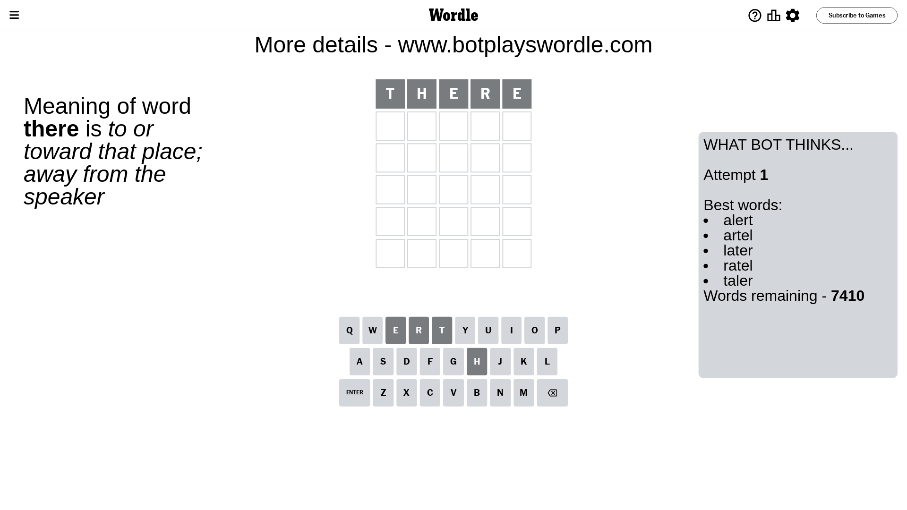
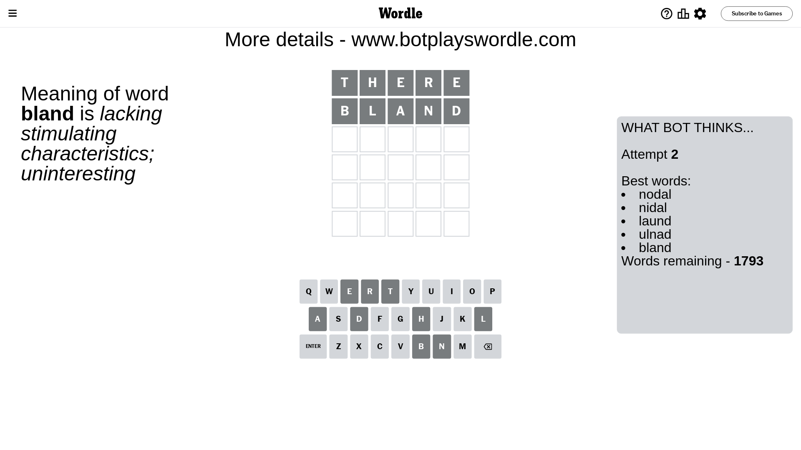
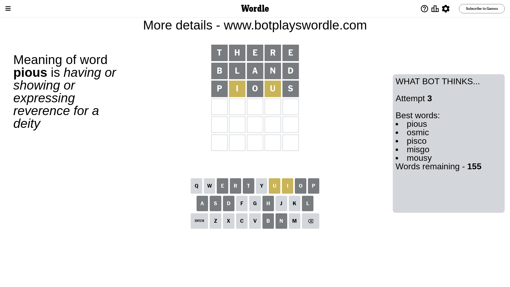
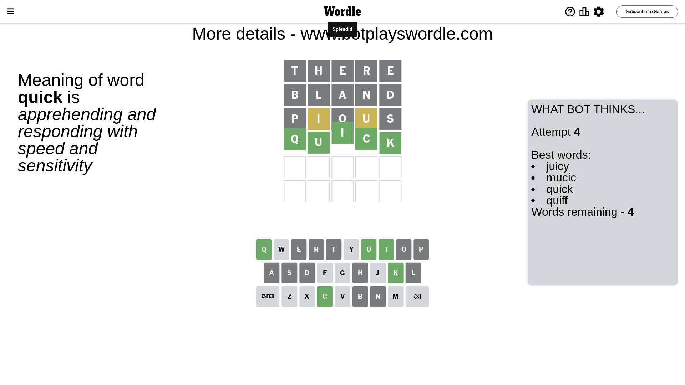

# Wordle for August 12, 2023 - \#784

## Attempt 1

This is the first attempt and we'll choose a random word to start with.

Let's start with word `there`

Attempt for `there` gives us 0 correct letters, 0 present letters and 5 wrong letters.

If we look into details, we can see that:

Letter `t` is not present in the word and we will not use it any more

Letter `h` is not present in the word and we will not use it any more

Letter `e` is not present in the word and we will not use it any more

Letter `r` is not present in the word and we will not use it any more

Letter `e` is not present in the word and we will not use it any more

Some letters are missing (like `t`, `h`, `e`, `r`) but it's also important piece of information

So far we don't know any of the letters!

Not a bad guess in general

## Attempt 2

Right now we have 1793 words to choose from and best of them seem to be `[nodal nidal laund ulnad bland]`

So far we know that possible letters are:

At position 1: `[a b c d f g i j k l m n o p q s u v w x y z]`

At position 2: `[a b c d f g i j k l m n o p q s u v w x y z]`

At position 3: `[a b c d f g i j k l m n o p q s u v w x y z]`

At position 4: `[a b c d f g i j k l m n o p q s u v w x y z]`

At position 5: `[a b c d f g i j k l m n o p q s u v w x y z]`

Next guess is `bland`, let's see what it gives us

Attempt for `bland` gives us 0 correct letters, 0 present letters and 5 wrong letters.

If we look into details, we can see that:

Letter `b` is not present in the word and we will not use it any more

Letter `l` is not present in the word and we will not use it any more

Letter `a` is not present in the word and we will not use it any more

Letter `n` is not present in the word and we will not use it any more

Letter `d` is not present in the word and we will not use it any more

Some letters are missing (like `b`, `l`, `a`, `n`, `d`) but it's also important piece of information

So far we don't know any of the letters!

That was a great guess that limited number of remaining words

## Attempt 3

Right now we have 155 words to choose from and best of them seem to be `[pious osmic pisco misgo mousy]`

So far we know that possible letters are:

At position 1: `[c f g i j k m o p q s u v w x y z]`

At position 2: `[c f g i j k m o p q s u v w x y z]`

At position 3: `[c f g i j k m o p q s u v w x y z]`

At position 4: `[c f g i j k m o p q s u v w x y z]`

At position 5: `[c f g i j k m o p q s u v w x y z]`

Next guess is `pious`, let's see what it gives us

Attempt for `pious` gives us 0 correct letters, 2 present letters and 3 wrong letters.

If we look into details, we can see that:

Letter `p` is not present in the word and we will not use it any more

Letter `i` is on a different spot - this means that it cannot be at position 2

Letter `o` is not present in the word and we will not use it any more

Letter `u` is on a different spot - this means that it cannot be at position 4

Letter `s` is not present in the word and we will not use it any more

Some letters are missing (like `p`, `o`, `s`) but it's also important piece of information

Word should contain letters `[i u]`

That was a great guess that limited number of remaining words

## Attempt 4

Right now we have 4 words to choose from and best of them seem to be `[juicy mucic quick quiff]`

So far we know that possible letters are:

At position 1: `[c f g i j k m q u v w x y z]`

At position 2: `[c f g j k m q u v w x y z]`

At position 3: `[c f g i j k m q u v w x y z]`

At position 4: `[c f g i j k m q v w x y z]`

At position 5: `[c f g i j k m q u v w x y z]`

Next guess is `quick`, let's see what it gives us

That's the correct answer! The word is `quick`!

## Conclusion

Today's word is `quick` and it took 4 attempts to guess it

