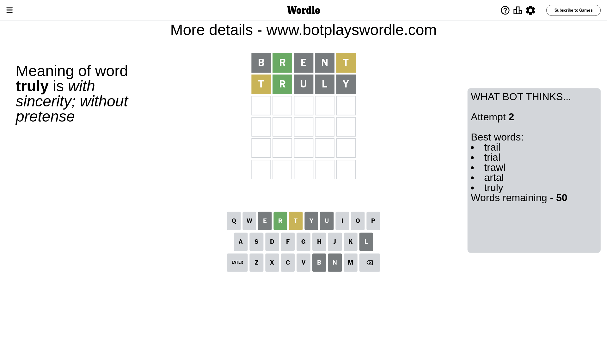

# Wordle for August 13, 2023 - \#785

## Attempt 1

This is the first attempt and we'll choose a random word to start with.

Let's start with word `brent`

Attempt for `brent` gives us 1 correct letters, 1 present letters and 3 wrong letters.

If we look into details, we can see that:

Letter `b` is not present in the word and we will not use it any more

Letter `r` should be at position 2

Letter `e` is not present in the word and we will not use it any more

Letter `n` is not present in the word and we will not use it any more

Letter `t` is on a different spot - this means that it cannot be at position 5

We got information about the correct letters and it should make next attempt easier

Some letters are missing (like `b`, `e`, `n`) but it's also important piece of information

Word should contain letters `[r t]`

That was a great guess that limited number of remaining words

## Attempt 2

Right now we have 50 words to choose from and best of them seem to be `[trail trial trawl artal truly]`

So far we know that possible letters are:

At position 1: `[a c d f g h i j k l m o p q r s t u v w x y z]`

At position 2: `[r]`

At position 3: `[a c d f g h i j k l m o p q r s t u v w x y z]`

At position 4: `[a c d f g h i j k l m o p q r s t u v w x y z]`

At position 5: `[a c d f g h i j k l m o p q r s u v w x y z]`

Next guess is `truly`, let's see what it gives us

Attempt for `truly` gives us 1 correct letters, 1 present letters and 3 wrong letters.

If we look into details, we can see that:

Letter `t` is on a different spot - this means that it cannot be at position 1

Letter `u` is not present in the word and we will not use it any more

Letter `l` is not present in the word and we will not use it any more

Letter `y` is not present in the word and we will not use it any more

Some letters are missing (like `u`, `l`, `y`) but it's also important piece of information

Word should contain letters `[r t]`

Not a bad guess in general

## Attempt 3

Right now we have 11 words to choose from and best of them seem to be `[wrath artha crith grith wroth]`

So far we know that possible letters are:

At position 1: `[a c d f g h i j k m o p q r s v w x z]`

At position 2: `[r]`

At position 3: `[a c d f g h i j k m o p q r s t v w x z]`

At position 4: `[a c d f g h i j k m o p q r s t v w x z]`

At position 5: `[a c d f g h i j k m o p q r s v w x z]`

Next guess is `wroth`, let's see what it gives us

Attempt for `wroth` gives us 4 correct letters, 0 present letters and 1 wrong letters.

If we look into details, we can see that:

Letter `w` should be at position 1

Letter `o` is not present in the word and we will not use it any more

Letter `t` should be at position 4

Letter `h` should be at position 5

We got information about the correct letters and it should make next attempt easier

Some letters are missing (like `o`) but it's also important piece of information

Word should contain letters `[r t w h]`

That was a great guess that limited number of remaining words

## Attempt 4

Right now we have 1 words to choose from and best of them seem to be `[wrath]`

So far we know that possible letters are:

At position 1: `[w]`

At position 2: `[r]`

At position 3: `[a c d f g h i j k m p q r s t v w x z]`

At position 4: `[t]`

At position 5: `[h]`

It must be `wrath`

That's the correct answer! The word is `wrath`!

## Conclusion

Today's word is `wrath` and it took 4 attempts to guess it

