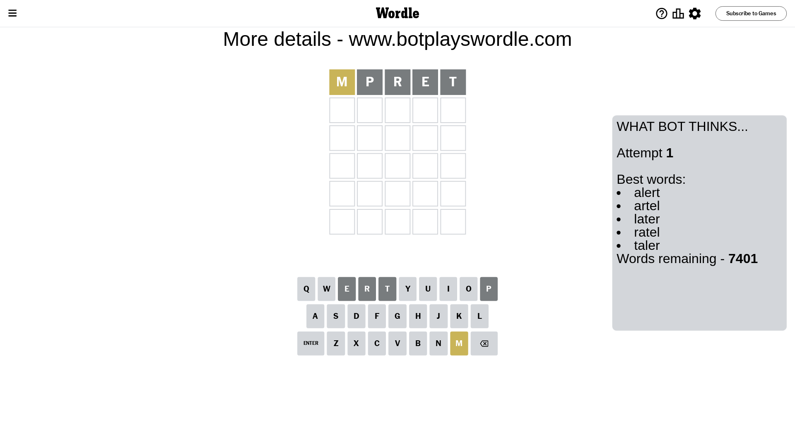
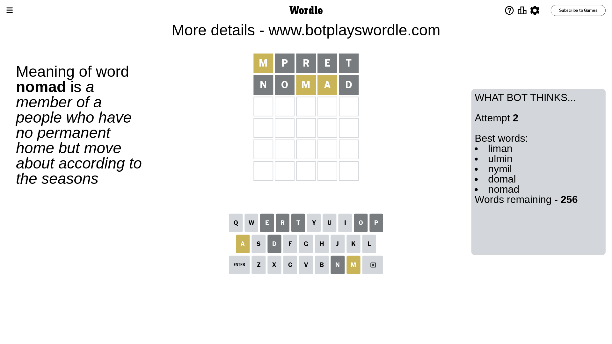
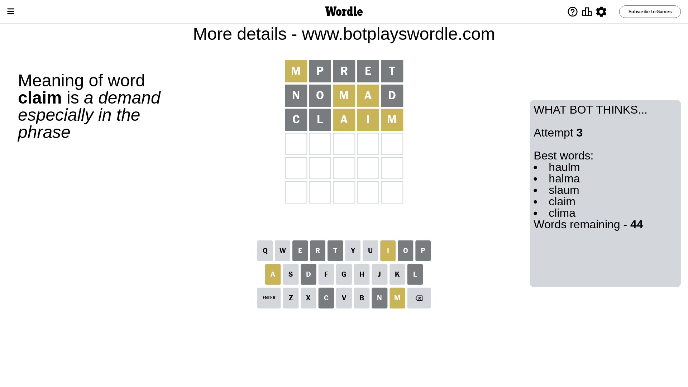
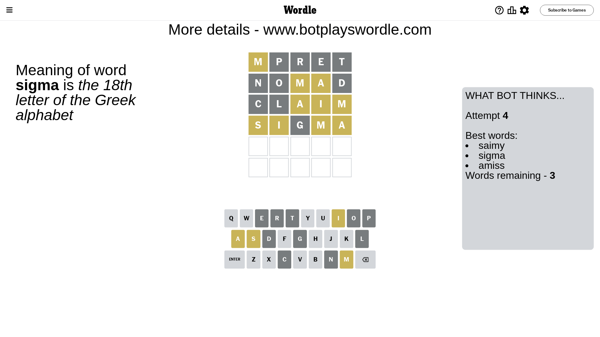
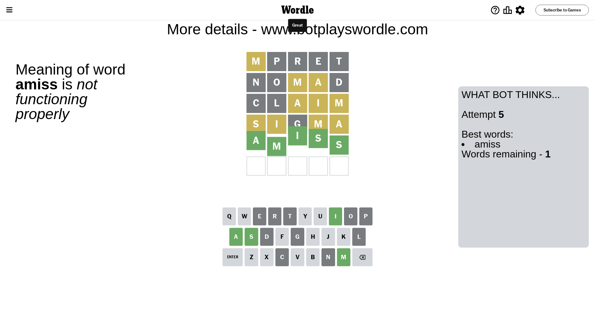

# Wordle for August 17, 2023 - \#789

## Attempt 1

This is the first attempt and we'll choose a random word to start with.

Let's start with word `mpret`

Attempt for `mpret` gives us 0 correct letters, 1 present letters and 4 wrong letters.

If we look into details, we can see that:

Letter `m` is on a different spot - this means that it cannot be at position 1

Letter `p` is not present in the word and we will not use it any more

Letter `r` is not present in the word and we will not use it any more

Letter `e` is not present in the word and we will not use it any more

Letter `t` is not present in the word and we will not use it any more

Some letters are missing (like `p`, `r`, `e`, `t`) but it's also important piece of information

Word should contain letters `[m]`

That was a great guess that limited number of remaining words

## Attempt 2

Right now we have 256 words to choose from and best of them seem to be `[liman ulmin nymil domal nomad]`

So far we know that possible letters are:

At position 1: `[a b c d f g h i j k l n o q s u v w x y z]`

At position 2: `[a b c d f g h i j k l m n o q s u v w x y z]`

At position 3: `[a b c d f g h i j k l m n o q s u v w x y z]`

At position 4: `[a b c d f g h i j k l m n o q s u v w x y z]`

At position 5: `[a b c d f g h i j k l m n o q s u v w x y z]`

Next guess is `nomad`, let's see what it gives us

Attempt for `nomad` gives us 0 correct letters, 2 present letters and 3 wrong letters.

If we look into details, we can see that:

Letter `n` is not present in the word and we will not use it any more

Letter `o` is not present in the word and we will not use it any more

Letter `m` is on a different spot - this means that it cannot be at position 3

Letter `a` is on a different spot - this means that it cannot be at position 4

Letter `d` is not present in the word and we will not use it any more

Some letters are missing (like `n`, `o`, `d`) but it's also important piece of information

Word should contain letters `[m a]`

Not a bad guess in general

## Attempt 3

Right now we have 44 words to choose from and best of them seem to be `[haulm halma slaum claim clima]`

So far we know that possible letters are:

At position 1: `[a b c f g h i j k l q s u v w x y z]`

At position 2: `[a b c f g h i j k l m q s u v w x y z]`

At position 3: `[a b c f g h i j k l q s u v w x y z]`

At position 4: `[b c f g h i j k l m q s u v w x y z]`

At position 5: `[a b c f g h i j k l m q s u v w x y z]`

Next guess is `claim`, let's see what it gives us

Attempt for `claim` gives us 0 correct letters, 3 present letters and 2 wrong letters.

If we look into details, we can see that:

Letter `c` is not present in the word and we will not use it any more

Letter `l` is not present in the word and we will not use it any more

Letter `a` is on a different spot - this means that it cannot be at position 3

Letter `i` is on a different spot - this means that it cannot be at position 4

Letter `m` is on a different spot - this means that it cannot be at position 5

Some letters are missing (like `c`, `l`) but it's also important piece of information

Word should contain letters `[m a i]`

That was a great guess that limited number of remaining words

## Attempt 4

Right now we have 3 words to choose from and best of them seem to be `[saimy sigma amiss]`

So far we know that possible letters are:

At position 1: `[a b f g h i j k q s u v w x y z]`

At position 2: `[a b f g h i j k m q s u v w x y z]`

At position 3: `[b f g h i j k q s u v w x y z]`

At position 4: `[b f g h j k m q s u v w x y z]`

At position 5: `[a b f g h i j k q s u v w x y z]`

Next guess is `sigma`, let's see what it gives us

Attempt for `sigma` gives us 0 correct letters, 4 present letters and 1 wrong letters.

If we look into details, we can see that:

Letter `s` is on a different spot - this means that it cannot be at position 1

Letter `i` is on a different spot - this means that it cannot be at position 2

Letter `g` is not present in the word and we will not use it any more

Letter `m` is on a different spot - this means that it cannot be at position 4

Letter `a` is on a different spot - this means that it cannot be at position 5

Some letters are missing (like `g`) but it's also important piece of information

Word should contain letters `[m a i s]`

Could be a better guess

## Attempt 5

Right now we have 1 words to choose from and best of them seem to be `[amiss]`

So far we know that possible letters are:

At position 1: `[a b f h i j k q u v w x y z]`

At position 2: `[a b f h j k m q s u v w x y z]`

At position 3: `[b f h i j k q s u v w x y z]`

At position 4: `[b f h j k q s u v w x y z]`

At position 5: `[b f h i j k q s u v w x y z]`

It must be `amiss`

That's the correct answer! The word is `amiss`!

## Conclusion

Today's word is `amiss` and it took 5 attempts to guess it

