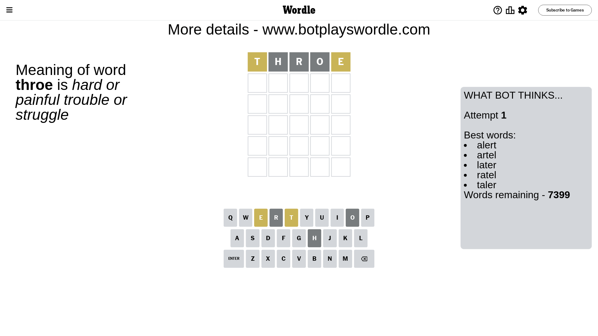
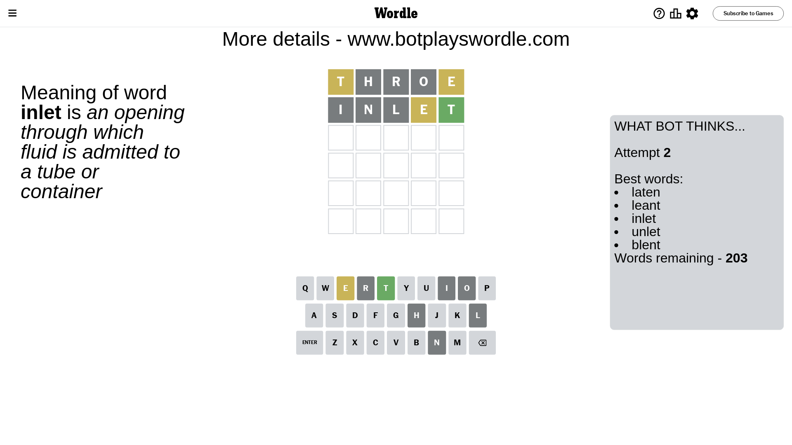
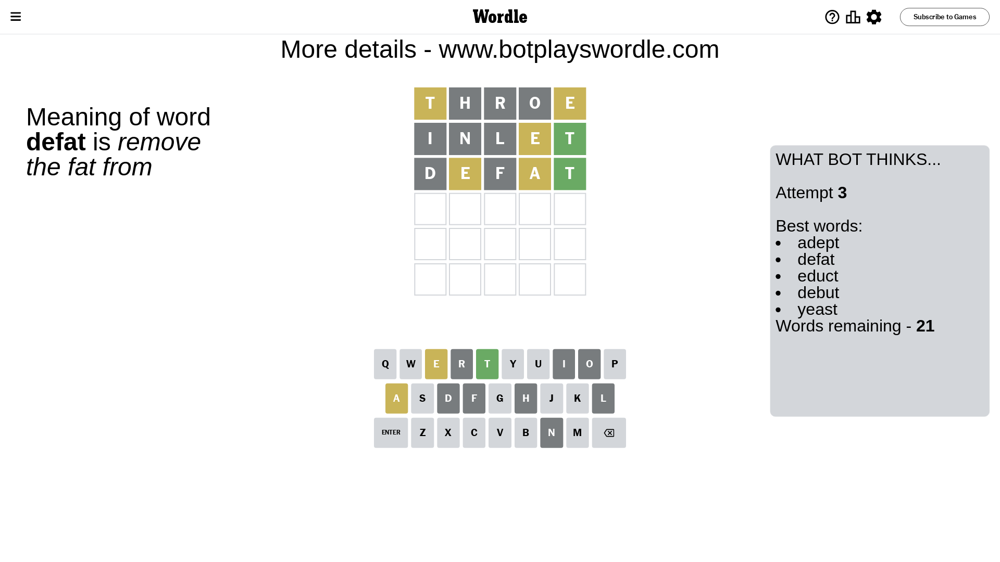
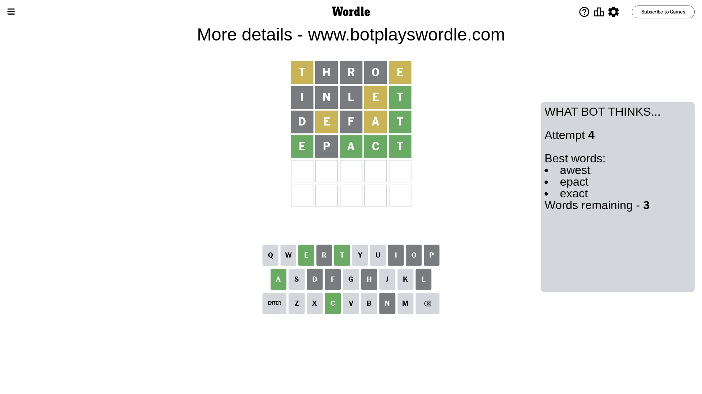
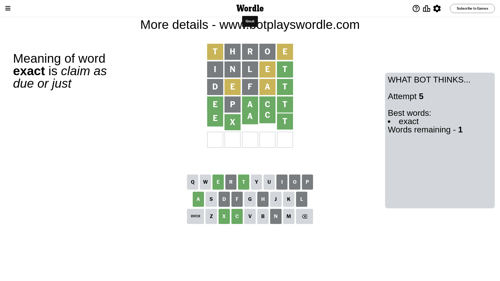

# Wordle for August 18, 2023 - \#790

## Attempt 1

This is the first attempt and we'll choose a random word to start with.

Let's start with word `throe`

Attempt for `throe` gives us 0 correct letters, 2 present letters and 3 wrong letters.

If we look into details, we can see that:

Letter `t` is on a different spot - this means that it cannot be at position 1

Letter `h` is not present in the word and we will not use it any more

Letter `r` is not present in the word and we will not use it any more

Letter `o` is not present in the word and we will not use it any more

Letter `e` is on a different spot - this means that it cannot be at position 5

Some letters are missing (like `h`, `r`, `o`) but it's also important piece of information

Word should contain letters `[t e]`

That was a great guess that limited number of remaining words

## Attempt 2

Right now we have 203 words to choose from and best of them seem to be `[laten leant inlet unlet blent]`

So far we know that possible letters are:

At position 1: `[a b c d e f g i j k l m n p q s u v w x y z]`

At position 2: `[a b c d e f g i j k l m n p q s t u v w x y z]`

At position 3: `[a b c d e f g i j k l m n p q s t u v w x y z]`

At position 4: `[a b c d e f g i j k l m n p q s t u v w x y z]`

At position 5: `[a b c d f g i j k l m n p q s t u v w x y z]`

Next guess is `inlet`, let's see what it gives us

Attempt for `inlet` gives us 1 correct letters, 1 present letters and 3 wrong letters.

If we look into details, we can see that:

Letter `i` is not present in the word and we will not use it any more

Letter `n` is not present in the word and we will not use it any more

Letter `l` is not present in the word and we will not use it any more

Letter `e` is on a different spot - this means that it cannot be at position 4

Letter `t` should be at position 5

We got information about the correct letters and it should make next attempt easier

Some letters are missing (like `i`, `n`, `l`) but it's also important piece of information

Word should contain letters `[t e]`

That was a great guess that limited number of remaining words

## Attempt 3

Right now we have 21 words to choose from and best of them seem to be `[adept defat educt debut yeast]`

So far we know that possible letters are:

At position 1: `[a b c d e f g j k m p q s u v w x y z]`

At position 2: `[a b c d e f g j k m p q s t u v w x y z]`

At position 3: `[a b c d e f g j k m p q s t u v w x y z]`

At position 4: `[a b c d f g j k m p q s t u v w x y z]`

At position 5: `[t]`

Next guess is `defat`, let's see what it gives us

Attempt for `defat` gives us 1 correct letters, 2 present letters and 2 wrong letters.

If we look into details, we can see that:

Letter `d` is not present in the word and we will not use it any more

Letter `e` is on a different spot - this means that it cannot be at position 2

Letter `f` is not present in the word and we will not use it any more

Letter `a` is on a different spot - this means that it cannot be at position 4

Some letters are missing (like `d`, `f`) but it's also important piece of information

Word should contain letters `[t e a]`

Not a bad guess in general

## Attempt 4

Right now we have 3 words to choose from and best of them seem to be `[awest epact exact]`

So far we know that possible letters are:

At position 1: `[a b c e g j k m p q s u v w x y z]`

At position 2: `[a b c g j k m p q s t u v w x y z]`

At position 3: `[a b c e g j k m p q s t u v w x y z]`

At position 4: `[b c g j k m p q s t u v w x y z]`

At position 5: `[t]`

Next guess is `epact`, let's see what it gives us

Attempt for `epact` gives us 4 correct letters, 0 present letters and 1 wrong letters.

If we look into details, we can see that:

Letter `e` should be at position 1

Letter `p` is not present in the word and we will not use it any more

Letter `a` should be at position 3

Letter `c` should be at position 4

We got information about the correct letters and it should make next attempt easier

Some letters are missing (like `p`) but it's also important piece of information

Word should contain letters `[t e a c]`

Could be a better guess

## Attempt 5

Right now we have 1 words to choose from and best of them seem to be `[exact]`

So far we know that possible letters are:

At position 1: `[e]`

At position 2: `[a b c g j k m q s t u v w x y z]`

At position 3: `[a]`

At position 4: `[c]`

At position 5: `[t]`

It must be `exact`

That's the correct answer! The word is `exact`!

## Conclusion

Today's word is `exact` and it took 5 attempts to guess it

