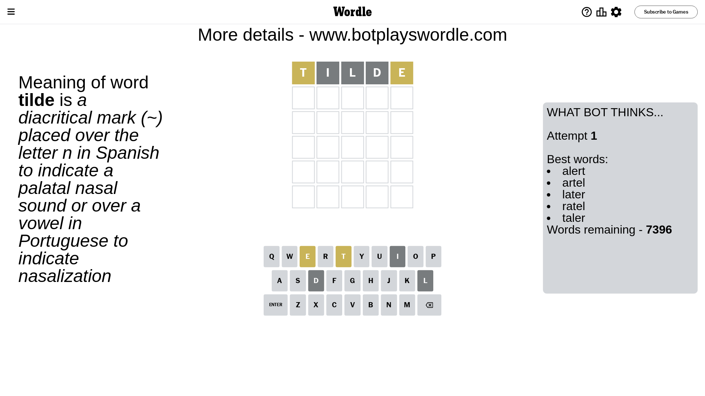

# Wordle for August 20, 2023 - \#792

## Attempt 1

This is the first attempt and we'll choose a random word to start with.

Let's start with word `tilde`

Attempt for `tilde` gives us 0 correct letters, 2 present letters and 3 wrong letters.

If we look into details, we can see that:

Letter `t` is on a different spot - this means that it cannot be at position 1

Letter `i` is not present in the word and we will not use it any more

Letter `l` is not present in the word and we will not use it any more

Letter `d` is not present in the word and we will not use it any more

Letter `e` is on a different spot - this means that it cannot be at position 5

Some letters are missing (like `i`, `l`, `d`) but it's also important piece of information

Word should contain letters `[t e]`

That was a great guess that limited number of remaining words

## Attempt 2

Right now we have 225 words to choose from and best of them seem to be `[noter stern urent entry brent]`

So far we know that possible letters are:

At position 1: `[a b c e f g h j k m n o p q r s u v w x y z]`

At position 2: `[a b c e f g h j k m n o p q r s t u v w x y z]`

At position 3: `[a b c e f g h j k m n o p q r s t u v w x y z]`

At position 4: `[a b c e f g h j k m n o p q r s t u v w x y z]`

At position 5: `[a b c f g h j k m n o p q r s t u v w x y z]`

Next guess is `entry`, let's see what it gives us

Attempt for `entry` gives us 0 correct letters, 2 present letters and 3 wrong letters.

If we look into details, we can see that:

Letter `e` is on a different spot - this means that it cannot be at position 1

Letter `n` is not present in the word and we will not use it any more

Letter `t` is on a different spot - this means that it cannot be at position 3

Letter `r` is not present in the word and we will not use it any more

Letter `y` is not present in the word and we will not use it any more

Some letters are missing (like `n`, `r`, `y`) but it's also important piece of information

Word should contain letters `[t e]`

Could be a better guess

## Attempt 3

Right now we have 57 words to choose from and best of them seem to be `[ashet sheat cheat beath wheat]`

So far we know that possible letters are:

At position 1: `[a b c f g h j k m o p q s u v w x z]`

At position 2: `[a b c e f g h j k m o p q s t u v w x z]`

At position 3: `[a b c e f g h j k m o p q s u v w x z]`

At position 4: `[a b c e f g h j k m o p q s t u v w x z]`

At position 5: `[a b c f g h j k m o p q s t u v w x z]`

Next guess is `beath`, let's see what it gives us

Attempt for `beath` gives us 0 correct letters, 2 present letters and 3 wrong letters.

If we look into details, we can see that:

Letter `b` is not present in the word and we will not use it any more

Letter `e` is on a different spot - this means that it cannot be at position 2

Letter `a` is not present in the word and we will not use it any more

Letter `t` is on a different spot - this means that it cannot be at position 4

Letter `h` is not present in the word and we will not use it any more

Some letters are missing (like `b`, `a`, `h`) but it's also important piece of information

Word should contain letters `[t e]`

Could be a better guess

## Attempt 4

Right now we have 17 words to choose from and best of them seem to be `[coset stoep comet ovest upset]`

So far we know that possible letters are:

At position 1: `[c f g j k m o p q s u v w x z]`

At position 2: `[c f g j k m o p q s t u v w x z]`

At position 3: `[c e f g j k m o p q s u v w x z]`

At position 4: `[c e f g j k m o p q s u v w x z]`

At position 5: `[c f g j k m o p q s t u v w x z]`

Next guess is `stoep`, let's see what it gives us

Attempt for `stoep` gives us 0 correct letters, 3 present letters and 2 wrong letters.

If we look into details, we can see that:

Letter `s` is on a different spot - this means that it cannot be at position 1

Letter `t` is on a different spot - this means that it cannot be at position 2

Letter `o` is not present in the word and we will not use it any more

Letter `e` is on a different spot - this means that it cannot be at position 4

Letter `p` is not present in the word and we will not use it any more

Some letters are missing (like `o`, `p`) but it's also important piece of information

Word should contain letters `[t e s]`

That was a great guess that limited number of remaining words

## Attempt 5

Right now we have 1 words to choose from and best of them seem to be `[quest]`

So far we know that possible letters are:

At position 1: `[c f g j k m q u v w x z]`

At position 2: `[c f g j k m q s u v w x z]`

At position 3: `[c e f g j k m q s u v w x z]`

At position 4: `[c f g j k m q s u v w x z]`

At position 5: `[c f g j k m q s t u v w x z]`

It must be `guest`

Attempt for `guest` gives us 4 correct letters, 0 present letters and 1 wrong letters.

If we look into details, we can see that:

Letter `g` is not present in the word and we will not use it any more

Letter `u` should be at position 2

Letter `e` should be at position 3

Letter `s` should be at position 4

Letter `t` should be at position 5

We got information about the correct letters and it should make next attempt easier

Some letters are missing (like `g`) but it's also important piece of information

Word should contain letters `[t e s u]`

This was a waste, almost no valuable information...

## Attempt 6

Right now we have 1 words to choose from and best of them seem to be `[quest]`

So far we know that possible letters are:

At position 1: `[c f j k m q u v w x z]`

At position 2: `[u]`

At position 3: `[e]`

At position 4: `[s]`

At position 5: `[t]`

It must be `quest`

That's the correct answer! The word is `quest`!

## Conclusion

Today's word is `quest` and it took 6 attempts to guess it

