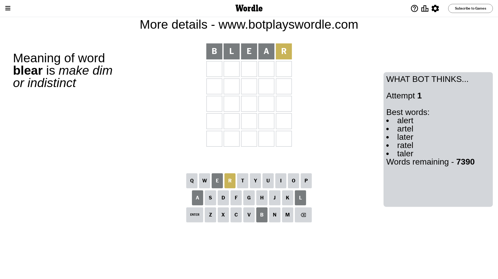
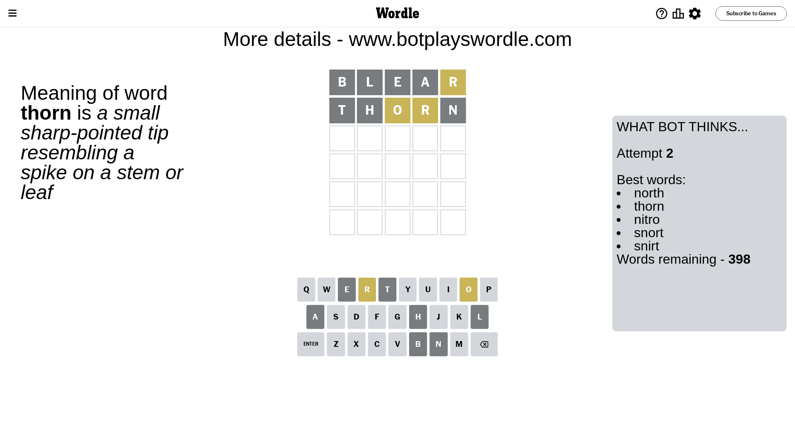
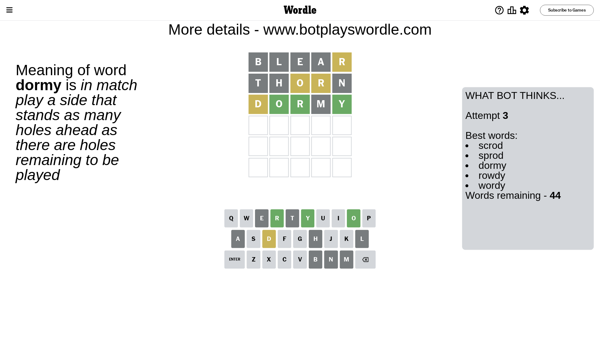
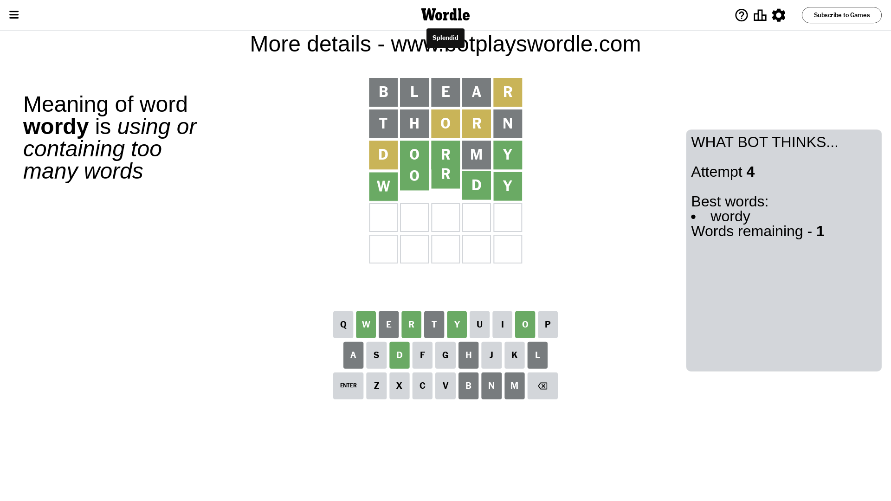

# Wordle for August 24, 2023 - \#796

## Attempt 1

This is the first attempt and we'll choose a random word to start with.

Let's start with word `blear`

Attempt for `blear` gives us 0 correct letters, 1 present letters and 4 wrong letters.

If we look into details, we can see that:

Letter `b` is not present in the word and we will not use it any more

Letter `l` is not present in the word and we will not use it any more

Letter `e` is not present in the word and we will not use it any more

Letter `a` is not present in the word and we will not use it any more

Letter `r` is on a different spot - this means that it cannot be at position 5

Some letters are missing (like `b`, `l`, `e`, `a`) but it's also important piece of information

Word should contain letters `[r]`

That was a great guess that limited number of remaining words

## Attempt 2

Right now we have 398 words to choose from and best of them seem to be `[north thorn nitro snort snirt]`

So far we know that possible letters are:

At position 1: `[c d f g h i j k m n o p q r s t u v w x y z]`

At position 2: `[c d f g h i j k m n o p q r s t u v w x y z]`

At position 3: `[c d f g h i j k m n o p q r s t u v w x y z]`

At position 4: `[c d f g h i j k m n o p q r s t u v w x y z]`

At position 5: `[c d f g h i j k m n o p q s t u v w x y z]`

Next guess is `thorn`, let's see what it gives us

Attempt for `thorn` gives us 0 correct letters, 2 present letters and 3 wrong letters.

If we look into details, we can see that:

Letter `t` is not present in the word and we will not use it any more

Letter `h` is not present in the word and we will not use it any more

Letter `o` is on a different spot - this means that it cannot be at position 3

Letter `r` is on a different spot - this means that it cannot be at position 4

Letter `n` is not present in the word and we will not use it any more

Some letters are missing (like `t`, `h`, `n`) but it's also important piece of information

Word should contain letters `[r o]`

That was a great guess that limited number of remaining words

## Attempt 3

Right now we have 44 words to choose from and best of them seem to be `[scrod sprod dormy rowdy wordy]`

So far we know that possible letters are:

At position 1: `[c d f g i j k m o p q r s u v w x y z]`

At position 2: `[c d f g i j k m o p q r s u v w x y z]`

At position 3: `[c d f g i j k m p q r s u v w x y z]`

At position 4: `[c d f g i j k m o p q s u v w x y z]`

At position 5: `[c d f g i j k m o p q s u v w x y z]`

Next guess is `dormy`, let's see what it gives us

Attempt for `dormy` gives us 3 correct letters, 1 present letters and 1 wrong letters.

If we look into details, we can see that:

Letter `d` is on a different spot - this means that it cannot be at position 1

Letter `o` should be at position 2

Letter `r` should be at position 3

Letter `m` is not present in the word and we will not use it any more

Letter `y` should be at position 5

We got information about the correct letters and it should make next attempt easier

Some letters are missing (like `m`) but it's also important piece of information

Word should contain letters `[r o d y]`

That was a great guess that limited number of remaining words

## Attempt 4

Right now we have 1 words to choose from and best of them seem to be `[wordy]`

So far we know that possible letters are:

At position 1: `[c f g i j k o p q r s u v w x y z]`

At position 2: `[o]`

At position 3: `[r]`

At position 4: `[c d f g i j k o p q s u v w x y z]`

At position 5: `[y]`

It must be `wordy`

That's the correct answer! The word is `wordy`!

## Conclusion

Today's word is `wordy` and it took 4 attempts to guess it

