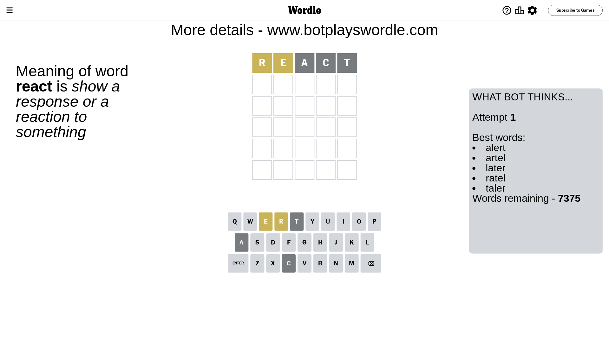
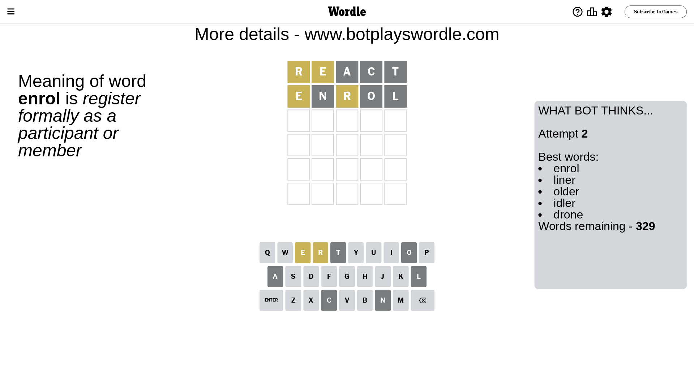
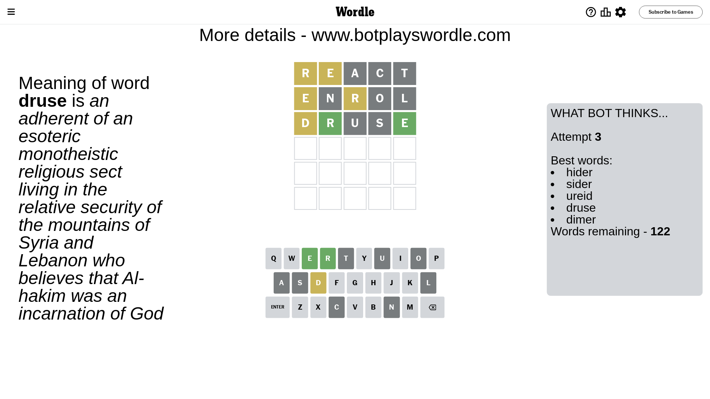
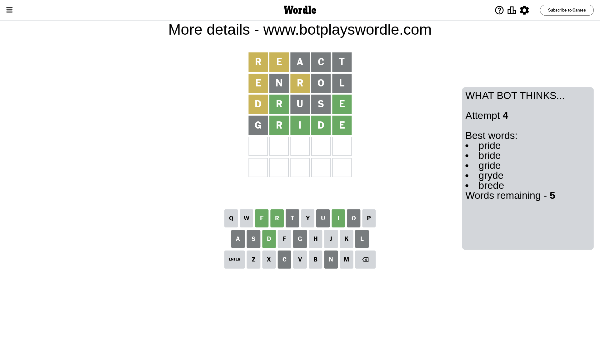
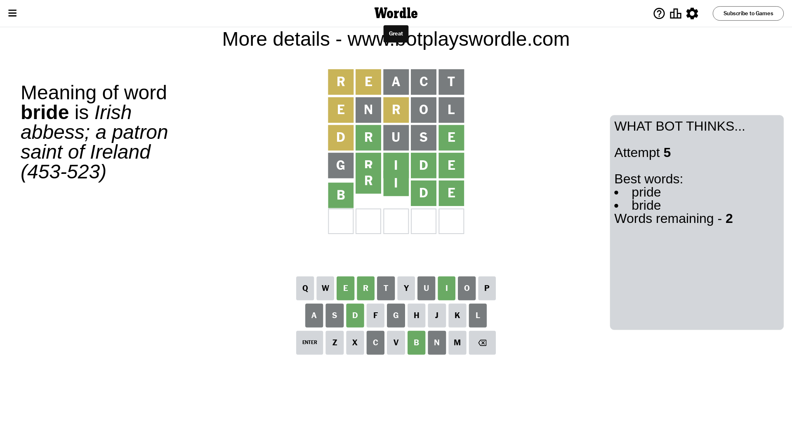

# Wordle for August 31, 2023 - \#803

## Attempt 1

This is the first attempt and we'll choose a random word to start with.

Let's start with word `react`

Attempt for `react` gives us 0 correct letters, 2 present letters and 3 wrong letters.

If we look into details, we can see that:

Letter `r` is on a different spot - this means that it cannot be at position 1

Letter `e` is on a different spot - this means that it cannot be at position 2

Letter `a` is not present in the word and we will not use it any more

Letter `c` is not present in the word and we will not use it any more

Letter `t` is not present in the word and we will not use it any more

Some letters are missing (like `a`, `c`, `t`) but it's also important piece of information

Word should contain letters `[r e]`

That was a great guess that limited number of remaining words

## Attempt 2

Right now we have 329 words to choose from and best of them seem to be `[enrol liner older idler drone]`

So far we know that possible letters are:

At position 1: `[b d e f g h i j k l m n o p q s u v w x y z]`

At position 2: `[b d f g h i j k l m n o p q r s u v w x y z]`

At position 3: `[b d e f g h i j k l m n o p q r s u v w x y z]`

At position 4: `[b d e f g h i j k l m n o p q r s u v w x y z]`

At position 5: `[b d e f g h i j k l m n o p q r s u v w x y z]`

Next guess is `enrol`, let's see what it gives us

Attempt for `enrol` gives us 0 correct letters, 2 present letters and 3 wrong letters.

If we look into details, we can see that:

Letter `e` is on a different spot - this means that it cannot be at position 1

Letter `n` is not present in the word and we will not use it any more

Letter `r` is on a different spot - this means that it cannot be at position 3

Letter `o` is not present in the word and we will not use it any more

Letter `l` is not present in the word and we will not use it any more

Some letters are missing (like `n`, `o`, `l`) but it's also important piece of information

Word should contain letters `[r e]`

Could be a better guess

## Attempt 3

Right now we have 122 words to choose from and best of them seem to be `[hider sider ureid druse dimer]`

So far we know that possible letters are:

At position 1: `[b d f g h i j k m p q s u v w x y z]`

At position 2: `[b d f g h i j k m p q r s u v w x y z]`

At position 3: `[b d e f g h i j k m p q s u v w x y z]`

At position 4: `[b d e f g h i j k m p q r s u v w x y z]`

At position 5: `[b d e f g h i j k m p q r s u v w x y z]`

Next guess is `druse`, let's see what it gives us

Attempt for `druse` gives us 2 correct letters, 1 present letters and 2 wrong letters.

If we look into details, we can see that:

Letter `d` is on a different spot - this means that it cannot be at position 1

Letter `r` should be at position 2

Letter `u` is not present in the word and we will not use it any more

Letter `s` is not present in the word and we will not use it any more

Letter `e` should be at position 5

We got information about the correct letters and it should make next attempt easier

Some letters are missing (like `u`, `s`) but it's also important piece of information

Word should contain letters `[r e d]`

That was a great guess that limited number of remaining words

## Attempt 4

Right now we have 5 words to choose from and best of them seem to be `[pride bride gride gryde brede]`

So far we know that possible letters are:

At position 1: `[b f g h i j k m p q v w x y z]`

At position 2: `[r]`

At position 3: `[b d e f g h i j k m p q v w x y z]`

At position 4: `[b d e f g h i j k m p q r v w x y z]`

At position 5: `[e]`

Next guess is `gride`, let's see what it gives us

Attempt for `gride` gives us 4 correct letters, 0 present letters and 1 wrong letters.

If we look into details, we can see that:

Letter `g` is not present in the word and we will not use it any more

Letter `i` should be at position 3

Letter `d` should be at position 4

We got information about the correct letters and it should make next attempt easier

Some letters are missing (like `g`) but it's also important piece of information

Word should contain letters `[r e d i]`

Could be a better guess

## Attempt 5

Right now we have 2 words to choose from and best of them seem to be `[pride bride]`

So far we know that possible letters are:

At position 1: `[b f h i j k m p q v w x y z]`

At position 2: `[r]`

At position 3: `[i]`

At position 4: `[d]`

At position 5: `[e]`

Next guess is `bride`, let's see what it gives us

That's the correct answer! The word is `bride`!

## Conclusion

Today's word is `bride` and it took 5 attempts to guess it

