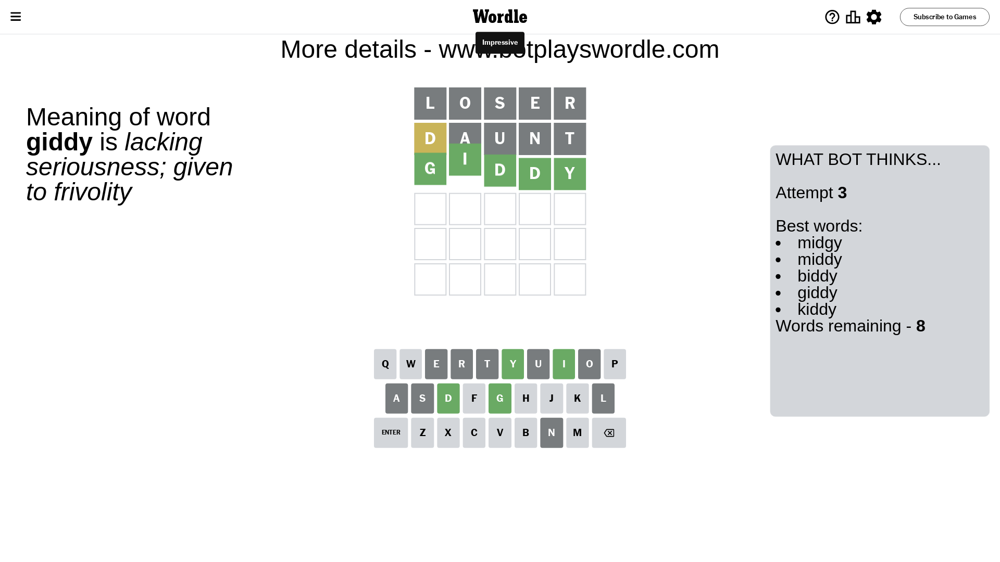

# Wordle for September 4, 2023 - \#807

## Attempt 1

This is the first attempt and we'll choose a random word to start with.

Let's start with word `loser`

Attempt for `loser` gives us 0 correct letters, 0 present letters and 5 wrong letters.

If we look into details, we can see that:

Letter `l` is not present in the word and we will not use it any more

Letter `o` is not present in the word and we will not use it any more

Letter `s` is not present in the word and we will not use it any more

Letter `e` is not present in the word and we will not use it any more

Letter `r` is not present in the word and we will not use it any more

Some letters are missing (like `l`, `o`, `s`, `e`, `r`) but it's also important piece of information

So far we don't know any of the letters!

That was a great guess that limited number of remaining words

## Attempt 2

Right now we have 894 words to choose from and best of them seem to be `[idant daunt ahint hiant haunt]`

So far we know that possible letters are:

At position 1: `[a b c d f g h i j k m n p q t u v w x y z]`

At position 2: `[a b c d f g h i j k m n p q t u v w x y z]`

At position 3: `[a b c d f g h i j k m n p q t u v w x y z]`

At position 4: `[a b c d f g h i j k m n p q t u v w x y z]`

At position 5: `[a b c d f g h i j k m n p q t u v w x y z]`

Next guess is `daunt`, let's see what it gives us

Attempt for `daunt` gives us 0 correct letters, 1 present letters and 4 wrong letters.

If we look into details, we can see that:

Letter `d` is on a different spot - this means that it cannot be at position 1

Letter `a` is not present in the word and we will not use it any more

Letter `u` is not present in the word and we will not use it any more

Letter `n` is not present in the word and we will not use it any more

Letter `t` is not present in the word and we will not use it any more

Some letters are missing (like `a`, `u`, `n`, `t`) but it's also important piece of information

Word should contain letters `[d]`

That was a great guess that limited number of remaining words

## Attempt 3

Right now we have 8 words to choose from and best of them seem to be `[midgy middy biddy giddy kiddy]`

So far we know that possible letters are:

At position 1: `[b c f g h i j k m p q v w x y z]`

At position 2: `[b c d f g h i j k m p q v w x y z]`

At position 3: `[b c d f g h i j k m p q v w x y z]`

At position 4: `[b c d f g h i j k m p q v w x y z]`

At position 5: `[b c d f g h i j k m p q v w x y z]`

Next guess is `giddy`, let's see what it gives us

That's the correct answer! The word is `giddy`!

## Conclusion

Today's word is `giddy` and it took 3 attempts to guess it

