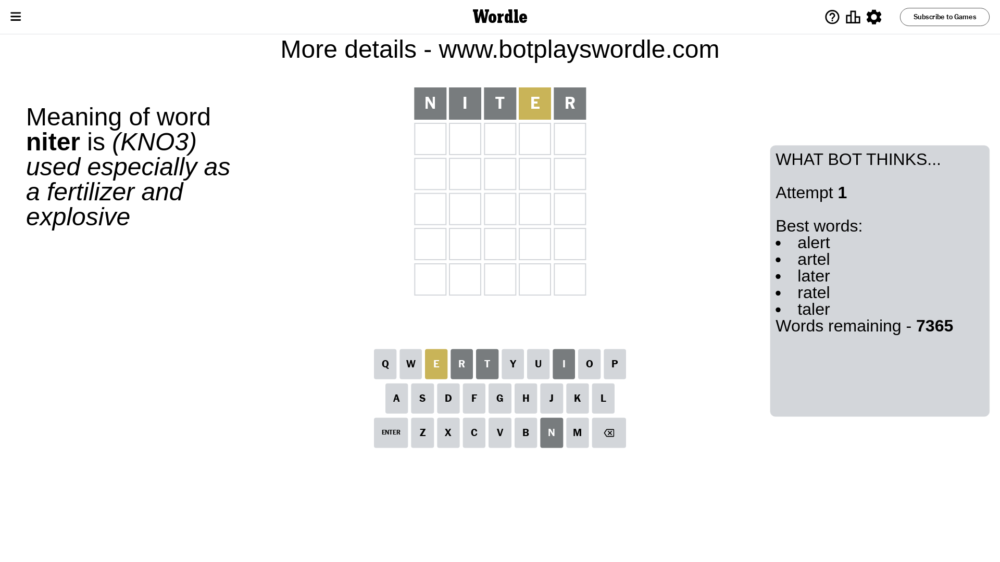
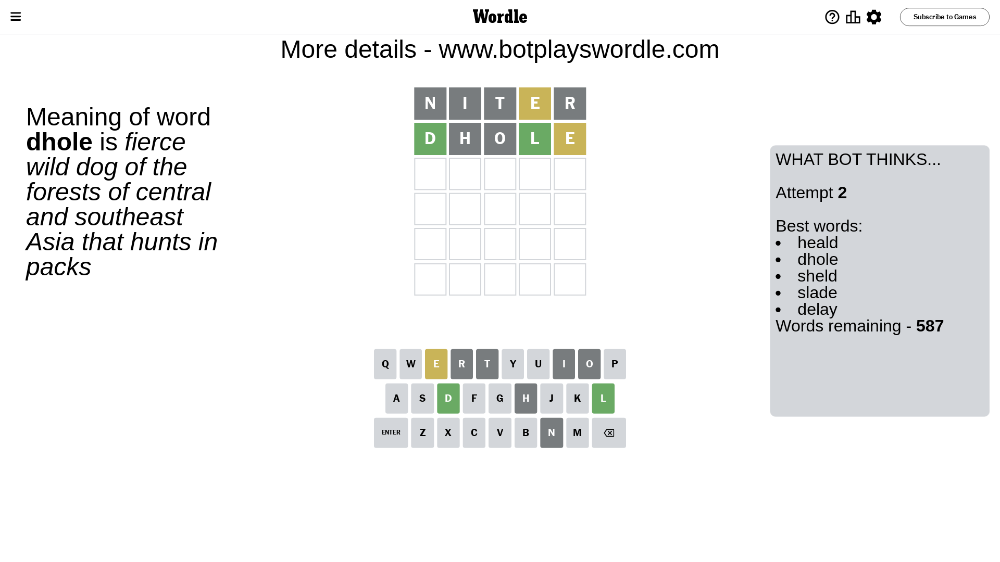
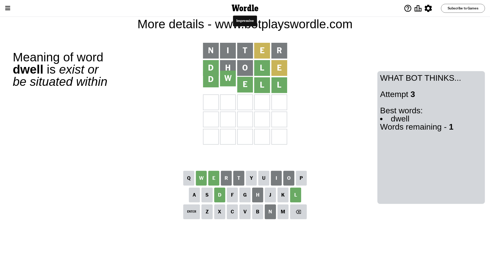

# Wordle for September 7, 2023 - \#810

## Attempt 1

This is the first attempt and we'll choose a random word to start with.

Let's start with word `niter`

Attempt for `niter` gives us 0 correct letters, 1 present letters and 4 wrong letters.

If we look into details, we can see that:

Letter `n` is not present in the word and we will not use it any more

Letter `i` is not present in the word and we will not use it any more

Letter `t` is not present in the word and we will not use it any more

Letter `e` is on a different spot - this means that it cannot be at position 4

Letter `r` is not present in the word and we will not use it any more

Some letters are missing (like `n`, `i`, `t`, `r`) but it's also important piece of information

Word should contain letters `[e]`

That was a great guess that limited number of remaining words

## Attempt 2

Right now we have 587 words to choose from and best of them seem to be `[heald dhole sheld slade delay]`

So far we know that possible letters are:

At position 1: `[a b c d e f g h j k l m o p q s u v w x y z]`

At position 2: `[a b c d e f g h j k l m o p q s u v w x y z]`

At position 3: `[a b c d e f g h j k l m o p q s u v w x y z]`

At position 4: `[a b c d f g h j k l m o p q s u v w x y z]`

At position 5: `[a b c d e f g h j k l m o p q s u v w x y z]`

Next guess is `dhole`, let's see what it gives us

Attempt for `dhole` gives us 2 correct letters, 1 present letters and 2 wrong letters.

If we look into details, we can see that:

Letter `d` should be at position 1

Letter `h` is not present in the word and we will not use it any more

Letter `o` is not present in the word and we will not use it any more

Letter `l` should be at position 4

Letter `e` is on a different spot - this means that it cannot be at position 5

We got information about the correct letters and it should make next attempt easier

Some letters are missing (like `h`, `o`) but it's also important piece of information

Word should contain letters `[e d l]`

That was a great guess that limited number of remaining words

## Attempt 3

Right now we have 1 words to choose from and best of them seem to be `[dwell]`

So far we know that possible letters are:

At position 1: `[d]`

At position 2: `[a b c d e f g j k l m p q s u v w x y z]`

At position 3: `[a b c d e f g j k l m p q s u v w x y z]`

At position 4: `[l]`

At position 5: `[a b c d f g j k l m p q s u v w x y z]`

It must be `dwell`

That's the correct answer! The word is `dwell`!

## Conclusion

Today's word is `dwell` and it took 3 attempts to guess it

