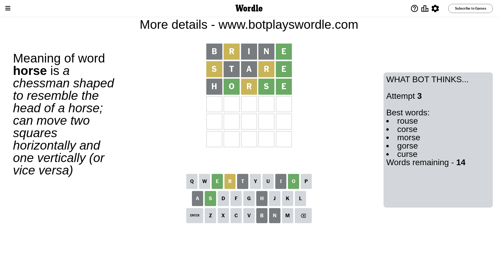

# Wordle for September 8, 2023 - \#811

## Attempt 1

This is the first attempt and we'll choose a random word to start with.

Let's start with word `brine`

Attempt for `brine` gives us 1 correct letters, 1 present letters and 3 wrong letters.

If we look into details, we can see that:

Letter `b` is not present in the word and we will not use it any more

Letter `r` is on a different spot - this means that it cannot be at position 2

Letter `i` is not present in the word and we will not use it any more

Letter `n` is not present in the word and we will not use it any more

Letter `e` should be at position 5

We got information about the correct letters and it should make next attempt easier

Some letters are missing (like `b`, `i`, `n`) but it's also important piece of information

Word should contain letters `[r e]`

That was a great guess that limited number of remaining words

## Attempt 2

Right now we have 138 words to choose from and best of them seem to be `[rathe throe stare strae tarse]`

So far we know that possible letters are:

At position 1: `[a c d e f g h j k l m o p q r s t u v w x y z]`

At position 2: `[a c d e f g h j k l m o p q s t u v w x y z]`

At position 3: `[a c d e f g h j k l m o p q r s t u v w x y z]`

At position 4: `[a c d e f g h j k l m o p q r s t u v w x y z]`

At position 5: `[e]`

Next guess is `stare`, let's see what it gives us

Attempt for `stare` gives us 1 correct letters, 2 present letters and 2 wrong letters.

If we look into details, we can see that:

Letter `s` is on a different spot - this means that it cannot be at position 1

Letter `t` is not present in the word and we will not use it any more

Letter `a` is not present in the word and we will not use it any more

Letter `r` is on a different spot - this means that it cannot be at position 4

Some letters are missing (like `t`, `a`) but it's also important piece of information

Word should contain letters `[r e s]`

That was a great guess that limited number of remaining words

## Attempt 3

Right now we have 14 words to choose from and best of them seem to be `[rouse corse morse gorse curse]`

So far we know that possible letters are:

At position 1: `[c d e f g h j k l m o p q r u v w x y z]`

At position 2: `[c d e f g h j k l m o p q s u v w x y z]`

At position 3: `[c d e f g h j k l m o p q r s u v w x y z]`

At position 4: `[c d e f g h j k l m o p q s u v w x y z]`

At position 5: `[e]`

Next guess is `horse`, let's see what it gives us

Attempt for `horse` gives us 3 correct letters, 1 present letters and 1 wrong letters.

If we look into details, we can see that:

Letter `h` is not present in the word and we will not use it any more

Letter `o` should be at position 2

Letter `r` is on a different spot - this means that it cannot be at position 3

Letter `s` should be at position 4

We got information about the correct letters and it should make next attempt easier

Some letters are missing (like `h`) but it's also important piece of information

Word should contain letters `[r e s o]`

That was a great guess that limited number of remaining words

## Attempt 4

Right now we have 1 words to choose from and best of them seem to be `[rouse]`

So far we know that possible letters are:

At position 1: `[c d e f g j k l m o p q r u v w x y z]`

At position 2: `[o]`

At position 3: `[c d e f g j k l m o p q s u v w x y z]`

At position 4: `[s]`

At position 5: `[e]`

It must be `rouse`

That's the correct answer! The word is `rouse`!

## Conclusion

Today's word is `rouse` and it took 4 attempts to guess it

