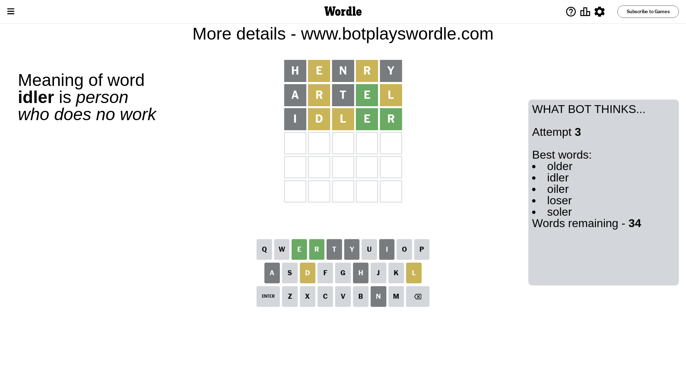

# Wordle for September 11, 2023 - \#814

## Attempt 1

This is the first attempt and we'll choose a random word to start with.

Let's start with word `henry`

Attempt for `henry` gives us 0 correct letters, 2 present letters and 3 wrong letters.

If we look into details, we can see that:

Letter `h` is not present in the word and we will not use it any more

Letter `e` is on a different spot - this means that it cannot be at position 2

Letter `n` is not present in the word and we will not use it any more

Letter `r` is on a different spot - this means that it cannot be at position 4

Letter `y` is not present in the word and we will not use it any more

Some letters are missing (like `h`, `n`, `y`) but it's also important piece of information

Word should contain letters `[e r]`

That was a great guess that limited number of remaining words

## Attempt 2

Right now we have 580 words to choose from and best of them seem to be `[artel later ratel taler liter]`

So far we know that possible letters are:

At position 1: `[a b c d e f g i j k l m o p q r s t u v w x z]`

At position 2: `[a b c d f g i j k l m o p q r s t u v w x z]`

At position 3: `[a b c d e f g i j k l m o p q r s t u v w x z]`

At position 4: `[a b c d e f g i j k l m o p q s t u v w x z]`

At position 5: `[a b c d e f g i j k l m o p q r s t u v w x z]`

Next guess is `artel`, let's see what it gives us

Attempt for `artel` gives us 1 correct letters, 2 present letters and 2 wrong letters.

If we look into details, we can see that:

Letter `a` is not present in the word and we will not use it any more

Letter `r` is on a different spot - this means that it cannot be at position 2

Letter `t` is not present in the word and we will not use it any more

Letter `e` should be at position 4

Letter `l` is on a different spot - this means that it cannot be at position 5

We got information about the correct letters and it should make next attempt easier

Some letters are missing (like `a`, `t`) but it's also important piece of information

Word should contain letters `[e r l]`

That was a great guess that limited number of remaining words

## Attempt 3

Right now we have 34 words to choose from and best of them seem to be `[older idler oiler loser soler]`

So far we know that possible letters are:

At position 1: `[b c d e f g i j k l m o p q r s u v w x z]`

At position 2: `[b c d f g i j k l m o p q s u v w x z]`

At position 3: `[b c d e f g i j k l m o p q r s u v w x z]`

At position 4: `[e]`

At position 5: `[b c d e f g i j k m o p q r s u v w x z]`

Next guess is `idler`, let's see what it gives us

Attempt for `idler` gives us 2 correct letters, 2 present letters and 1 wrong letters.

If we look into details, we can see that:

Letter `i` is not present in the word and we will not use it any more

Letter `d` is on a different spot - this means that it cannot be at position 2

Letter `l` is on a different spot - this means that it cannot be at position 3

Letter `r` should be at position 5

We got information about the correct letters and it should make next attempt easier

Some letters are missing (like `i`) but it's also important piece of information

Word should contain letters `[e r l d]`

That was a great guess that limited number of remaining words

## Attempt 4

Right now we have 2 words to choose from and best of them seem to be `[older elder]`

So far we know that possible letters are:

At position 1: `[b c d e f g j k l m o p q r s u v w x z]`

At position 2: `[b c f g j k l m o p q s u v w x z]`

At position 3: `[b c d e f g j k m o p q r s u v w x z]`

At position 4: `[e]`

At position 5: `[r]`

Next guess is `elder`, let's see what it gives us

Attempt for `elder` gives us 4 correct letters, 0 present letters and 1 wrong letters.

If we look into details, we can see that:

Letter `e` is not present in the word and we will not use it any more

Letter `l` should be at position 2

Letter `d` should be at position 3

We got information about the correct letters and it should make next attempt easier

Some letters are missing (like `e`) but it's also important piece of information

Word should contain letters `[e r l d]`

This was a waste, almost no valuable information...

## Attempt 5

Right now we have 1 words to choose from and best of them seem to be `[older]`

So far we know that possible letters are:

At position 1: `[b c d f g j k l m o p q r s u v w x z]`

At position 2: `[l]`

At position 3: `[d]`

At position 4: `[e]`

At position 5: `[r]`

It must be `older`

That's the correct answer! The word is `older`!

## Conclusion

Today's word is `older` and it took 5 attempts to guess it

