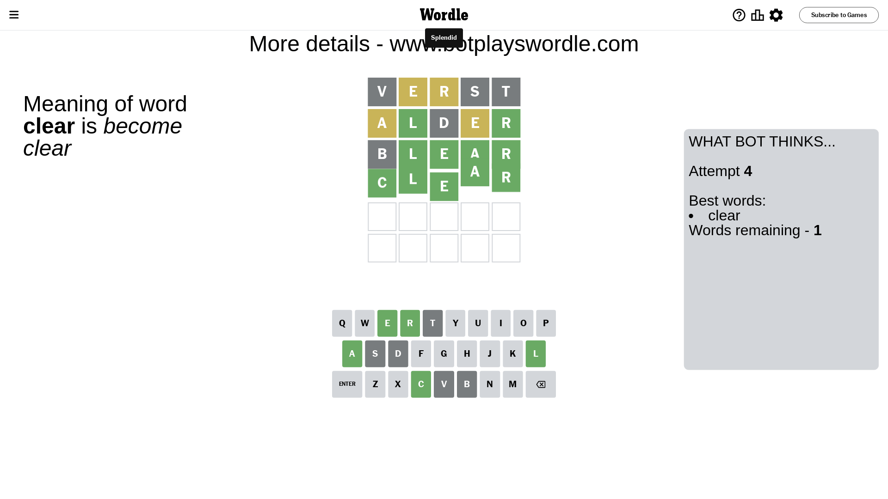

# Wordle for September 13, 2023 - \#816

## Attempt 1

This is the first attempt and we'll choose a random word to start with.

Let's start with word `verst`

Attempt for `verst` gives us 0 correct letters, 2 present letters and 3 wrong letters.

If we look into details, we can see that:

Letter `v` is not present in the word and we will not use it any more

Letter `e` is on a different spot - this means that it cannot be at position 2

Letter `r` is on a different spot - this means that it cannot be at position 3

Letter `s` is not present in the word and we will not use it any more

Letter `t` is not present in the word and we will not use it any more

Some letters are missing (like `v`, `s`, `t`) but it's also important piece of information

Word should contain letters `[e r]`

That was a great guess that limited number of remaining words

## Attempt 2

Right now we have 405 words to choose from and best of them seem to be `[liner alder lader haler idler]`

So far we know that possible letters are:

At position 1: `[a b c d e f g h i j k l m n o p q r u w x y z]`

At position 2: `[a b c d f g h i j k l m n o p q r u w x y z]`

At position 3: `[a b c d e f g h i j k l m n o p q u w x y z]`

At position 4: `[a b c d e f g h i j k l m n o p q r u w x y z]`

At position 5: `[a b c d e f g h i j k l m n o p q r u w x y z]`

Next guess is `alder`, let's see what it gives us

Attempt for `alder` gives us 2 correct letters, 2 present letters and 1 wrong letters.

If we look into details, we can see that:

Letter `a` is on a different spot - this means that it cannot be at position 1

Letter `l` should be at position 2

Letter `d` is not present in the word and we will not use it any more

Letter `e` is on a different spot - this means that it cannot be at position 4

Letter `r` should be at position 5

We got information about the correct letters and it should make next attempt easier

Some letters are missing (like `d`) but it's also important piece of information

Word should contain letters `[e r a l]`

That was a great guess that limited number of remaining words

## Attempt 3

Right now we have 2 words to choose from and best of them seem to be `[clear blear]`

So far we know that possible letters are:

At position 1: `[b c e f g h i j k l m n o p q r u w x y z]`

At position 2: `[l]`

At position 3: `[a b c e f g h i j k l m n o p q u w x y z]`

At position 4: `[a b c f g h i j k l m n o p q r u w x y z]`

At position 5: `[r]`

Next guess is `blear`, let's see what it gives us

Attempt for `blear` gives us 4 correct letters, 0 present letters and 1 wrong letters.

If we look into details, we can see that:

Letter `b` is not present in the word and we will not use it any more

Letter `e` should be at position 3

Letter `a` should be at position 4

We got information about the correct letters and it should make next attempt easier

Some letters are missing (like `b`) but it's also important piece of information

Word should contain letters `[e r a l]`

This was a waste, almost no valuable information...

## Attempt 4

Right now we have 1 words to choose from and best of them seem to be `[clear]`

So far we know that possible letters are:

At position 1: `[c e f g h i j k l m n o p q r u w x y z]`

At position 2: `[l]`

At position 3: `[e]`

At position 4: `[a]`

At position 5: `[r]`

It must be `clear`

That's the correct answer! The word is `clear`!

## Conclusion

Today's word is `clear` and it took 4 attempts to guess it

