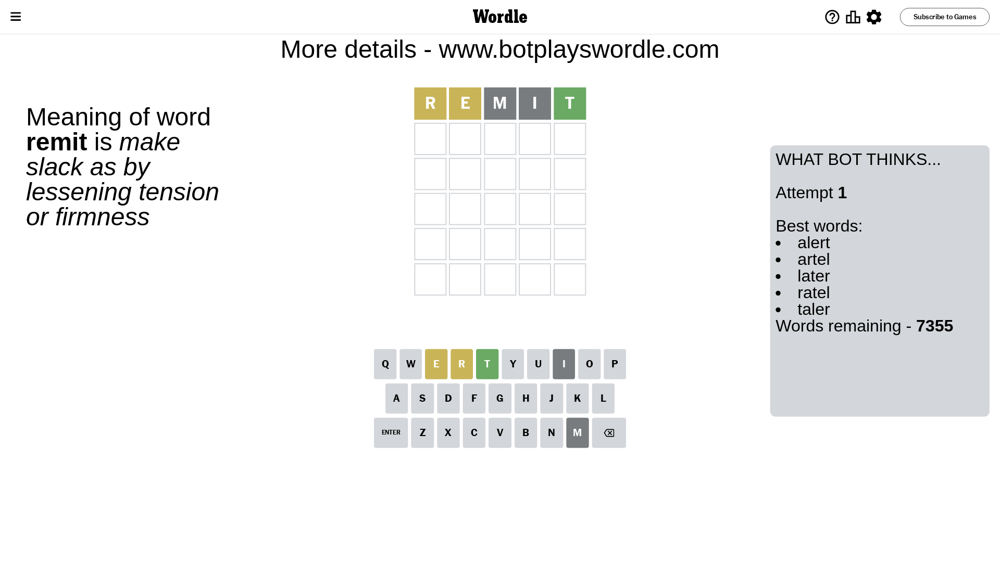
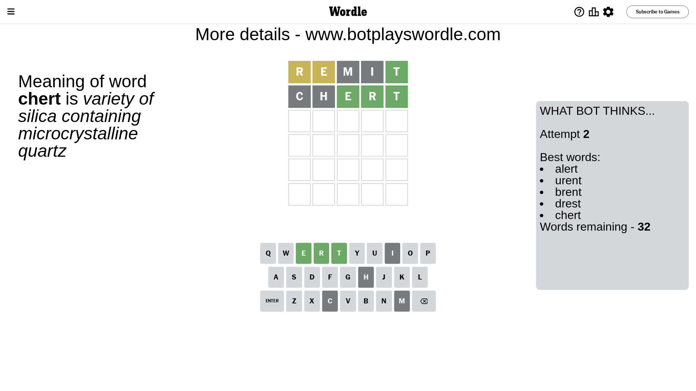
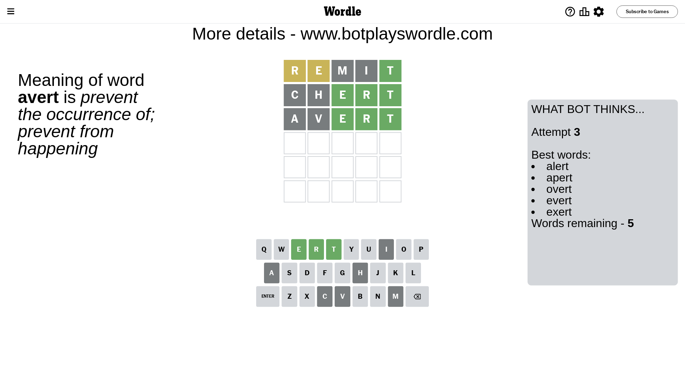
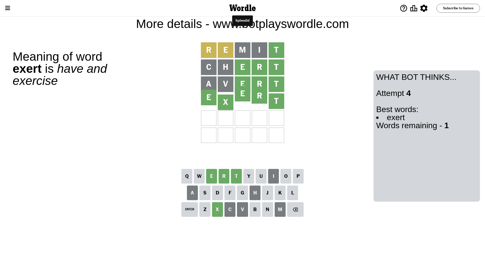

# Wordle for September 15, 2023 - \#818

## Attempt 1

This is the first attempt and we'll choose a random word to start with.

Let's start with word `remit`

Attempt for `remit` gives us 1 correct letters, 2 present letters and 2 wrong letters.

If we look into details, we can see that:

Letter `r` is on a different spot - this means that it cannot be at position 1

Letter `e` is on a different spot - this means that it cannot be at position 2

Letter `m` is not present in the word and we will not use it any more

Letter `i` is not present in the word and we will not use it any more

Letter `t` should be at position 5

We got information about the correct letters and it should make next attempt easier

Some letters are missing (like `m`, `i`) but it's also important piece of information

Word should contain letters `[r e t]`

That was a great guess that limited number of remaining words

## Attempt 2

Right now we have 32 words to choose from and best of them seem to be `[alert urent brent drest chert]`

So far we know that possible letters are:

At position 1: `[a b c d e f g h j k l n o p q s t u v w x y z]`

At position 2: `[a b c d f g h j k l n o p q r s t u v w x y z]`

At position 3: `[a b c d e f g h j k l n o p q r s t u v w x y z]`

At position 4: `[a b c d e f g h j k l n o p q r s t u v w x y z]`

At position 5: `[t]`

Next guess is `chert`, let's see what it gives us

Attempt for `chert` gives us 3 correct letters, 0 present letters and 2 wrong letters.

If we look into details, we can see that:

Letter `c` is not present in the word and we will not use it any more

Letter `h` is not present in the word and we will not use it any more

Letter `e` should be at position 3

Letter `r` should be at position 4

We got information about the correct letters and it should make next attempt easier

Some letters are missing (like `c`, `h`) but it's also important piece of information

Word should contain letters `[r e t]`

Not a bad guess in general

## Attempt 3

Right now we have 5 words to choose from and best of them seem to be `[alert apert overt evert exert]`

So far we know that possible letters are:

At position 1: `[a b d e f g j k l n o p q s t u v w x y z]`

At position 2: `[a b d f g j k l n o p q r s t u v w x y z]`

At position 3: `[e]`

At position 4: `[r]`

At position 5: `[t]`

Next guess is `avert`, let's see what it gives us

Attempt for `avert` gives us 3 correct letters, 0 present letters and 2 wrong letters.

If we look into details, we can see that:

Letter `a` is not present in the word and we will not use it any more

Letter `v` is not present in the word and we will not use it any more

Some letters are missing (like `a`, `v`) but it's also important piece of information

Word should contain letters `[r e t]`

Not a bad guess in general

## Attempt 4

Right now we have 1 words to choose from and best of them seem to be `[exert]`

So far we know that possible letters are:

At position 1: `[b d e f g j k l n o p q s t u w x y z]`

At position 2: `[b d f g j k l n o p q r s t u w x y z]`

At position 3: `[e]`

At position 4: `[r]`

At position 5: `[t]`

It must be `exert`

That's the correct answer! The word is `exert`!

## Conclusion

Today's word is `exert` and it took 4 attempts to guess it

