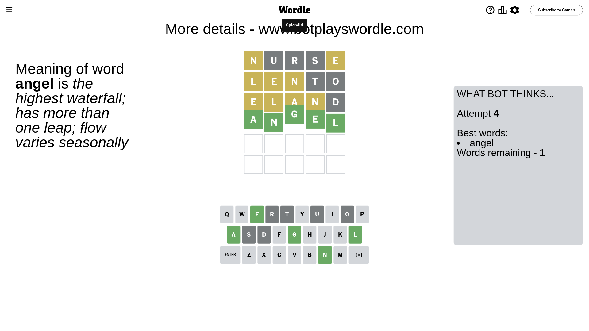

# Wordle for September 16, 2023 - \#819

## Attempt 1

This is the first attempt and we'll choose a random word to start with.

Let's start with word `nurse`

Attempt for `nurse` gives us 0 correct letters, 2 present letters and 3 wrong letters.

If we look into details, we can see that:

Letter `n` is on a different spot - this means that it cannot be at position 1

Letter `u` is not present in the word and we will not use it any more

Letter `r` is not present in the word and we will not use it any more

Letter `s` is not present in the word and we will not use it any more

Letter `e` is on a different spot - this means that it cannot be at position 5

Some letters are missing (like `u`, `r`, `s`) but it's also important piece of information

Word should contain letters `[n e]`

That was a great guess that limited number of remaining words

## Attempt 2

Right now we have 229 words to choose from and best of them seem to be `[laten leant lento olent inlet]`

So far we know that possible letters are:

At position 1: `[a b c d e f g h i j k l m o p q t v w x y z]`

At position 2: `[a b c d e f g h i j k l m n o p q t v w x y z]`

At position 3: `[a b c d e f g h i j k l m n o p q t v w x y z]`

At position 4: `[a b c d e f g h i j k l m n o p q t v w x y z]`

At position 5: `[a b c d f g h i j k l m n o p q t v w x y z]`

Next guess is `lento`, let's see what it gives us

Attempt for `lento` gives us 0 correct letters, 3 present letters and 2 wrong letters.

If we look into details, we can see that:

Letter `l` is on a different spot - this means that it cannot be at position 1

Letter `e` is on a different spot - this means that it cannot be at position 2

Letter `n` is on a different spot - this means that it cannot be at position 3

Letter `t` is not present in the word and we will not use it any more

Letter `o` is not present in the word and we will not use it any more

Some letters are missing (like `t`, `o`) but it's also important piece of information

Word should contain letters `[n e l]`

That was a great guess that limited number of remaining words

## Attempt 3

Right now we have 10 words to choose from and best of them seem to be `[eland eldin blend alien elain]`

So far we know that possible letters are:

At position 1: `[a b c d e f g h i j k m p q v w x y z]`

At position 2: `[a b c d f g h i j k l m n p q v w x y z]`

At position 3: `[a b c d e f g h i j k l m p q v w x y z]`

At position 4: `[a b c d e f g h i j k l m n p q v w x y z]`

At position 5: `[a b c d f g h i j k l m n p q v w x y z]`

Next guess is `eland`, let's see what it gives us

Attempt for `eland` gives us 0 correct letters, 4 present letters and 1 wrong letters.

If we look into details, we can see that:

Letter `e` is on a different spot - this means that it cannot be at position 1

Letter `l` is on a different spot - this means that it cannot be at position 2

Letter `a` is on a different spot - this means that it cannot be at position 3

Letter `n` is on a different spot - this means that it cannot be at position 4

Letter `d` is not present in the word and we will not use it any more

Some letters are missing (like `d`) but it's also important piece of information

Word should contain letters `[n e l a]`

That was a great guess that limited number of remaining words

## Attempt 4

Right now we have 1 words to choose from and best of them seem to be `[angel]`

So far we know that possible letters are:

At position 1: `[a b c f g h i j k m p q v w x y z]`

At position 2: `[a b c f g h i j k m n p q v w x y z]`

At position 3: `[b c e f g h i j k l m p q v w x y z]`

At position 4: `[a b c e f g h i j k l m p q v w x y z]`

At position 5: `[a b c f g h i j k l m n p q v w x y z]`

It must be `angel`

That's the correct answer! The word is `angel`!

## Conclusion

Today's word is `angel` and it took 4 attempts to guess it

