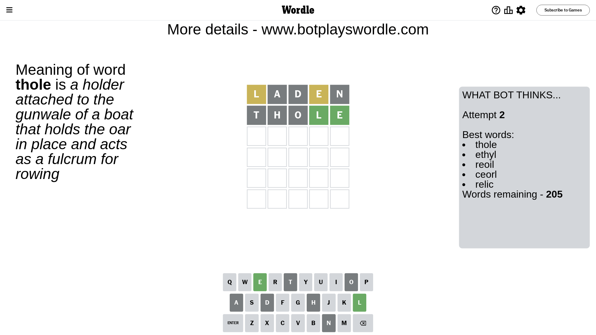

# Wordle for September 27, 2023 - \#830

## Attempt 1

This is the first attempt and we'll choose a random word to start with.

Let's start with word `laden`

Attempt for `laden` gives us 0 correct letters, 2 present letters and 3 wrong letters.

If we look into details, we can see that:

Letter `l` is on a different spot - this means that it cannot be at position 1

Letter `a` is not present in the word and we will not use it any more

Letter `d` is not present in the word and we will not use it any more

Letter `e` is on a different spot - this means that it cannot be at position 4

Letter `n` is not present in the word and we will not use it any more

Some letters are missing (like `a`, `d`, `n`) but it's also important piece of information

Word should contain letters `[l e]`

That was a great guess that limited number of remaining words

## Attempt 2

Right now we have 205 words to choose from and best of them seem to be `[thole ethyl reoil ceorl relic]`

So far we know that possible letters are:

At position 1: `[b c e f g h i j k m o p q r s t u v w x y z]`

At position 2: `[b c e f g h i j k l m o p q r s t u v w x y z]`

At position 3: `[b c e f g h i j k l m o p q r s t u v w x y z]`

At position 4: `[b c f g h i j k l m o p q r s t u v w x y z]`

At position 5: `[b c e f g h i j k l m o p q r s t u v w x y z]`

Next guess is `thole`, let's see what it gives us

Attempt for `thole` gives us 2 correct letters, 0 present letters and 3 wrong letters.

If we look into details, we can see that:

Letter `t` is not present in the word and we will not use it any more

Letter `h` is not present in the word and we will not use it any more

Letter `o` is not present in the word and we will not use it any more

Letter `l` should be at position 4

Letter `e` should be at position 5

We got information about the correct letters and it should make next attempt easier

Some letters are missing (like `t`, `h`, `o`) but it's also important piece of information

Word should contain letters `[l e]`

That was a great guess that limited number of remaining words

## Attempt 3

Right now we have 23 words to choose from and best of them seem to be `[birle rifle ruble smile spile]`

So far we know that possible letters are:

At position 1: `[b c e f g i j k m p q r s u v w x y z]`

At position 2: `[b c e f g i j k l m p q r s u v w x y z]`

At position 3: `[b c e f g i j k l m p q r s u v w x y z]`

At position 4: `[l]`

At position 5: `[e]`

Next guess is `spile`, let's see what it gives us

Attempt for `spile` gives us 4 correct letters, 0 present letters and 1 wrong letters.

If we look into details, we can see that:

Letter `s` should be at position 1

Letter `p` is not present in the word and we will not use it any more

Letter `i` should be at position 3

We got information about the correct letters and it should make next attempt easier

Some letters are missing (like `p`) but it's also important piece of information

Word should contain letters `[l e s i]`

That was a great guess that limited number of remaining words

## Attempt 4

Right now we have 2 words to choose from and best of them seem to be `[smile swile]`

So far we know that possible letters are:

At position 1: `[s]`

At position 2: `[b c e f g i j k l m q r s u v w x y z]`

At position 3: `[i]`

At position 4: `[l]`

At position 5: `[e]`

Next guess is `smile`, let's see what it gives us

That's the correct answer! The word is `smile`!

## Conclusion

Today's word is `smile` and it took 4 attempts to guess it

