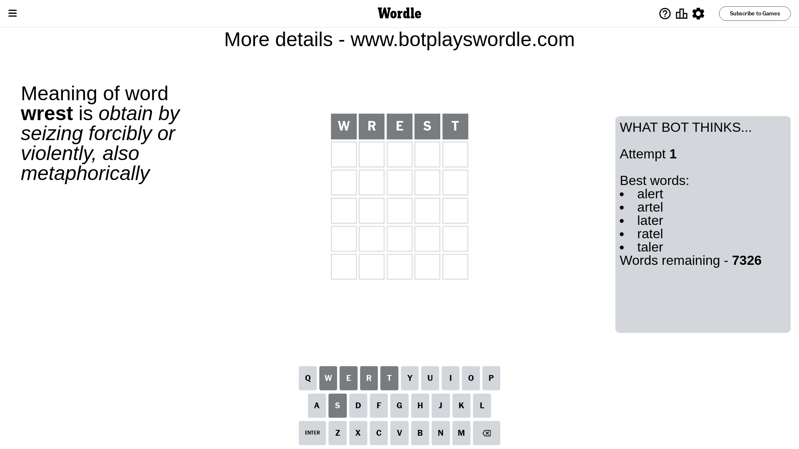
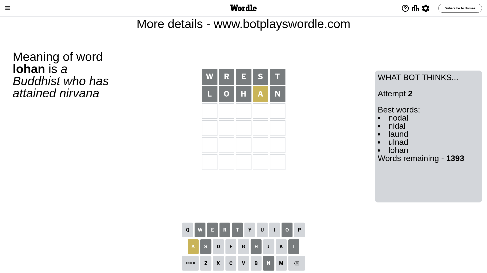
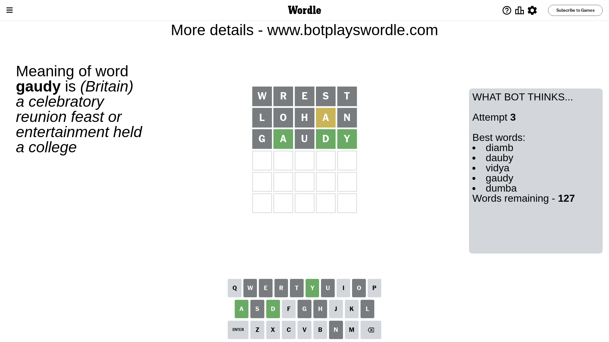
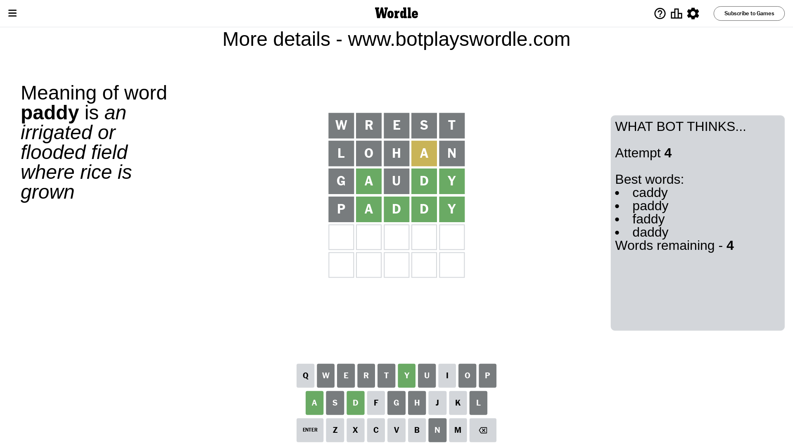
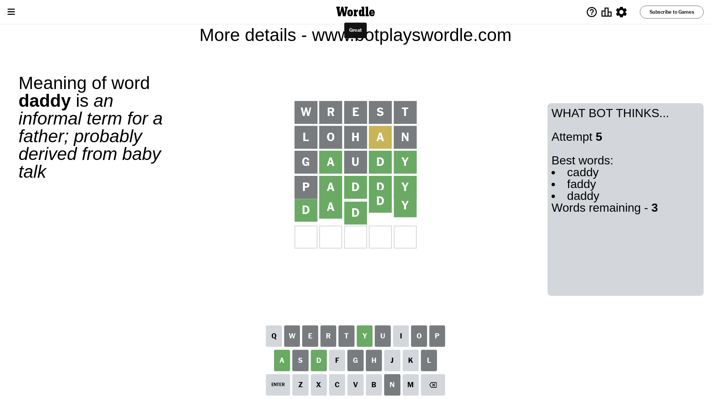

# Wordle for September 30, 2023 - \#833

## Attempt 1

This is the first attempt and we'll choose a random word to start with.

Let's start with word `wrest`

Attempt for `wrest` gives us 0 correct letters, 0 present letters and 5 wrong letters.

If we look into details, we can see that:

Letter `w` is not present in the word and we will not use it any more

Letter `r` is not present in the word and we will not use it any more

Letter `e` is not present in the word and we will not use it any more

Letter `s` is not present in the word and we will not use it any more

Letter `t` is not present in the word and we will not use it any more

Some letters are missing (like `w`, `r`, `e`, `s`, `t`) but it's also important piece of information

So far we don't know any of the letters!

Not a bad guess in general

## Attempt 2

Right now we have 1393 words to choose from and best of them seem to be `[nodal nidal laund ulnad lohan]`

So far we know that possible letters are:

At position 1: `[a b c d f g h i j k l m n o p q u v x y z]`

At position 2: `[a b c d f g h i j k l m n o p q u v x y z]`

At position 3: `[a b c d f g h i j k l m n o p q u v x y z]`

At position 4: `[a b c d f g h i j k l m n o p q u v x y z]`

At position 5: `[a b c d f g h i j k l m n o p q u v x y z]`

Next guess is `lohan`, let's see what it gives us

Attempt for `lohan` gives us 0 correct letters, 1 present letters and 4 wrong letters.

If we look into details, we can see that:

Letter `l` is not present in the word and we will not use it any more

Letter `o` is not present in the word and we will not use it any more

Letter `h` is not present in the word and we will not use it any more

Letter `a` is on a different spot - this means that it cannot be at position 4

Letter `n` is not present in the word and we will not use it any more

Some letters are missing (like `l`, `o`, `h`, `n`) but it's also important piece of information

Word should contain letters `[a]`

That was a great guess that limited number of remaining words

## Attempt 3

Right now we have 127 words to choose from and best of them seem to be `[diamb dauby vidya gaudy dumba]`

So far we know that possible letters are:

At position 1: `[a b c d f g i j k m p q u v x y z]`

At position 2: `[a b c d f g i j k m p q u v x y z]`

At position 3: `[a b c d f g i j k m p q u v x y z]`

At position 4: `[b c d f g i j k m p q u v x y z]`

At position 5: `[a b c d f g i j k m p q u v x y z]`

Next guess is `gaudy`, let's see what it gives us

Attempt for `gaudy` gives us 3 correct letters, 0 present letters and 2 wrong letters.

If we look into details, we can see that:

Letter `g` is not present in the word and we will not use it any more

Letter `a` should be at position 2

Letter `u` is not present in the word and we will not use it any more

Letter `d` should be at position 4

Letter `y` should be at position 5

We got information about the correct letters and it should make next attempt easier

Some letters are missing (like `g`, `u`) but it's also important piece of information

Word should contain letters `[a d y]`

That was a great guess that limited number of remaining words

## Attempt 4

Right now we have 4 words to choose from and best of them seem to be `[caddy paddy faddy daddy]`

So far we know that possible letters are:

At position 1: `[a b c d f i j k m p q v x y z]`

At position 2: `[a]`

At position 3: `[a b c d f i j k m p q v x y z]`

At position 4: `[d]`

At position 5: `[y]`

Next guess is `paddy`, let's see what it gives us

Attempt for `paddy` gives us 4 correct letters, 0 present letters and 1 wrong letters.

If we look into details, we can see that:

Letter `p` is not present in the word and we will not use it any more

Letter `d` should be at position 3

We got information about the correct letters and it should make next attempt easier

Some letters are missing (like `p`) but it's also important piece of information

Word should contain letters `[a d y]`

This was a waste, almost no valuable information...

## Attempt 5

Right now we have 3 words to choose from and best of them seem to be `[caddy faddy daddy]`

So far we know that possible letters are:

At position 1: `[a b c d f i j k m q v x y z]`

At position 2: `[a]`

At position 3: `[d]`

At position 4: `[d]`

At position 5: `[y]`

Next guess is `daddy`, let's see what it gives us

That's the correct answer! The word is `daddy`!

## Conclusion

Today's word is `daddy` and it took 5 attempts to guess it

